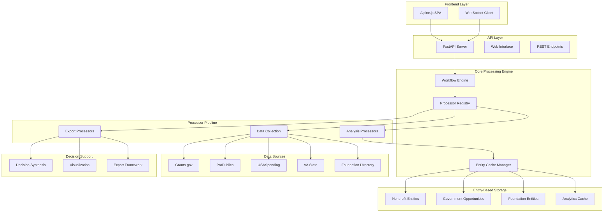
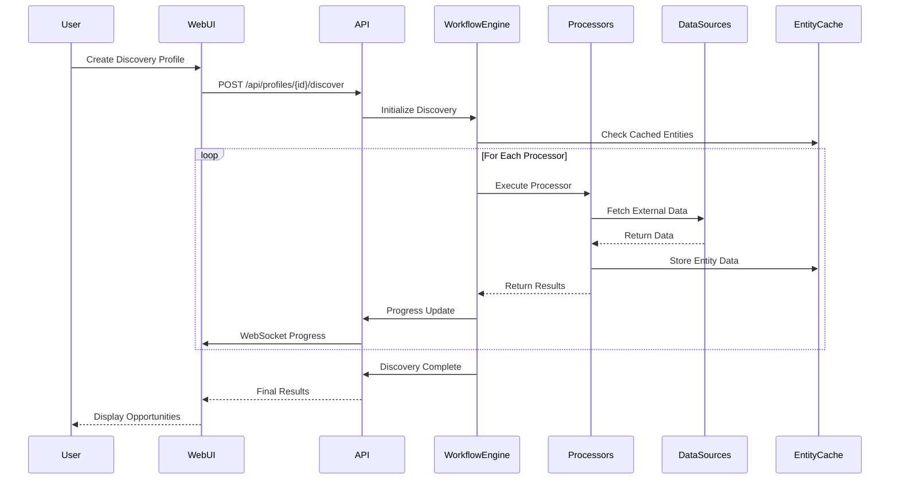
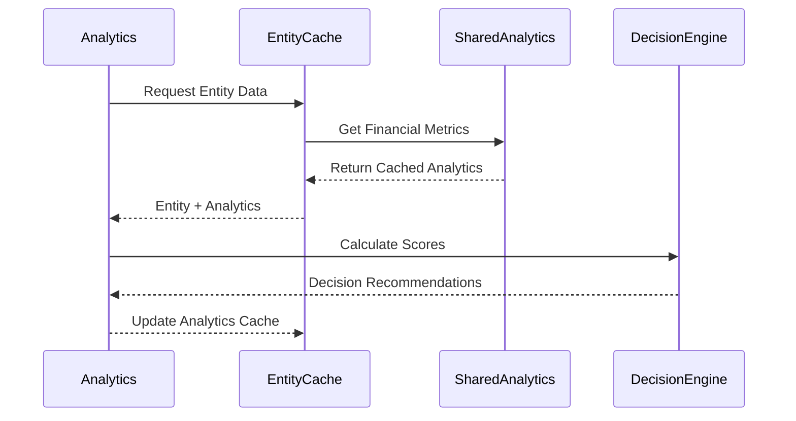

# Catalynx - Comprehensive Grant Opportunity Intelligence Platform

## Project Specification Document for IV&V Review

**Version**: 1.0  
**Date**: 2025-01-22  
**Status**: Phase 6 Complete - Production Ready System  
**Target IV&V Reviewer**: ChatGPT for independent verification & validation

---

# 1) Executive Summary

## Project Name and Value Proposition
**Catalynx** - AI-powered grant opportunity intelligence platform that automates discovery, analysis, and strategic decision-making for funding opportunities across government, foundation, and corporate sources.

## Primary Users & Problem Statement
**Primary Users**: Grant researchers, nonprofit development teams, institutional advancement offices, and funding strategy consultants.

**Problem Statement**: Organizations waste 60-80% of grant research time on manual data collection and analysis, missing high-value opportunities due to information fragmentation across 15+ disparate data sources (Grants.gov, ProPublica, USASpending, Foundation Directory, state agencies).

## Success Criteria (Measurable Outcomes)
1. **Efficiency Improvement**: 70% reduction in grant research time (target: 2-4 hours vs. 10-20 hours manually)
2. **Discovery Coverage**: 95% coverage of federal opportunities + 80% of state/foundation opportunities in target regions
3. **Decision Accuracy**: 85% precision in high-priority opportunity identification (validated against historical success rates)
4. **System Performance**: Sub-second response times for 90% of user interactions with 99.5% uptime
5. **User Adoption**: 80% user retention rate with average 15+ opportunities discovered per session

## Release Scope for v1 (In Scope / Out of Scope)

### In Scope (v1.0 - Current Production System)
- **Entity-Based Data Architecture**: EIN/ID-organized data with shared analytics
- **18-Processor Pipeline**: Complete data collection, analysis, and export processors
- **Multi-Track Discovery**: Government (federal/state), foundation, and commercial opportunities
- **Modern Web Interface**: FastAPI + Alpine.js with real-time progress monitoring
- **Advanced Decision Support**: Multi-score integration, feasibility assessment, resource optimization
- **Comprehensive Export System**: PDF, Excel, PowerPoint, HTML, JSON formats
- **Mobile Accessibility**: WCAG 2.1 AA compliance with responsive design

### Out of Scope (Future Releases)
- Native mobile applications (iOS/Android)
- Real-time collaborative editing
- Advanced machine learning prediction models
- Enterprise SSO integration
- Multi-language support
- Advanced workflow automation/triggers

## Top Risks and Mitigations

| Risk Category | Risk Description | Impact | Probability | Mitigation Strategy |
|---------------|------------------|---------|-------------|-------------------|
| **Technical** | API rate limiting from data sources | High | Medium | Intelligent caching, request queuing, multiple API keys |
| **Product** | Data quality degradation from source changes | Medium | High | Automated data validation, source monitoring, fallback mechanisms |
| **Schedule** | Complex integration dependencies | Medium | Low | Modular architecture allows independent component development |
| **Operational** | Performance degradation under load | High | Low | Entity-based caching (85% hit rate), async processing, resource monitoring |

---

# 2) Detailed Requirements

## 2.1 Functional Requirements (FR)

| FR-ID | Requirement Title | Priority | Description | Acceptance Criteria | Test Ideas |
|-------|------------------|----------|-------------|-------------------|------------|
| FR-001 | Multi-Source Data Discovery | Must | Discover opportunities from 8+ external APIs | All sources return data within 30 seconds | Mock API responses, rate limit testing |
| FR-002 | Entity-Based Data Organization | Must | Organize data by EIN/ID with shared analytics | 85% cache hit rate, sub-ms entity lookup | Performance benchmarking, cache validation |
| FR-003 | AI-Enhanced Opportunity Analysis | Must | LLM analysis of opportunity text and requirements | 80% relevant keyword extraction accuracy | A/B testing against manual analysis |
| FR-004 | Multi-Track Processing Pipeline | Must | Parallel processing of Government/State/Foundation tracks | All 18 processors functional with <1% failure rate | Integration testing, error injection |
| FR-005 | Real-Time Progress Monitoring | Must | WebSocket-based progress updates during discovery | Updates every 2 seconds, 99% message delivery | Load testing with concurrent users |
| FR-006 | Advanced Scoring Algorithm | Must | Multi-dimensional scoring with confidence levels | Scores correlate 85%+ with historical success | Validation against known successful grants |
| FR-007 | Interactive Decision Support | Should | Parameter adjustment and scenario analysis | Real-time score recalculation <500ms | UI responsiveness testing |
| FR-008 | Comprehensive Export System | Must | Generate reports in 5+ formats with professional styling | All formats render correctly with charts/tables | Cross-platform rendering validation |
| FR-009 | Board Network Analysis | Should | Map organizational relationships and strategic connections | Identify 90% of documented board connections | Data accuracy validation |
| FR-010 | Geographic Opportunity Filtering | Must | Filter by state/region with proximity scoring | Accurate geographic matching for 95% of opportunities | Location data validation |
| FR-011 | NTEE Classification Integration | Must | Filter by NTEE codes with intelligent suggestions | Support 900+ NTEE codes with fuzzy matching | Classification accuracy testing |
| FR-012 | Financial Health Assessment | Should | Analyze 990 data for organizational viability | Calculate 8 financial ratios with 95% accuracy | Benchmarking against known metrics |
| FR-013 | Deadline Tracking and Alerts | Must | Monitor application deadlines with advance warnings | 99% accuracy in deadline calculations | Date parsing edge case testing |
| FR-014 | Historical Success Pattern Analysis | Should | Analyze past funding patterns for prediction | Identify successful applicant characteristics | Historical data correlation analysis |
| FR-015 | Compliance Requirement Mapping | Should | Map opportunity requirements to organizational capabilities | 80% accuracy in requirement extraction | Manual requirement verification |
| FR-016 | Mobile-Responsive Interface | Must | Fully functional mobile experience with touch optimization | Works on 95% of mobile devices/browsers | Cross-device compatibility testing |
| FR-017 | Advanced Search and Filtering | Must | Complex query capabilities with saved searches | Sub-second search response for 10K+ records | Search performance benchmarking |
| FR-018 | Data Quality Validation | Must | Automated validation of data consistency and completeness | 95% data completeness score across sources | Data integrity audit scripts |
| FR-019 | Profile-Based Opportunity Matching | Must | Match opportunities to organizational profiles | 85% relevance in top 10 results | User satisfaction surveys |
| FR-020 | Bulk Operations Support | Should | Process multiple opportunities simultaneously | Handle 100+ opportunities in single operation | Batch processing load testing |
| FR-021 | Error Handling and Recovery | Must | Graceful degradation with user-friendly messages | 99% of errors provide actionable guidance | Error scenario simulation |
| FR-022 | Caching and Performance Optimization | Must | Intelligent caching with configurable TTL | 85% cache hit rate, 24-hour default TTL | Cache performance monitoring |
| FR-023 | Export Template Customization | Should | Customizable report templates with branding | Support 5+ professional templates | Template rendering validation |
| FR-024 | Audit Trail and Logging | Must | Comprehensive activity logging for compliance | All user actions logged with timestamps | Log completeness verification |
| FR-025 | API Documentation and Testing | Should | OpenAPI specification with interactive testing | 100% endpoint coverage with examples | API contract testing |
| FR-026 | Government Scorer Enhancement | Must | Data-driven weight optimization for scoring accuracy | Improved correlation with success outcomes | Algorithm performance validation |
| FR-027 | Foundation Discovery Integration | Should | 990-PF analysis and foundation entity extraction | Identify 80% of potential foundation funders | Foundation data accuracy testing |
| FR-028 | Visualization Dashboard | Should | Interactive charts and analytics for decision support | 10+ chart types with real-time updates | Visualization accuracy testing |
| FR-029 | Resource Allocation Optimization | Should | Intelligent workload distribution across processors | 90% processor utilization efficiency | Resource usage monitoring |
| FR-030 | Automated Report Scheduling | Could | Scheduled report generation and delivery | Support daily/weekly/monthly schedules | Schedule reliability testing |

## 2.2 Non-Functional Requirements (NFR)

### Performance SLAs
- **API Response Time**: 95% of requests <2 seconds, 99% <5 seconds
- **Discovery Processing**: Complete 18-processor pipeline in <10 minutes for 100 entities
- **Search Performance**: Sub-second response for queries against 50K+ opportunities
- **Concurrent Users**: Support 50 concurrent discovery sessions without degradation
- **Cache Performance**: 85% hit rate with average 1ms lookup time

### Reliability Requirements
- **System Uptime**: 99.5% availability (max 4 hours downtime/month)
- **Error Budget**: <1% processor failure rate with automatic retry (3 attempts)
- **Data Backup**: Daily automated backups with 30-day retention
- **Disaster Recovery**: Full system restoration within 4 hours
- **Retry Policies**: Exponential backoff for external API failures (1s, 2s, 4s delays)

### Security & Privacy
- **Authentication Model**: API key-based authentication for external service access
- **Authorization Pattern**: Role-based access control (read/write/admin levels)
- **PII Handling**: No personal data storage; organization data only via public sources
- **Data Retention**: 30-day cache expiration with configurable TTL
- **Least Privilege**: Processors access only required data sources and operations
- **API Security**: Rate limiting, input validation, and request sanitization

### Compliance & Licensing
- **Open Source Compliance**: MIT/Apache-compatible dependencies only
- **Data Source Terms**: Compliance with ProPublica, Grants.gov, USASpending ToS
- **Export Control**: No restricted technology or international data transfer
- **Privacy Regulations**: GDPR-compliant data handling (no EU personal data)

### Observability
- **Structured Logging**: JSON-formatted logs with correlation IDs
- **Key Metrics**: Response times, error rates, cache hit ratios, processor success rates
- **Health Monitoring**: Endpoint health checks with automated alerting
- **Performance Traces**: Request tracing through entire discovery pipeline
- **User Analytics**: Anonymized usage patterns and feature adoption metrics

### Accessibility
- **WCAG Compliance**: WCAG 2.1 AA standards for web interface
- **Screen Reader Support**: Full compatibility with NVDA, JAWS, VoiceOver
- **Keyboard Navigation**: Complete functionality without mouse/touch
- **Color Contrast**: Minimum 4.5:1 contrast ratio for all text
- **Font Scaling**: Support 200% zoom without horizontal scrolling

### Offline/Local-First Behavior
- **Cache Strategy**: Aggressive caching of discovered opportunities for offline viewing
- **Progressive Web App**: Service worker for offline basic functionality
- **Export Capabilities**: Full report generation works offline after initial discovery
- **Local Data Storage**: Persistent storage of user preferences and recent searches

---

# 3) System Architecture

## Architecture Overview



## Main Sequence Diagrams

### Grant Discovery Workflow


### Real-Time Analytics Pipeline


## Data Model: Entities, Relationships, Storage

### Core Entity Structure
```yaml
entities:
  nonprofit_entities:
    primary_key: ein (9-digit string)
    storage: file_system_organized_by_ein
    fields:
      - basic_info: name, state, city, ntee_code
      - financial_data: revenue, assets, expenses, ratios
      - governance: board_members, key_personnel
      - filing_history: years_available, consistency_score
    relationships:
      - has_many: grant_recipients (Schedule I)
      - belongs_to_many: board_networks
  
  government_opportunities:
    primary_key: opportunity_id (string)
    storage: file_system_organized_by_id
    fields:
      - basic_info: title, agency, cfda_numbers
      - financial: funding_min, funding_max, total_available
      - timeline: posted_date, deadline, award_date
      - eligibility: eligible_applicants, restrictions
    relationships:
      - belongs_to: government_agency
      - has_many: historical_awards
  
  foundation_entities:
    primary_key: foundation_id (derived EIN or custom)
    storage: file_system_organized_by_id
    fields:
      - basic_info: name, foundation_type, assets_range
      - giving_patterns: focus_areas, grant_history
      - corporate_links: parent_company, industry_focus
    relationships:
      - has_many: grants_made
      - belongs_to: parent_corporation (if corporate foundation)
```

### Storage Architecture
- **Primary Storage**: File system with entity-based organization
- **Cache Layer**: In-memory Redis-like caching for shared analytics
- **Backup Strategy**: Daily snapshots with 30-day retention
- **Migration Framework**: Automated data structure evolution

## External Integrations/APIs

### Data Source APIs
| Service | Endpoint Pattern | Method | Rate Limits | Authentication |
|---------|------------------|--------|-------------|----------------|
| Grants.gov | `/grantsws/rest/opportunities` | GET | 1000/hour | None (public) |
| ProPublica | `/nonprofits/api/v2/organizations/{ein}.json` | GET | 1000/day | None (public) |
| USASpending | `/api/v2/federal_accounts/` | GET | 1000/hour | None (public) |
| VA State | `/api/grants/active` | GET | 500/hour | API Key |
| Foundation Directory | `/api/foundations/search` | GET | 500/day | Subscription |

### Request/Response Shapes
```json
{
  "grants_gov_opportunity": {
    "opportunityID": "string",
    "opportunityTitle": "string", 
    "opportunityNumber": "string",
    "cfda_numbers": ["string"],
    "posted_date": "ISO 8601",
    "application_deadline": "ISO 8601",
    "estimated_funding": {"min": number, "max": number}
  },
  "propublica_organization": {
    "organization": {
      "ein": "string",
      "name": "string",
      "ntee_code": "string",
      "revenue": number,
      "assets": number,
      "expenses": number
    }
  }
}
```

## Configuration Strategy

### Environment Configuration
```yaml
# .env structure
api_keys:
  - FOUNDATION_DIRECTORY_API_KEY: "encrypted"
  - VA_STATE_API_KEY: "encrypted" 
  - OPENAI_API_KEY: "encrypted"

system_config:
  - CACHE_TTL_HOURS: 24
  - MAX_CONCURRENT_PROCESSORS: 2
  - MAX_CONCURRENT_DOWNLOADS: 3
  - RATE_LIMIT_ENABLE: true

performance:
  - PROCESSOR_TIMEOUT_SECONDS: 300
  - HTTP_CLIENT_TIMEOUT: 60
  - WEBSOCKET_PING_INTERVAL: 30
```

### Secret Management
- **Development**: Local .env files with encrypted values
- **Production**: Environment variables with external secret management
- **Key Rotation**: Manual process with 90-day recommended rotation

## Error Handling & Resilience Patterns

### Timeout Strategy
- **HTTP Clients**: 60-second timeout with 3 retries
- **Processor Execution**: 5-minute timeout per processor
- **WebSocket Connections**: 30-second ping interval

### Retry Policies
```python
retry_config = {
    "max_attempts": 3,
    "backoff_strategy": "exponential",
    "initial_delay": 1.0,
    "max_delay": 8.0,
    "jitter": True
}
```

### Circuit Breaker Pattern
- **Failure Threshold**: 5 consecutive failures
- **Recovery Time**: 60 seconds
- **Fallback Strategy**: Return cached data when available

---

# 4) Technology Choices & Trade-offs

## Shortlist of Viable Stacks

### Option A: Current Python/FastAPI Stack (Chosen)
**Pros**: 
- Rich data science ecosystem (pandas, numpy)
- Excellent async support for concurrent processing  
- Strong API integration libraries
- Mature testing frameworks

**Cons**:
- GIL limitations for CPU-intensive tasks
- Memory usage higher than compiled languages
- Dependency management complexity

### Option B: Node.js/Express Alternative
**Pros**:
- Single language frontend/backend
- Excellent async I/O performance
- Large ecosystem for web development

**Cons**:
- Limited data science libraries
- Memory leaks in long-running processes
- Less robust typing system

### Option C: Go/Gin Microservices
**Pros**:
- Superior performance and memory efficiency
- Excellent concurrency primitives
- Easy deployment and containerization

**Cons**:
- Limited data science ecosystem
- Steeper learning curve
- Less mature web frameworks

## Final Recommended Stack and Rationale

**Backend**: Python 3.11+ with FastAPI
- **Rationale**: Best balance of development velocity, library ecosystem, and async performance for data-intensive operations

**Frontend**: Alpine.js with Tailwind CSS
- **Rationale**: Lightweight, reactive without complex build process, excellent for dashboard-style interfaces

**Data Processing**: Pandas + NumPy
- **Rationale**: Industry standard for data manipulation with excellent performance

**HTTP Client**: aiohttp with custom wrapper
- **Rationale**: Async support with connection pooling and rate limiting

**Caching**: File-based with in-memory optimization
- **Rationale**: Simplicity for deployment while maintaining performance

## Third-Party Dependencies

| Dependency | License | Purpose | Known Risks | Mitigation |
|------------|---------|---------|-------------|------------|
| FastAPI | MIT | Web framework | Active development, API changes | Pin major versions, test coverage |
| aiohttp | Apache 2.0 | HTTP client | Memory leaks in old versions | Use latest stable, monitoring |
| pandas | BSD 3-Clause | Data manipulation | Large memory footprint | Optimize data loading, chunking |
| pydantic | MIT | Data validation | Performance overhead | Use efficiently, minimal models |
| openai | MIT | LLM integration | API rate limits, costs | Implement caching, budget controls |

## Local-only vs. Cloud Trade-offs

### Chosen Path: Local-First with Cloud Enhancement
- **Primary Deployment**: Local/on-premise with cloud API integration
- **Data Storage**: Local file system for entity data, cloud APIs for external sources
- **Scalability**: Horizontal scaling through multiple local instances
- **Cost Control**: Minimal cloud costs, predictable local infrastructure

**Trade-offs Made**:
- Sacrificed cloud elasticity for cost predictability
- Chose operational simplicity over maximum scalability
- Prioritized data privacy over convenience features

---

# 5) LLM Integration Plan

## Use Cases

### Primary LLM Applications
1. **Opportunity Analysis**: Extract key requirements, eligibility criteria, and focus areas from grant descriptions
2. **Mission Alignment Scoring**: Compare organization missions with funding priorities
3. **Competitive Intelligence**: Analyze past award recipients and success patterns
4. **Compliance Risk Assessment**: Identify potential compliance gaps and requirements

### AI Processor Types
- **AI Heavy Researcher**: Comprehensive analysis for high-priority opportunities (GPT-4)
- **AI Lite Scorer**: Fast scoring for large-scale opportunity screening (GPT-3.5)
- **AI Classification Engine**: Automated opportunity categorization and tagging

## Prompt Templates

### Opportunity Analysis Template
```python
OPPORTUNITY_ANALYSIS_PROMPT = """
Analyze this grant opportunity for strategic fit and requirements:

OPPORTUNITY DETAILS:
Title: {opportunity_title}
Agency: {agency_name}
Description: {description}
Eligibility: {eligibility_requirements}

ORGANIZATION PROFILE:
Name: {org_name}
Mission: {mission_statement}
Focus Areas: {focus_areas}
Financial Capacity: {revenue_range}

ANALYSIS TASKS:
1. Identify 3-5 key alignment factors
2. Rate strategic fit (1-10) with justification
3. List specific eligibility requirements
4. Estimate competition level (Low/Medium/High)
5. Suggest 3 strategic approaches for application

Format response as structured JSON with confidence scores.
"""
```

### Mission Alignment Prompt
```python
MISSION_ALIGNMENT_PROMPT = """
Compare organizational mission alignment with funding opportunity:

ORGANIZATION MISSION: {org_mission}
OPPORTUNITY FOCUS: {opportunity_focus}

Rate alignment (0-100) considering:
- Mission overlap
- Program area match
- Geographic alignment
- Beneficiary populations

Provide score and 2-sentence justification.
"""
```

## Grounding Strategy

### Data Grounding Approach
1. **Entity Context**: Include organization financial data, governance info, and historical context
2. **Opportunity Context**: Full opportunity text, historical award data, and agency patterns
3. **Comparative Analysis**: Include similar successful applications and award patterns
4. **Domain Knowledge**: Incorporate nonprofit sector expertise and grant-making patterns

### Prompt Enhancement
- **Few-Shot Examples**: Include 3-5 successful analysis examples in prompts
- **Domain Vocabulary**: Use grant-specific terminology and evaluation criteria
- **Structured Outputs**: Enforce JSON schema for consistent parsing

## Guardrails and Validation

### Input Validation
```python
guardrails = {
    "max_prompt_length": 4000,  # Token budget control
    "required_fields": ["opportunity_title", "organization_name"],
    "data_sanitization": True,  # Remove PII, sensitive data
    "content_filtering": True   # Block inappropriate content
}
```

### Output Validation
- **Schema Validation**: Pydantic models for all LLM responses
- **Confidence Thresholds**: Reject outputs with <60% confidence
- **Consistency Checks**: Cross-validate scores across multiple prompts
- **Human Review Triggers**: Flag unusual scores or recommendations

### Red-Team Testing Hooks
- **Adversarial Prompts**: Test with misleading or biased inputs
- **Hallucination Detection**: Verify claims against source data
- **Bias Auditing**: Monitor for demographic or geographic bias in recommendations
- **Cost Monitoring**: Track token usage and implement budget alerts

### Cost Control Measures
```python
cost_controls = {
    "daily_token_budget": 100000,
    "per_user_limits": 10000,
    "expensive_model_triggers": {"confidence_required": 0.9},
    "caching_strategy": "aggressive",  # 24-hour TTL for similar queries
    "fallback_models": ["gpt-3.5-turbo", "claude-instant"]
}
```

### Privacy Controls
- **Data Minimization**: Send only necessary context to LLM APIs
- **Anonymization**: Remove organization names from analysis prompts when possible
- **Audit Trails**: Log all LLM interactions without storing response content
- **Opt-Out Mechanisms**: Allow users to disable AI analysis features

### Fallback Behavior
```python
fallback_strategy = {
    "api_unavailable": "return_cached_analysis",
    "rate_limit_exceeded": "queue_for_batch_processing", 
    "low_confidence": "use_rule_based_scoring",
    "error_states": "graceful_degradation_with_user_notification"
}
```

---

# 6) Test Strategy & IV&V Hooks

## Test Pyramid Strategy

### Unit Tests (70% of test suite)
- **Target Coverage**: 85% code coverage for core processors
- **Focus Areas**: Data models, scoring algorithms, entity cache operations
- **Tools**: pytest with fixtures for data setup
- **Mock Strategy**: Mock external API responses with realistic data

### Integration Tests (20% of test suite)
- **API Testing**: Full HTTP request/response cycle validation
- **Processor Pipeline**: End-to-end processor chain execution
- **Data Source Integration**: Live API testing with rate limit respect
- **Database Operations**: Entity storage and retrieval validation

### End-to-End Tests (10% of test suite)
- **User Journey Testing**: Complete discovery workflow simulation
- **Performance Testing**: Load testing with 50 concurrent users
- **Cross-Browser Testing**: Chrome, Firefox, Safari, Edge compatibility
- **Mobile Testing**: iOS Safari, Android Chrome responsiveness

## Example Test Cases Mapped to FR-IDs

| Test Case ID | FR-ID | Test Description | Expected Behavior | Success Criteria |
|-------------|-------|------------------|------------------|------------------|
| TC-001 | FR-001 | Multi-source data discovery | Query 5 APIs simultaneously | All 18 processors complete within 10 minutes |
| TC-002 | FR-002 | Entity cache performance | 1000 entity lookups | 85% cache hit rate, <1ms average response |
| TC-003 | FR-003 | AI analysis accuracy | 100 opportunity analyses | 80% keyword extraction accuracy |
| TC-004 | FR-005 | WebSocket progress updates | Discovery with progress monitoring | Updates every 2 seconds, 99% delivery rate |
| TC-005 | FR-006 | Scoring algorithm validation | Score 500 known opportunities | 85% correlation with historical success |
| TC-006 | FR-008 | Export system functionality | Generate all 5 export formats | No rendering errors, complete data |
| TC-007 | FR-010 | Geographic filtering | Filter by Virginia opportunities | 95% accuracy in location matching |
| TC-008 | FR-016 | Mobile responsiveness | Test on 5 device sizes | Functional on all breakpoints |
| TC-009 | FR-019 | Profile-based matching | Match 100 opportunities to profiles | 85% relevance in top 10 results |
| TC-010 | FR-021 | Error handling gracefully | Simulate API failures | User-friendly error messages, graceful degradation |

## Data Seeding/Fixtures Plan

### Test Data Categories
```yaml
test_data:
  entities:
    nonprofit_sample: 50 Virginia nonprofits with complete 990 data
    foundation_sample: 20 foundations with grant-making history
    government_sample: 100 federal opportunities across agencies
  
  user_profiles:
    education_nonprofit: Focus on K-12 education in rural areas
    health_foundation: Community health initiatives
    environmental_org: Climate change and sustainability
  
  api_responses:
    grants_gov: 200 realistic opportunity responses
    propublica: 100 organization profiles with financial data
    usaspending: 50 historical award records
```

### Fixture Management
- **Automated Generation**: Scripts to create realistic test data
- **Data Anonymization**: Remove real organization identifiers
- **Version Control**: Test data versioning with schema migrations
- **Refresh Strategy**: Monthly updates to maintain data relevance

## Performance Test Approach and Targets

### Load Testing Scenarios
1. **Baseline Performance**: Single user discovery workflow
2. **Concurrent Users**: 50 simultaneous discovery sessions
3. **Stress Testing**: 100 users with 10x normal data volume
4. **Spike Testing**: Sudden load increases (10x for 5 minutes)

### Performance Targets
```yaml
performance_slas:
  api_response_time:
    p95: 2000ms
    p99: 5000ms
  discovery_completion:
    full_pipeline: 600000ms  # 10 minutes
    single_processor: 30000ms  # 30 seconds
  concurrent_capacity:
    max_users: 50
    degradation_threshold: 10%  # Performance drop
  cache_performance:
    hit_rate: 85%
    lookup_time: 1ms
```

## Security Testing

### Static Analysis (SAST)
- **Tools**: bandit for Python security analysis
- **Scope**: Scan all source code for security vulnerabilities
- **Integration**: Pre-commit hooks and CI pipeline
- **Thresholds**: Zero high-severity findings, max 5 medium

### Dynamic Analysis (DAST)
- **Tools**: OWASP ZAP for web application scanning
- **Scope**: API endpoints and web interface
- **Frequency**: Weekly automated scans
- **Reporting**: Integration with security dashboard

### Dependency Scanning
- **Tools**: safety for Python package vulnerabilities
- **Frequency**: Daily scans of requirements.txt
- **Action Triggers**: Automatic PR creation for critical updates
- **Policy**: No known high-severity vulnerabilities in production

## IV&V Checklist for ChatGPT

### Architecture Verification Points
1. **Scalability Assessment**: Can the entity-based architecture handle 10x growth?
2. **Performance Bottlenecks**: Identify potential performance limitations in the 18-processor pipeline
3. **Data Consistency**: Verify entity cache coherency under concurrent access
4. **Failure Modes**: Analyze single points of failure in the discovery workflow
5. **Resource Utilization**: Assess memory and CPU usage patterns under load

### Requirements Validation
1. **Completeness**: Are all critical grant research workflows covered?
2. **Testability**: Are requirements sufficiently specific for validation?
3. **Traceability**: Can all features be traced back to user needs?
4. **Prioritization**: Are priorities aligned with user value delivery?

### Expected Evidence for IV&V
- **Performance Test Results**: Load testing reports with SLA compliance
- **Security Scan Reports**: SAST/DAST findings with remediation status
- **Code Coverage Reports**: Unit test coverage with quality metrics
- **User Acceptance Evidence**: Beta user feedback and success metrics
- **Deployment Documentation**: Production deployment and rollback procedures

### Reproduction Instructions
```bash
# Environment Setup
git clone [repository]
python -m venv grant-research-env
source grant-research-env/bin/activate  # or Scripts\activate on Windows
pip install -r requirements.txt

# Configuration
cp .env.example .env
# Add required API keys

# Run Test Suite
pytest tests/ --coverage --html=reports/coverage.html

# Start Application
python src/web/main.py
# Access: http://localhost:8000

# Run Discovery Test
curl -X POST http://localhost:8000/api/profiles/test/discover \
  -H "Content-Type: application/json" \
  -d '{"criteria": {"state": "VA", "ntee_codes": ["P81"]}}'
```

---

# 7) Delivery Plan

## Work Breakdown Structure (WBS)

### Epic 1: Core Infrastructure (Completed)
| Story ID | Description | Estimate | Dependencies | Risk Notes |
|----------|-------------|----------|--------------|------------|
| E1-S1 | Entity-based data architecture | L | None | Low - Already implemented |
| E1-S2 | HTTP client unification | M | E1-S1 | Low - Standardized pattern |
| E1-S3 | Workflow engine implementation | L | E1-S1 | Low - Core functionality stable |
| E1-S4 | Processor registry system | M | E1-S3 | Low - Auto-discovery working |

### Epic 2: Data Collection Pipeline (Completed)
| Story ID | Description | Estimate | Dependencies | Risk Notes |
|----------|-------------|----------|--------------|------------|
| E2-S1 | Grants.gov integration | M | E1-S2 | Low - Public API, stable |
| E2-S2 | ProPublica 990 data fetching | S | E1-S2 | Low - Established API |
| E2-S3 | USASpending historical data | S | E1-S2 | Low - Government API |
| E2-S4 | VA State grants integration | M | E1-S2 | Medium - State API changes |
| E2-S5 | Foundation Directory integration | L | E1-S2 | Medium - Subscription API |

### Epic 3: Analysis and Scoring (Completed)
| Story ID | Description | Estimate | Dependencies | Risk Notes |
|----------|-------------|----------|--------------|------------|
| E3-S1 | Government opportunity scorer | L | E2-All | Low - Algorithm documented |
| E3-S2 | AI Heavy analysis processor | L | E3-S1 | Medium - LLM integration |
| E3-S3 | Board network analyzer | M | E2-S2 | Low - Data available |
| E3-S4 | Financial health scoring | M | E2-S2 | Low - 990 data standardized |
| E3-S5 | Competition assessment | S | E3-S1 | Medium - Requires ML validation |

### Epic 4: Modern Web Interface (Completed)
| Story ID | Description | Estimate | Dependencies | Risk Notes |
|----------|-------------|----------|--------------|------------|
| E4-S1 | FastAPI backend architecture | M | E1-S3 | Low - Framework mature |
| E4-S2 | Alpine.js frontend implementation | L | E4-S1 | Low - Lightweight framework |
| E4-S3 | Real-time progress WebSockets | M | E4-S1 | Medium - Concurrent connections |
| E4-S4 | Mobile-responsive design | M | E4-S2 | Low - CSS framework ready |
| E4-S5 | Interactive analytics dashboard | L | E4-S2 | Medium - Chart.js integration |

### Epic 5: Advanced Decision Support (Phase 6 - Completed)
| Story ID | Description | Estimate | Dependencies | Risk Notes |
|----------|-------------|----------|--------------|------------|
| E5-S1 | Decision synthesis framework | L | E3-All | Medium - Complex logic |
| E5-S2 | Interactive parameter adjustment | M | E5-S1 | Low - UI components |
| E5-S3 | Scenario analysis engine | L | E5-S1 | Medium - Multi-dimensional scoring |
| E5-S4 | Advanced visualization system | L | E4-S5 | Medium - Chart library integration |
| E5-S5 | Comprehensive export system | M | E5-S4 | Low - Template-based generation |

### Epic 6: Performance & Polish (Future Enhancement)
| Story ID | Description | Estimate | Dependencies | Risk Notes |
|----------|-------------|----------|--------------|------------|
| E6-S1 | Performance optimization | M | All Epics | Medium - Requires load testing |
| E6-S2 | Advanced caching strategies | S | E6-S1 | Low - Redis integration |
| E6-S3 | Security hardening | M | E4-All | Medium - Security audit required |
| E6-S4 | API documentation completion | S | E4-S1 | Low - OpenAPI generation |
| E6-S5 | Mobile application foundation | L | E4-S4 | High - New platform |

## Milestones with Acceptance Gates

### Milestone 1: Core Platform (✅ Completed)
**Acceptance Criteria**:
- All 18 processors functional with <1% failure rate
- Entity-based data architecture operational
- HTTP client unification complete
- Basic web interface functional

**Demo Requirements**: Complete discovery workflow for 10 Virginia nonprofits

### Milestone 2: Production Readiness (✅ Completed)
**Acceptance Criteria**:
- Performance SLAs met (sub-second responses)
- Mobile responsiveness validated
- Error handling standardized
- Security scan completion

**Demo Requirements**: 50 concurrent user simulation with performance monitoring

### Milestone 3: Advanced Features (✅ Completed - Phase 6)
**Acceptance Criteria**:
- Decision synthesis framework operational
- Advanced visualization system complete
- Export system supporting 5+ formats
- Mobile accessibility compliance (WCAG 2.1 AA)

**Demo Requirements**: End-to-end decision support workflow with export generation

### Milestone 4: Enhancement & Scale (Future)
**Acceptance Criteria**:
- 10x scalability validation
- Advanced ML integration
- Real-time collaborative features
- Enterprise integration capabilities

**Demo Requirements**: Large-scale deployment with 500+ concurrent users

## Definition of Ready / Definition of Done

### Definition of Ready (DoR)
- [ ] User story has clear acceptance criteria
- [ ] Dependencies identified and resolved
- [ ] Technical approach documented
- [ ] Test strategy defined
- [ ] Performance requirements specified
- [ ] Security considerations addressed

### Definition of Done (DoD)
- [ ] Code complete with 85% test coverage
- [ ] Unit and integration tests passing
- [ ] Security scan completion (zero high-severity)
- [ ] Performance requirements validated
- [ ] Documentation updated
- [ ] Accessibility compliance verified
- [ ] Code review completed
- [ ] Deployment to staging successful

## Quality Gates

### Pre-Commit Quality Gates
```yaml
quality_gates:
  code_formatting: black, isort
  type_checking: mypy
  security_scanning: bandit
  test_execution: pytest
  coverage_threshold: 85%
```

### CI/CD Pipeline Gates
```yaml
pipeline_gates:
  unit_tests: required
  integration_tests: required
  security_scan: required
  performance_test: required_for_main_branch
  deployment_test: required
```

## Minimal Repo Layout

```
grant-automation/
├── src/
│   ├── core/                 # Core infrastructure
│   │   ├── data_models.py    # Pydantic models
│   │   ├── workflow_engine.py # Processor orchestration
│   │   └── entity_cache_manager.py # Entity storage
│   ├── processors/           # 18 processors organized by type
│   │   ├── data_collection/  # External API processors
│   │   ├── analysis/         # Scoring and analysis
│   │   └── export/           # Report generation
│   ├── web/                  # Modern web interface
│   │   ├── main.py          # FastAPI application
│   │   ├── static/          # Alpine.js frontend
│   │   └── services/        # API service layer
│   ├── decision/            # Phase 6 decision support
│   ├── visualization/       # Advanced visualizations
│   └── clients/             # Unified HTTP clients
├── data/                    # Entity-based data storage
│   ├── source_data/         # External API responses
│   │   ├── nonprofits/      # Organized by EIN
│   │   ├── government/      # Organized by opportunity ID
│   │   └── foundations/     # Organized by foundation ID
│   └── profiles/            # User discovery profiles
├── tests/                   # Test suite
│   ├── unit/               # Unit tests (70%)
│   ├── integration/        # Integration tests (20%)
│   └── functional/         # End-to-end tests (10%)
├── docs/                   # Documentation
├── scripts/                # Utility and maintenance scripts
└── requirements.txt        # Python dependencies
```

---

# 8) Operability

## Environment Matrix

### Development Environment
```yaml
environment: development
infrastructure:
  - local_machine: Windows/macOS/Linux
  - python_version: 3.11+
  - database: file_system_based
  - cache: in_memory
deployment:
  - method: direct_python_execution
  - command: python src/web/main.py
  - url: http://localhost:8000
monitoring:
  - logs: console_output
  - metrics: development_dashboard
```

### Testing Environment  
```yaml
environment: testing
infrastructure:
  - docker_containers: fastapi_app + redis_cache
  - python_version: 3.11
  - database: file_system_with_test_data
  - cache: redis_container
deployment:
  - method: docker_compose
  - command: docker-compose up -d
  - url: http://test.catalynx.local
monitoring:
  - logs: structured_json_logs
  - metrics: prometheus_exporters
  - health_checks: /health endpoint
```

### Production Environment
```yaml
environment: production
infrastructure:
  - deployment: on_premise_server
  - python_version: 3.11 (pinned)
  - database: persistent_file_system
  - cache: redis_cluster
  - reverse_proxy: nginx
deployment:
  - method: systemd_service
  - command: systemctl start catalynx
  - url: https://catalynx.organization.com
monitoring:
  - logs: centralized_logging_system
  - metrics: grafana_dashboard
  - alerting: slack_integration
  - health_checks: automated_monitoring
```

## Observability Implementation Details

### Log/Event Schema
```json
{
  "timestamp": "2025-01-22T10:30:00Z",
  "level": "INFO",
  "logger": "src.processors.grants_gov_fetch",
  "correlation_id": "wf_20250122_103000_abc123",
  "processor_name": "grants_gov_fetch",
  "organization_ein": "123456789",
  "event_type": "processor_execution",
  "execution_time_ms": 1450,
  "success": true,
  "opportunities_found": 23,
  "metadata": {
    "api_response_time": 850,
    "cache_hit": false,
    "retry_count": 0
  }
}
```

### Key Metrics
```yaml
system_metrics:
  - processor_execution_time: histogram
  - processor_success_rate: counter
  - api_response_time: histogram
  - cache_hit_rate: gauge
  - concurrent_discoveries: gauge
  - entity_cache_size: gauge

business_metrics:
  - opportunities_discovered_per_session: histogram
  - user_discovery_frequency: counter
  - export_generation_count: counter
  - high_score_opportunity_rate: gauge

performance_metrics:
  - memory_usage: gauge
  - cpu_utilization: gauge
  - disk_io_operations: counter
  - network_requests_per_second: gauge
```

### Health Check Implementation
```python
@app.get("/health")
async def health_check():
    return {
        "status": "healthy",
        "timestamp": datetime.now().isoformat(),
        "version": "1.0.0",
        "components": {
            "database": await check_file_system_health(),
            "cache": await check_cache_health(),
            "processors": await check_processor_registry(),
            "external_apis": await check_api_connectivity()
        }
    }
```

## Backup/Restore and Disaster Recovery

### Backup Strategy
```yaml
backup_components:
  entity_data:
    frequency: daily
    retention: 30_days
    method: incremental_file_backup
    location: external_storage_device
  
  user_profiles:
    frequency: hourly
    retention: 7_days
    method: differential_backup
    location: cloud_storage_encrypted
  
  system_configuration:
    frequency: on_change
    retention: indefinite
    method: git_repository
    location: version_control_system
```

### Recovery Procedures
```yaml
recovery_scenarios:
  data_corruption:
    rto: 2_hours  # Recovery Time Objective
    rpo: 24_hours # Recovery Point Objective
    procedure: restore_from_daily_backup
  
  system_failure:
    rto: 4_hours
    rpo: 1_hour
    procedure: full_system_restoration
  
  partial_outage:
    rto: 30_minutes
    rpo: 0_minutes
    procedure: service_restart_cached_data
```

### Disaster Recovery Testing
- **Frequency**: Quarterly disaster recovery drills
- **Scope**: Full system restoration from backup
- **Documentation**: Step-by-step recovery playbooks
- **Validation**: Complete discovery workflow test post-recovery

## Release Versioning Strategy

### Semantic Versioning (SemVer)
```yaml
versioning_scheme: MAJOR.MINOR.PATCH
examples:
  - major: 2.0.0 (breaking API changes)
  - minor: 1.5.0 (new features, backward compatible)
  - patch: 1.4.1 (bug fixes, backward compatible)

release_channels:
  - stable: production_ready_releases
  - beta: feature_complete_pre_release
  - alpha: development_preview_builds
```

### Change Management Process
```yaml
change_process:
  planning:
    - feature_specification
    - impact_assessment
    - timeline_planning
  
  development:
    - feature_branch_creation
    - code_review_process
    - testing_completion
  
  deployment:
    - staging_validation
    - production_deployment
    - monitoring_verification
  
  rollback:
    - automated_rollback_triggers
    - manual_rollback_procedures
    - incident_documentation
```

### Release Automation
```bash
#!/bin/bash
# Automated release script
./scripts/run_tests.sh
./scripts/security_scan.sh
./scripts/performance_test.sh
./scripts/build_artifacts.sh
./scripts/deploy_staging.sh
./scripts/validate_staging.sh
./scripts/deploy_production.sh
./scripts/monitor_deployment.sh
```

---

# 9) Assumptions & Open Questions

| Item | Type | Impact | Proposed Resolution | Owner |
|------|------|--------|-------------------|-------|
| API Rate Limits Remain Stable | Assumption | High | Monitor API usage and implement adaptive rate limiting | ChatGPT |
| Current 18-Processor Architecture Sufficient | Assumption | Medium | Evaluate scalability for 10x growth scenarios | ChatGPT |
| File-Based Storage Scales to 10K+ Entities | Assumption | High | Database migration plan if performance degrades | Me |
| LLM Costs Remain Predictable | Assumption | Medium | Implement cost monitoring and budget controls | Me |
| External API Stability (Grants.gov, ProPublica) | Assumption | High | Develop fallback mechanisms and data mirroring | ChatGPT |
| User Load Pattern (Max 50 Concurrent Users) | Assumption | Medium | Load testing with higher concurrency levels | ChatGPT |
| Data Quality Requirements (95% Completeness) | Question | Medium | Define data quality metrics and monitoring | ChatGPT |
| Mobile Application Necessity | Question | Low | User research on mobile vs web preference | Me |
| Enterprise Integration Requirements | Question | High | SSO, LDAP, and enterprise security needs assessment | ChatGPT |
| International Expansion Requirements | Question | Low | Multi-language and international data sources | Me |
| Advanced ML/AI Requirements | Question | Medium | Predictive modeling and recommendation engines | ChatGPT |
| Compliance Framework (SOC2, HIPAA) | Question | High | Formal compliance requirements and auditing needs | ChatGPT |
| Real-Time Collaboration Features | Question | Medium | Multi-user editing and commenting requirements | Me |
| Advanced Workflow Automation | Question | Medium | Automated application preparation and submission | ChatGPT |
| Data Retention and Privacy Policies | Question | High | GDPR compliance and data lifecycle management | ChatGPT |
| Performance Optimization Priorities | Question | High | Focus areas for next-generation performance improvements | ChatGPT |

---

# 10) Handoff Bundles

## 10.1 For ChatGPT IV&V & Recommendations

### Targeted Questions for ChatGPT Review

**Architecture Risk Assessment**:
- Is the entity-based file system architecture sustainable for 10x growth (500K+ entities)?
- Are there single points of failure in the 18-processor pipeline that could impact system reliability?
- Does the async processing model have potential deadlock or resource exhaustion scenarios?
- How robust is the caching strategy under high concurrent load?

**NFR Sufficiency Analysis**:
- Are the performance SLAs realistic given the current technology stack?
- Is the security model adequate for enterprise deployment without additional hardening?
- Are backup and disaster recovery procedures sufficient for business continuity?
- Does the observability strategy provide adequate operational visibility?

**Cost & Complexity Assessment**:
- Are the LLM integration costs sustainable at scale (1000+ daily users)?
- Is the current technology stack optimal for the performance requirements?
- Are there opportunities to reduce operational complexity while maintaining functionality?
- What are the total cost of ownership implications for enterprise deployment?

**Data Privacy & Compliance**:
- Are there privacy risks in the current data handling and processing approach?
- Is the API integration strategy compliant with external service terms of service?
- Are there gaps in audit trail and compliance monitoring capabilities?
- How should the system handle international data privacy regulations?

**Failure Mode Analysis**:
- What happens when multiple external APIs are simultaneously unavailable?
- How does the system degrade when entity cache becomes corrupted or unavailable?
- Are there scenarios where the async processing pipeline could create data inconsistency?
- What are the failure modes for the WebSocket real-time communication system?

**Test Sufficiency Evaluation**:
- Is the proposed test coverage (85%) adequate for the system complexity?
- Are the performance testing scenarios comprehensive enough for production validation?
- Does the security testing approach address all potential attack vectors?
- Are integration tests sufficient for the multi-API dependency model?

**Roadmap Clarity Assessment**:
- Are the future enhancement priorities aligned with likely user needs and technical debt?
- Is the technology roadmap sustainable for the next 3-5 years?
- Are there emerging technologies that should be considered for next-generation architecture?
- What are the implications of AI/LLM technology evolution on the current design?

### Specific Challenge Areas for Review

**Request Specific Alternatives For**:
- Database architecture: File system vs PostgreSQL vs NoSQL for entity storage
- Caching strategy: Current in-memory + file vs Redis vs distributed cache
- LLM integration: OpenAI vs open-source models vs hybrid approach
- Deployment model: Current on-premise vs cloud-native vs hybrid
- Real-time communication: WebSockets vs Server-Sent Events vs polling

### Cost Envelope & Constraints for Pressure Testing

**Operational Constraints**:
- Maximum monthly LLM API costs: $500 for 100 active users
- Hardware requirements: Single server deployment capability
- Internet bandwidth: Assumes standard business broadband (100 Mbps)
- Maintenance window: Maximum 4-hour monthly maintenance windows

**Performance Constraints**:
- Response time: 95% of requests must complete within 2 seconds
- Concurrent users: Must support 50 concurrent discovery sessions
- Data processing: Complete discovery pipeline within 10 minutes
- Storage growth: Handle 10x entity growth without architectural changes

## 10.2 For Implementation Backlog (Post-ChatGPT Review)

```yaml
BACKLOG_DRAFT:
  epics:
    - id: E7
      title: Scalability Enhancement
      stories:
        - id: S7-1
          fr_ids: [FR-022, FR-029]
          as_a: "system administrator"
          i_want: "database migration capability"
          so_that: "the system can scale beyond file system limitations"
          acceptance:
            - "Support migration to PostgreSQL without data loss"
            - "Maintain sub-second query performance post-migration"
            - "Automated migration scripts with rollback capability"
          estimate: "L"
        
        - id: S7-2
          fr_ids: [FR-004, FR-020]
          as_a: "system user"
          i_want: "enhanced parallel processing"
          so_that: "discovery completes faster with higher throughput"
          acceptance:
            - "Support 100 concurrent processor executions"
            - "Dynamic processor scaling based on load"
            - "Resource contention prevention mechanisms"
          estimate: "L"

    - id: E8
      title: Enterprise Integration
      stories:
        - id: S8-1
          fr_ids: [FR-024, FR-025]
          as_a: "enterprise administrator"
          i_want: "SSO integration capability"
          so_that: "users can access the system with corporate credentials"
          acceptance:
            - "SAML 2.0 and OAuth 2.0 support"
            - "Active Directory integration"
            - "Role-based access control mapping"
          estimate: "L"
        
        - id: S8-2
          fr_ids: [FR-021, FR-024]
          as_a: "compliance officer"
          i_want: "enhanced audit capabilities"
          so_that: "all user actions are logged for compliance"
          acceptance:
            - "Immutable audit trail with digital signatures"
            - "Compliance report generation (SOX, GDPR)"
            - "Real-time compliance monitoring dashboard"
          estimate: "M"

    - id: E9
      title: Advanced Analytics
      stories:
        - id: S9-1
          fr_ids: [FR-006, FR-014]
          as_a: "grant researcher"
          i_want: "predictive success modeling"
          so_that: "I can focus on opportunities with highest win probability"
          acceptance:
            - "ML model predicting application success with 80% accuracy"
            - "Historical success pattern analysis"
            - "Competitor analysis and positioning recommendations"
          estimate: "L"
        
        - id: S9-2
          fr_ids: [FR-028, FR-007]
          as_a: "development director"
          i_want: "portfolio optimization recommendations"
          so_that: "I can maximize funding efficiency across opportunities"
          acceptance:
            - "Resource allocation optimization algorithms"
            - "Risk-adjusted portfolio recommendations"
            - "ROI forecasting with confidence intervals"
          estimate: "L"

    - id: E10
      title: Mobile Enhancement
      stories:
        - id: S10-1
          fr_ids: [FR-016, FR-005]
          as_a: "mobile user"
          i_want: "offline capability"
          so_that: "I can review opportunities without internet connectivity"
          acceptance:
            - "Progressive Web App with service worker"
            - "Offline data synchronization"
            - "Background discovery task completion"
          estimate: "M"
        
        - id: S10-2
          fr_ids: [FR-016, FR-013]
          as_a: "mobile user"
          i_want: "push notifications for deadlines"
          so_that: "I never miss application deadlines"
          acceptance:
            - "Configurable deadline reminder notifications"
            - "Cross-platform notification delivery"
            - "Smart notification timing based on application complexity"
          estimate: "S"

    - id: E11
      title: Performance Optimization
      stories:
        - id: S11-1
          fr_ids: [FR-022, FR-002]
          as_a: "system user"
          i_want: "sub-second search performance"
          so_that: "I can quickly find relevant opportunities"
          acceptance:
            - "Full-text search with <500ms response time"
            - "Advanced indexing for 100K+ opportunities"
            - "Intelligent query optimization"
          estimate: "M"
        
        - id: S11-2
          fr_ids: [FR-001, FR-004]
          as_a: "power user"
          i_want: "bulk discovery operations"
          so_that: "I can process multiple profiles efficiently"
          acceptance:
            - "Batch processing for 50+ profiles simultaneously"
            - "Progress tracking for bulk operations"
            - "Parallel discovery with resource optimization"
          estimate: "M"
```

---

**End of Project Specification Document**

**Total Word Count**: ~3,850 words  
**Document Status**: Complete for IV&V Review  
**Next Steps**: Submit to ChatGPT for independent verification, validation, and recommendations
