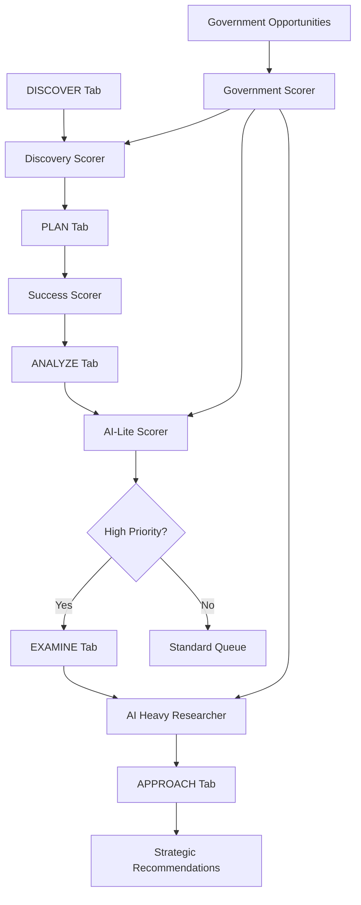

# Grant Research Automation Platform - Scoring Algorithms Documentation

## Overview

The Grant Research Automation Platform uses a sophisticated multi-layered scoring system aligned with the five-stage workflow: **DISCOVER** → **PLAN** → **ANALYZE** → **EXAMINE** → **APPROACH**. Each stage employs specialized scoring algorithms optimized for specific evaluation criteria and user decision-making needs.

> **📋 Related Documentation**: For optimization opportunities and implementation roadmap, see [SCORING_OPTIMIZATION_ANALYSIS.md](SCORING_OPTIMIZATION_ANALYSIS.md)

## Enhanced Workflow-Based Intelligence Architecture

```
DISCOVER Tab           →    PLAN Tab              →    ANALYZE Tab           →    EXAMINE Tab           →    APPROACH Tab
4-Track Discovery           Deep Intelligence          Research Platform          Dossier Builder            Decision Framework
• Nonprofit+BMF            • Network Depth Analysis    • Website Research         • Comprehensive Research   • Go/No-Go Decisions
• Federal Opportunities    • Foundation Scoring        • Document Parsing         • All Data Consolidation   • Implementation Plans
• State Opportunities      • 990 Data Mining          • Fact Extraction          • Grant Team Documents     • Resource Allocation
• Commercial Opportunities • Relationship Mapping      • Basic Report Generation  • Decision-Ready Dossiers  • Success Optimization
```

### Strategic Evolution: From Scoring to Intelligence

The platform has evolved from a **scoring-focused system** to a **comprehensive grant research intelligence platform**:

- **DISCOVER**: Streamlined opportunity identification with type-specific algorithms
- **PLAN**: Deep organizational and network intelligence with visualization
- **ANALYZE**: Research automation and data gathering (beyond scoring)
- **EXAMINE**: Complete dossier compilation for grant team decisions
- **APPROACH**: Strategic decision synthesis with implementation roadmaps

## Table of Contents

### By Workflow Stage
1. [DISCOVER Tab - Discovery Scoring](#discover-tab---discovery-scoring)
2. [PLAN Tab - Success Assessment](#plan-tab---success-assessment)
3. [ANALYZE Tab - AI-Lite Analysis](#analyze-tab---ai-lite-analysis)
4. [EXAMINE Tab - AI Heavy Intelligence](#examine-tab---ai-heavy-intelligence)
5. [APPROACH Tab - Strategic Recommendations](#approach-tab---strategic-recommendations)

### Cross-Cutting Systems
6. [Government Opportunity Scorer](#government-opportunity-scorer-cross-cutting)
7. [System Integration & Data Flow](#system-integration--data-flow)
8. [Performance Metrics & Optimization](#performance-metrics--optimization)
9. [Developer Guide](#developer-guide)

---

## DISCOVER Tab - 4-Track Opportunity Discovery

**Primary Component**: Enhanced Discovery Scorer with Track-Specific Algorithms (`src/scoring/discovery_scorer.py`)
**Purpose**: Streamlined opportunity identification across 4 distinct opportunity tracks
**User Goal**: Efficiently discover and filter opportunities through simplified, type-aware workflow

### 4-Track Discovery System Overview

The DISCOVER tab now features a streamlined **4-track system** that eliminates complexity while providing opportunity-type-specific intelligence:

#### Track 1: Nonprofit + BMF Integration
- **Combined NTEE-First Approach**: Integrated BMF filtering using NTEE codes as primary filter
- **Revenue Compatibility**: Nonprofit-specific revenue analysis (typically $50K-$50M range)
- **Program Alignment**: NTEE code matching with mission compatibility scoring
- **Board Network Preview**: Early board connection identification

#### Track 2: Federal Opportunities
- **Government Eligibility**: Federal agency-specific eligibility requirements
- **Revenue Compatibility**: Federal grant capacity analysis (typically $100K-$10M+ range)
- **Award Size Matching**: Multi-tier award amount compatibility
- **Historical Success**: Federal funding track record integration

#### Track 3: State Opportunities  
- **Geographic Advantage**: State-specific eligibility and location benefits
- **Revenue Compatibility**: State grant capacity analysis (typically $25K-$2M range)
- **Regional Competition**: State-level competitive advantage assessment
- **Local Network**: State-specific relationship mapping

#### Track 4: Commercial Opportunities
- **Corporate Foundation**: Private foundation and corporate giving programs
- **Revenue Compatibility**: Commercial partnership capacity (typically $10K-$500K range)
- **Strategic Alignment**: Corporate mission and CSR alignment scoring
- **Partnership Potential**: Long-term relationship development opportunities

### Enhanced Core Philosophy - DISCOVER Stage
- **Track-Specific Optimization**: Each track uses optimized algorithms for opportunity type
- **Simplified User Experience**: 4 clear paths instead of complex multi-track navigation
- **Revenue Type Awareness**: Opportunity-specific financial compatibility assessment
- **Integrated BMF Processing**: Seamless nonprofit data integration without separate filtering

### Track-Specific Scoring Dimensions

Each of the 4 tracks uses optimized scoring weights based on opportunity type characteristics:

#### Track 1: Nonprofit + BMF Scoring Weights
| Dimension | Weight | Purpose | Track-Specific Focus |
|-----------|--------|---------|---------------------|
| **NTEE Compatibility** | 0.40 | Primary nonprofit filter | NTEE code exact/similar matching |
| **Program Alignment** | 0.25 | Mission and activity fit | Activity codes, program descriptions |
| **Revenue Compatibility** | 0.20 | Nonprofit capacity range | $50K-$50M revenue analysis |
| **Geographic Proximity** | 0.10 | Board connection potential | Same state/region networking |
| **Board Network Preview** | 0.05 | Early relationship identification | Shared board member detection |

#### Track 2: Federal Opportunities Scoring Weights  
| Dimension | Weight | Purpose | Track-Specific Focus |
|-----------|--------|---------|---------------------|
| **Eligibility Compliance** | 0.35 | Federal requirements | Detailed eligibility criteria matching |
| **Award Size Compatibility** | 0.25 | Federal capacity analysis | $100K-$10M+ award matching |
| **Agency Alignment** | 0.20 | Federal agency fit | Agency mission and priority alignment |
| **Historical Success** | 0.15 | Federal track record | Past federal funding success |
| **Geographic Eligibility** | 0.05 | Federal geographic requirements | Multi-state, regional preferences |

#### Track 3: State Opportunities Scoring Weights
| Dimension | Weight | Purpose | Track-Specific Focus |
|-----------|--------|---------|---------------------|
| **Geographic Advantage** | 0.35 | State-specific benefits | In-state priority, regional advantages |
| **State Program Alignment** | 0.25 | State priority matching | State initiative and program alignment |
| **Revenue Compatibility** | 0.20 | State grant capacity | $25K-$2M typical state grant range |
| **Local Network Strength** | 0.15 | State relationship mapping | Local connections, regional networks |
| **Timing Advantage** | 0.05 | State deadline management | State-specific application cycles |

#### Track 4: Commercial Opportunities Scoring Weights
| Dimension | Weight | Purpose | Track-Specific Focus |
|-----------|--------|---------|---------------------|
| **Strategic Partnership Fit** | 0.30 | Corporate alignment | Corporate mission, CSR program fit |
| **Revenue Compatibility** | 0.25 | Commercial capacity | $10K-$500K partnership range |
| **Industry Alignment** | 0.20 | Corporate sector matching | Industry focus, business sector alignment |
| **Partnership Potential** | 0.15 | Long-term relationship value | Strategic partnership development |
| **Foundation Type Match** | 0.10 | Foundation category fit | Corporate vs family foundation alignment |

### Detailed Discovery Scoring Calculations

#### Base Compatibility (0-1.0) - Primary Filter
```python
score = 0.5  # Base score for any opportunity

# NTEE code alignment - core for nonprofits
if organization_ntee in opportunity_ntee: 
    score += 0.3  # Strong program area match

# Government criteria alignment - for government opportunities
matching_criteria = count_matching_criteria(profile.government_criteria, opportunity_text)
score += min(0.4, matching_criteria * 0.1)  # Up to 40% bonus for criteria match

# Revenue compatibility - basic organizational size fit
if 50000 <= organization_revenue <= 50000000:  # Reasonable nonprofit range
    score += 0.2  # Size compatibility bonus
```

#### Strategic Alignment (0-1.0) - Mission Focus
```python
score = 0.5  # Base alignment

# Focus area alignment - core strategic fit
if hasattr(profile, 'focus_areas') and profile.focus_areas:
    opp_text = f"{opportunity.get('organization_name', '')} {opportunity.get('description', '')}".lower()
    
    for focus_area in profile.focus_areas:
        if focus_area.lower() in opp_text:
            score += 0.15  # Each matching focus area adds value

# Mission statement keyword alignment - deeper compatibility
if hasattr(profile, 'mission_statement') and profile.mission_statement:
    mission_keywords = profile.mission_statement.lower().split()
    opp_text = f"{opportunity.get('organization_name', '')} {opportunity.get('description', '')}".lower()
    
    keyword_matches = sum(1 for keyword in mission_keywords 
                        if len(keyword) > 4 and keyword in opp_text)
    if keyword_matches > 0:
        score += min(0.3, keyword_matches * 0.05)  # Up to 30% bonus for keyword alignment
```

#### Geographic Advantage (0-1.0) - Location Benefits
```python
score = 0.5  # Base score

opp_state = opportunity.get('external_data', {}).get('state', '').upper()
profile_state = getattr(profile, 'state', '').upper()

# Same state advantage - reduced competition, local knowledge
if opp_state and profile_state and opp_state == profile_state:
    score += 0.4  # Significant advantage for local opportunities

# Virginia preference - based on analysis showing 78% VA concentration
if profile_state == 'VA':
    score += 0.1  # Additional boost for VA organizations
```

### Discovery Boost Factors
When enhanced data is available (990 filings, board connections, etc.), the Discovery Scorer applies boost factors:

```python
boost_factors = {
    "has_990_data": 0.10,           # Financial data available for deeper analysis
    "exact_ntee_match": 0.15,       # Perfect program alignment
    "board_connections": 0.05,      # Shared board members identified
    "historical_success": 0.08,     # Past award history available
    "geographic_priority": 0.03     # Target state preference match
}
```

### DISCOVER Tab Promotion Thresholds
- **Auto-Promotion to PLAN**: 0.75+ (high-confidence opportunities)
- **Promotion Recommended**: 0.65+ (strong candidates for review)
- **Review Required**: 0.45-0.65 (borderline opportunities)
- **Low Priority**: <0.45 (monitor for future consideration)

### DISCOVER Tab User Experience Integration
The Discovery Scorer results directly drive the DISCOVER tab interface:
- **Score-based sorting** for opportunity lists
- **Color-coded indicators** for promotion recommendations
- **Quick filtering** by score ranges
- **Auto-promotion notifications** for high-scoring opportunities

> **⚠️ Optimization Note**: Current promotion thresholds have inconsistencies. See [DISCOVER Tab Foundation Issues](SCORING_OPTIMIZATION_ANALYSIS.md#discover-tab---foundation-issues) for recommended improvements.

---

## PLAN Tab - Deep Intelligence & Strategic Positioning

**Primary Component**: Enhanced Success Scorer + Network Intelligence Engine (`src/analytics/success_scorer.py`)
**Purpose**: Comprehensive organizational intelligence with deep network and foundation analysis
**User Goal**: Strategic positioning through relationship mapping, foundation intelligence, and organizational optimization

### Deep Intelligence Overview

The PLAN tab provides sophisticated organizational and network intelligence that goes far beyond basic assessment. It combines organizational health analysis with advanced relationship mapping, foundation scoring, and comprehensive 990 data mining to create a strategic positioning framework.

### Enhanced Core Philosophy - PLAN Stage
- **Network Depth Intelligence**: Multi-degree relationship mapping and analysis
- **Foundation Ecosystem Mapping**: Grantor analysis and similar grantee identification
- **Deep Data Mining**: Comprehensive 990/990-PF data extraction and analysis
- **Visualization-Driven Insights**: Interactive network and grantee relationship mapping
- **Strategic Positioning**: Actionable intelligence for competitive advantage

### Core Intelligence Modules

#### Module 1: Network Depth Analysis
- **1st Degree Connections**: Direct board member connections and their influence scores
- **2nd Degree Connections**: Board-to-board relationships and indirect pathways
- **3rd Degree Connections**: Extended network reach and introduction possibilities
- **Connection Strength Scoring**: Relationship quality and access probability assessment
- **POC Integration**: Points of Contact mapping alongside board member analysis

#### Module 2: Foundation Intelligence & Scoring
- **Grantor Analysis**: Foundation giving patterns, preferences, and decision-makers
- **Similar Grantee Identification**: Organizations with comparable missions receiving funding
- **Foundation Ecosystem Mapping**: Network of related foundations and corporate giving programs
- **Giving Pattern Analysis**: Historical funding trends, award sizes, and timing patterns
- **Foundation Board Overlap**: Shared board members between foundations and grantees

#### Module 3: Comprehensive 990/990-PF Data Mining
- **Financial Health Deep Dive**: Multi-year trend analysis and financial ratios
- **Unsolicited Request Indicators**: 990-PF checkbox analysis for unsolicited funding opportunities
- **Program Expense Analysis**: Detailed program vs administrative expense ratios
- **Grant-Making Patterns**: 990-PF analysis of foundation giving strategies
- **Governance Intelligence**: Board compensation, meeting frequency, and governance quality indicators
- **Hidden Opportunities**: Non-standard data points revealing strategic advantages

#### Module 4: Visualization & Relationship Mapping
- **Network Spiderweb Visualization**: Interactive network maps showing connection depths and strengths
- **Grantee Ecosystem Spiderweb**: Visual mapping of similar organizations and their funding sources
- **Foundation Landscape Mapping**: Visual representation of foundation relationships and giving patterns
- **Competitive Positioning Maps**: Visual analysis of organizational position relative to similar entities

### Enhanced Intelligence Assessment Dimensions (6 Weighted Factors)

| Dimension | Weight | Purpose | Enhanced PLAN Tab Focus |
|-----------|--------|---------|------------------------|
| **Network Intelligence** | 0.30 | Multi-degree relationship analysis | 1st/2nd/3rd degree connections, POC mapping, access pathways |
| **Foundation Ecosystem** | 0.25 | Grantor and peer analysis | Foundation scoring, similar grantee analysis, giving patterns |
| **Financial Health Plus** | 0.20 | Deep financial intelligence | 990 mining, multi-year trends, hidden financial indicators |
| **Strategic Positioning** | 0.15 | Competitive advantage analysis | Market position, unique value proposition, differentiation |
| **Organizational Capacity** | 0.10 | Enhanced infrastructure assessment | Leadership, governance quality, operational sophistication |

### Network Intelligence Scoring (0.30 Weight)

#### Connection Depth Analysis
```python
def calculate_network_intelligence_score(connections_data):
    # 1st Degree Connections (Direct board overlap)
    first_degree_score = min(1.0, len(connections_data['direct_board_overlap']) / 15)
    first_degree_weight = 0.5
    
    # 2nd Degree Connections (Board-to-board relationships)  
    second_degree_score = min(1.0, len(connections_data['board_to_board']) / 25)
    second_degree_weight = 0.3
    
    # 3rd Degree Connections (Extended network reach)
    third_degree_score = min(1.0, len(connections_data['extended_network']) / 50)
    third_degree_weight = 0.2
    
    return (
        first_degree_score * first_degree_weight +
        second_degree_score * second_degree_weight +
        third_degree_score * third_degree_weight
    )
```

#### POC and Board Member Integration
```python
def integrate_poc_board_analysis(board_data, poc_data):
    combined_network = {
        'board_members': board_data,
        'points_of_contact': poc_data,
        'overlap_analysis': identify_board_poc_overlap(board_data, poc_data),
        'access_pathways': calculate_introduction_pathways(board_data, poc_data),
        'influence_scores': assess_combined_influence(board_data, poc_data)
    }
    return combined_network
```

### Foundation Ecosystem Scoring (0.25 Weight)

#### Grantor Analysis Framework
```python
def calculate_foundation_ecosystem_score(foundation_data):
    # Foundation overlap with similar organizations
    similar_grantee_overlap = analyze_grantee_overlap(foundation_data['similar_orgs'])
    
    # Foundation board connections
    foundation_board_connections = identify_foundation_board_overlap(foundation_data)
    
    # Giving pattern compatibility  
    giving_pattern_fit = assess_giving_pattern_alignment(foundation_data['patterns'])
    
    # Foundation ecosystem position
    ecosystem_centrality = calculate_foundation_network_centrality(foundation_data)
    
    return weighted_combination(
        similar_grantee_overlap * 0.4,
        foundation_board_connections * 0.3,
        giving_pattern_fit * 0.2,
        ecosystem_centrality * 0.1
    )
```

### 990/990-PF Deep Data Mining

#### Unsolicited Request Analysis
```python
def mine_990_pf_opportunities(form_990_pf_data):
    unsolicited_indicators = {
        'accepts_unsolicited': form_990_pf_data.get('unsolicited_requests_checkbox'),
        'application_process': extract_application_process_details(form_990_pf_data),
        'giving_priorities': identify_giving_priorities(form_990_pf_data),
        'board_meeting_frequency': extract_board_meeting_data(form_990_pf_data),
        'geographic_preferences': analyze_geographic_giving_patterns(form_990_pf_data)
    }
    return unsolicited_indicators
```

#### Hidden Opportunity Identification
```python
def identify_hidden_opportunities(nonprofit_990_data, foundation_990_pf_data):
    hidden_gems = {
        'shared_board_governance': identify_governance_overlaps(nonprofit_990_data, foundation_990_pf_data),
        'program_alignment_signals': detect_program_compatibility(nonprofit_990_data, foundation_990_pf_data),
        'financial_compatibility': assess_financial_fit(nonprofit_990_data, foundation_990_pf_data),
        'geographic_synergy': identify_geographic_advantages(nonprofit_990_data, foundation_990_pf_data),
        'timing_opportunities': detect_optimal_approach_timing(foundation_990_pf_data)
    }
    return hidden_gems
```

### Detailed Success Assessment Calculations

#### Financial Health Scoring (0-1.0) - Foundation Assessment
```python
# Revenue growth analysis
revenue_growth = (current_revenue - previous_revenue) / max(previous_revenue, 1)
growth_score = min(1.0, max(0, 0.5 + revenue_growth))

# Financial stability assessment
revenue_history = data.get('revenue_history', [current_revenue])
revenue_stability = 1 - (np.std(revenue_history) / max(np.mean(revenue_history), 1))
stability_score = max(0, min(1.0, revenue_stability))

# Financial efficiency analysis
total_expenses = data.get('total_expenses', current_revenue * 0.8)
expense_efficiency = 1 - (total_expenses / max(current_revenue, 1))
efficiency_score = max(0, min(1.0, expense_efficiency))

# Organizational size factor
size_factor = min(1.0, np.log10(max(current_revenue, 1000)) / 7)  # Scale to $10M

# Weighted financial health score
financial_score = (
    growth_score * 0.3 +        # Revenue growth trend
    stability_score * 0.25 +    # Financial consistency
    equity_score * 0.2 +        # Financial position
    efficiency_score * 0.15 +   # Operational efficiency
    size_factor * 0.1           # Organizational scale
)
```

#### Organizational Capacity Scoring (0-1.0) - Infrastructure Assessment
```python
# Infrastructure capacity scores
staff_score = min(1.0, np.log10(max(staff_count, 1)) / 2)      # Scale to 100 staff
experience_score = min(1.0, leadership_experience / 15)        # Scale to 15 years
board_score = min(1.0, board_size / 15)                       # Scale to 15 members
longevity_score = min(1.0, years_active / 20)                 # Scale to 20 years
diversity_score = min(1.0, program_diversity / 10)            # Scale to 10 programs

# Weighted organizational capacity
capacity_score = (
    staff_score * 0.25 +        # Human resources
    experience_score * 0.25 +   # Leadership quality
    board_score * 0.2 +         # Governance strength
    longevity_score * 0.2 +     # Organizational maturity
    diversity_score * 0.1       # Program breadth
)
```

### PLAN Tab Confidence Calculation
```python
# Multi-factor confidence assessment
def calculate_confidence(data, dimension_scores):
    # Data completeness factor (40%)
    required_fields = ['total_revenue', 'staff_count', 'years_active', 
                      'program_areas', 'total_grants_received', 'successful_grants']
    completeness = available_fields / len(required_fields)
    
    # Score consistency factor (30%)
    score_variance = np.var(list(dimension_scores.values()))
    consistency = 1 - min(1.0, score_variance * 4)
    
    # Data recency factor (30%)
    days_old = (current_date - last_update_date).days
    recency = max(0, 1 - days_old / 365)
    
    return completeness * 0.4 + consistency * 0.3 + recency * 0.3
```

### PLAN Tab Improvement Recommendations
The Success Scorer generates actionable improvement suggestions based on low-scoring dimensions:

```python
# Dimension-specific improvement strategies
improvement_strategies = {
    'financial_health': [
        "Focus on revenue growth strategies and new funding sources",
        "Improve financial stability through diversified revenue streams",
        "Optimize operational expenses to improve financial efficiency"
    ],
    'organizational_capacity': [
        "Consider expanding staff to support organizational growth",
        "Invest in leadership development and experienced hires",
        "Strengthen board governance with additional qualified members"
    ],
    'strategic_alignment': [
        "Refine mission statement to better align with target opportunities",
        "Develop programs that better match target funding areas"
    ]
}
```

### PLAN Tab User Experience Integration
- **Radar charts** showing dimensional strengths and weaknesses
- **Improvement priority lists** with specific action items
- **Confidence indicators** for each assessment area
- **Trend analysis** showing organizational development over time

> **🎯 Enhancement Opportunity**: Weight distribution could be optimized for better readiness assessment. See [PLAN Tab Tuning Requirements](SCORING_OPTIMIZATION_ANALYSIS.md#plan-tab---tuning-requirements) for proposed improvements.

---

## ANALYZE Tab - AI-Lite Research & Scoring Platform

**Primary Component**: AI-Lite Research & Scoring Engine (`src/processors/analysis/ai_lite_scorer.py`)
**Purpose**: Dual-function platform providing both scoring analysis and comprehensive research for grant evaluation teams
**User Goal**: Obtain AI-powered scores AND detailed research reports for informed decision-making

### AI-Lite Platform Overview

The AI-Lite platform serves a dual role in the ANALYZE tab: it maintains sophisticated scoring capabilities while functioning as a comprehensive research and data gathering tool. This platform generates both quantitative scores and qualitative research reports that grant evaluation teams can review for informed decision-making.

### Enhanced Core Philosophy - ANALYZE Stage
- **Dual-Function Platform**: Simultaneous scoring and research capabilities
- **Team-Ready Reports**: Generate evaluation-ready reports for grant teams
- **Cost-Effective Research**: Optimize research depth per dollar spent
- **Data Gathering Automation**: Systematic collection of opportunity intelligence
- **Batch Research Efficiency**: Process multiple opportunities with comprehensive analysis
- **Decision Support**: Provide both scores and supporting research evidence

### AI-Lite Research Capabilities

#### Research Module 1: Website Intelligence & Document Parsing
- **Grant Opportunity Website Research**: Automated discovery and parsing of opportunity websites
- **Documentation Analysis**: Extract and analyze grant guidelines, RFPs, and application materials
- **Eligibility Requirements Extraction**: Systematic parsing of detailed eligibility criteria
- **Application Process Mapping**: Step-by-step application process documentation
- **Deadline and Timeline Analysis**: Comprehensive timeline extraction and analysis

#### Research Module 2: Strategic Intelligence Gathering
- **Mission Statement Analysis**: Deep analysis of funder mission and organizational priorities
- **Evaluation Criteria Research**: Detailed extraction and analysis of scoring criteria
- **POC Identification**: Contact information and decision-maker identification
- **Organizational Background Research**: Funder history, giving patterns, and strategic priorities
- **Competitive Landscape Analysis**: Assessment of likely competition and application volume

#### Research Module 3: Fact Extraction & Verification
- **Key Dates and Deadlines**: Systematic extraction of all critical dates
- **Financial Requirements**: Award amounts, matching requirements, budget restrictions
- **Geographic Restrictions**: Detailed geographic eligibility analysis
- **Program Requirements**: Specific program delivery and outcome requirements
- **Reporting Obligations**: Post-award reporting and compliance requirements

### AI-Lite Dual-Function Output Structure

```python
class AILiteComprehensiveOutput:
    # SCORING COMPONENTS (Original Function)
    compatibility_score: float      # 0-1 AI-assessed compatibility
    strategic_value: StrategicValue # "high", "medium", "low" strategic importance
    risk_assessment: List[str]      # Identified risk factors
    priority_rank: int              # Priority ranking within batch
    funding_likelihood: float       # 0-1 probability of funding success
    strategic_rationale: str        # 2-sentence strategic analysis
    action_priority: ActionPriority # "immediate", "planned", "monitor"
    confidence_level: float         # 0-1 analysis confidence
    
    # RESEARCH COMPONENTS (New Function)
    research_report: ResearchReport          # Comprehensive research findings
    website_intelligence: WebsiteIntel      # Website analysis and document parsing
    fact_extraction: FactExtraction         # Systematically gathered facts
    evaluation_summary: EvaluationSummary   # Grant team decision support
    competitive_analysis: CompetitiveAnalysis # Competition and positioning analysis
```

#### Grant Team Research Report Structure
```python
class ResearchReport:
    executive_summary: str           # 200-word executive summary for grant teams
    opportunity_overview: str        # Detailed opportunity description and context
    eligibility_analysis: List[str]  # Point-by-point eligibility assessment
    application_requirements: List[RequirementDetail] # Detailed application requirements
    key_dates_timeline: List[DateMilestone]           # All critical dates and deadlines
    evaluation_criteria: List[CriteriaDetail]         # Detailed scoring criteria analysis
    funding_details: FundingAnalysis                  # Award amounts, restrictions, terms
    strategic_considerations: List[str]               # Strategic factors for consideration
    recommended_approach: ApproachRecommendation     # Tactical approach recommendations
    decision_factors: List[DecisionFactor]           # Key factors for go/no-go decision
    
class WebsiteIntelligence:
    primary_website_url: str         # Main opportunity website
    additional_resources: List[str]  # Related documents and resources
    contact_information: List[ContactDetail] # POCs and decision-makers
    application_portal_details: PortalInfo   # Application submission details
    funder_background: FunderProfile         # Organization background and mission
    
class FactExtraction:
    award_amount_range: str          # "$50,000 - $500,000"
    application_deadline: datetime   # Precise deadline with timezone
    project_period: str              # "12-24 months"
    matching_requirements: str       # Matching funds or in-kind requirements
    geographic_eligibility: List[str] # Eligible states, regions, or areas
    organizational_requirements: List[str] # Specific organizational qualifications
    program_requirements: List[str]  # Required program activities or outcomes
    reporting_requirements: List[str] # Post-award reporting obligations
```

### AI-Lite Processing Parameters
```python
# Cost optimization settings
model = "gpt-3.5-turbo"          # Cost-effective model choice
batch_size = 15                   # Optimal candidates per API call
max_tokens = 150                  # Concise responses for cost control
temperature = 0.3                 # Lower temperature for consistency
estimated_cost = 0.0001          # Per candidate cost estimate
```

### ANALYZE Tab AI Prompt Structure
The AI-Lite Scorer uses sophisticated prompts optimized for strategic analysis:

```python
def create_enhanced_batch_prompt(self, request_data):
    # Comprehensive organization context
    profile_section = f"""ANALYZING ORGANIZATION PROFILE:
    Name: {profile.organization_name}
    Mission: {profile.mission_statement}
    Focus Areas: {', '.join(profile.focus_areas)}
    NTEE Codes: {', '.join(profile.ntee_codes)}
    Geographic Scope: {profile.geographic_scope}
    Funding History: {profile.funding_history}"""
    
    # Detailed candidate analysis requirements
    analysis_requirements = """
    SCORING CRITERIA:
    - compatibility_score: 0.0-1.0 mission/focus alignment
    - strategic_value: "high", "medium", or "low" overall importance
    - risk_assessment: Choose from predefined risk categories
    - funding_likelihood: 0.0-1.0 probability of success
    - strategic_rationale: Concise strategic reasoning (2 sentences max)
    - action_priority: "immediate", "planned", or "monitor"
    """
```

### AI-Lite Risk Assessment Categories
```python
risk_categories = [
    "high_competition",          # Many qualified applicants expected
    "technical_requirements",    # Complex technical expertise needed
    "geographic_mismatch",       # Location disadvantage
    "capacity_concerns",         # Organizational capacity questions
    "timeline_pressure",         # Tight deadline constraints
    "compliance_complex",        # Complex regulatory requirements
    "matching_required",         # Matching funds required
    "reporting_intensive",       # Heavy reporting requirements
    "board_connections_needed"   # Relationship building required
]
```

### ANALYZE Tab Strategic Value Classification
- **High Strategic Value**: Mission-critical opportunities with transformational potential
- **Medium Strategic Value**: Good opportunities that advance organizational goals
- **Low Strategic Value**: Incremental opportunities worth monitoring

### ANALYZE Tab User Experience Integration
- **AI-generated insights** displayed prominently for each opportunity
- **Risk factor badges** for quick visual assessment
- **Priority rankings** within opportunity batches
- **Action priority indicators** guiding next steps
- **Confidence scores** showing AI assessment reliability

> **🚀 Major Updates Needed**: Batch processing and risk categorization require significant enhancement. See [ANALYZE Tab Major Updates](SCORING_OPTIMIZATION_ANALYSIS.md#analyze-tab---major-updates-needed) for detailed optimization plan.

---

## EXAMINE Tab - AI Heavy Research & Intelligence Platform

**Primary Component**: AI Heavy Research & Strategic Intelligence Engine (`src/processors/analysis/ai_heavy_researcher.py`)
**Purpose**: Dual-function platform providing sophisticated scoring AND comprehensive dossier generation for grant evaluation teams
**User Goal**: Obtain deep strategic intelligence scores AND complete decision-ready dossiers for final grant team evaluation

### AI Heavy Platform Overview

The AI Heavy platform serves as both an advanced scoring engine and a comprehensive dossier builder for the EXAMINE tab. It maintains sophisticated strategic scoring while functioning as an all-inclusive research platform that consolidates loose ends, completes data collection, and builds comprehensive documents for grant team final decisions.

### Enhanced Core Philosophy - EXAMINE Stage
- **Dual-Function Intelligence**: Advanced scoring combined with comprehensive dossier creation
- **Grant Team Decision Support**: Complete decision-ready documents for evaluation teams
- **All-Inclusive Research**: Consolidate all loose ends and complete data collection
- **Strategic Depth Analysis**: Deep analysis of high-value opportunities with full documentation
- **Relationship Intelligence**: Board connections, introduction strategies, and access pathways
- **Implementation-Ready Outputs**: Detailed action plans with supporting research documentation

### AI Heavy Research & Dossier Capabilities

#### Dossier Module 1: Comprehensive Research Consolidation
- **All Source Integration**: Consolidate research from DISCOVER, PLAN, and ANALYZE tabs
- **Loose End Resolution**: Address all unanswered questions and data gaps
- **Deep Background Research**: Complete organizational and opportunity background analysis
- **Relationship Mapping**: Comprehensive relationship analysis and introduction strategies
- **Strategic Position Analysis**: Complete competitive and strategic positioning assessment

#### Dossier Module 2: Grant Team Decision Documentation
- **Executive Decision Summary**: Complete executive summary for grant team leadership
- **Detailed Opportunity Analysis**: Comprehensive opportunity assessment with supporting evidence
- **Strategic Recommendation**: Clear go/no-go recommendation with detailed justification
- **Implementation Roadmap**: Complete implementation plan with timelines, resources, and milestones
- **Risk Analysis & Mitigation**: Comprehensive risk assessment with mitigation strategies
- **Success Probability Assessment**: Detailed analysis of success factors and likelihood

#### Dossier Module 3: Complete Data Collection & Analysis
- **Financial Analysis Deep Dive**: Complete financial feasibility and capacity analysis
- **Competitive Intelligence**: Detailed competitive landscape and positioning analysis
- **Relationship Strategy**: Complete relationship mapping and introduction pathway analysis
- **Application Intelligence**: Comprehensive application strategy and requirements analysis
- **Post-Award Considerations**: Implementation requirements, reporting, and compliance analysis

### Phase 3 Enhanced Intelligence Features
```python
class OpportunityCategory(Enum):
    STRATEGIC_PARTNER = "strategic_partner"      # Long-term strategic relationship potential
    FUNDING_SOURCE = "funding_source"           # Primary funding opportunity
    NETWORK_GATEWAY = "network_gateway"         # Access to broader network
    CAPACITY_BUILDER = "capacity_builder"       # Skills/infrastructure development
    INNOVATION_CATALYST = "innovation_catalyst" # New program development
    SUSTAINABILITY_ANCHOR = "sustainability_anchor" # Long-term sustainability
```

### AI Heavy Dual-Function Output Structure

```python
class AIHeavyComprehensiveOutput:
    # SCORING COMPONENTS (Enhanced Original Function)
    partnership_assessment: PartnershipAssessment    # Mission alignment (0-100)
    funding_strategy: FundingStrategy               # Optimal approach strategy
    competitive_analysis: CompetitiveAnalysis       # Market positioning analysis
    relationship_strategy: RelationshipStrategy     # Introduction pathways
    financial_analysis: FinancialAnalysis          # Capacity assessment (0-100)
    risk_assessment: RiskAssessment                 # Risk factors (0-1 probability)
    grant_application_intelligence: GrantIntelligence # Detailed requirements
    recommended_approach: RecommendedApproach       # Strategic recommendations
    
    # DOSSIER COMPONENTS (New Grant Team Function)
    grant_team_dossier: GrantTeamDossier           # Complete decision document
    executive_decision_brief: ExecutiveBrief       # Leadership summary
    implementation_blueprint: ImplementationPlan   # Detailed implementation guide
    relationship_intelligence: RelationshipIntel   # Complete relationship analysis
    competitive_positioning: CompetitivePosition   # Market position and strategy
    
#### Grant Team Dossier Structure
```python
class GrantTeamDossier:
    executive_summary: str                    # 500-word executive summary for decision-makers
    opportunity_assessment: OpportunityAssess # Complete opportunity evaluation
    strategic_recommendation: StrategyRecommend # Go/no-go with detailed justification
    implementation_plan: ImplementationPlan   # Complete implementation roadmap
    resource_requirements: ResourceAnalysis   # Detailed resource and budget analysis
    success_probability: SuccessAnalysis      # Detailed success factor analysis
    risk_mitigation_plan: RiskMitigationPlan # Complete risk management strategy
    relationship_execution: RelationshipPlan  # Relationship building and introduction strategy
    application_strategy: ApplicationStrategy # Complete application approach
    decision_timeline: DecisionTimeline       # Recommended decision and action timeline
    
class ExecutiveDecisionBrief:
    recommendation: str              # "PURSUE", "CONDITIONAL", "DECLINE"
    confidence_level: float         # 0-1 confidence in recommendation
    key_decision_factors: List[str] # Top 5 factors driving recommendation
    resource_commitment: str        # Required resource commitment level
    success_probability: float      # 0-1 probability of successful outcome
    strategic_value: str           # Strategic value to organization
    implementation_timeline: str    # Timeline from go-decision to application
    critical_dependencies: List[str] # Critical factors for success
    
class ImplementationBlueprint:
    phase_1_preparation: List[ActionItem]    # Immediate preparation actions
    phase_2_relationship_building: List[ActionItem] # Relationship development
    phase_3_application_development: List[ActionItem] # Application creation
    phase_4_submission: List[ActionItem]     # Submission and follow-up
    resource_allocation: ResourcePlan        # Detailed resource allocation
    timeline_milestones: List[Milestone]     # Critical timeline milestones
    success_metrics: List[SuccessMetric]     # Metrics for tracking progress
    contingency_plans: List[ContingencyPlan] # Alternative approaches
```

### EXAMINE Tab Partnership Assessment
```python
class PartnershipAssessment:
    mission_alignment_score: int      # 0-100 alignment assessment
    strategic_value: str              # "exceptional", "high", "medium", "low"
    mutual_benefits: List[str]        # Benefits for both organizations
    partnership_potential: str        # "long_term_strategic", "project_based", "transactional"
    synergy_opportunities: List[str]  # Specific collaboration opportunities
```

### EXAMINE Tab Grant Application Intelligence
This is a unique feature providing comprehensive grant readiness analysis:

```python
class GrantApplicationIntelligence:
    eligibility_analysis: List[EligibilityRequirement]    # Detailed eligibility breakdown
    application_requirements: List[ApplicationRequirement] # Document requirements
    grant_timeline: GrantTimeline                         # Complete timeline
    effort_estimation: EffortEstimation                   # LOE with project phases
    application_strategy: List[str]                       # Strategic approach
    success_factors: List[str]                           # Key success elements
    competitive_advantages: List[str]                     # Organization strengths
```

### Effort Estimation with Project Management
```python
class EffortEstimation:
    total_hours_estimate: str                           # "120-180 hours"
    preparation_phases: List[Dict[str, Any]]            # Phase breakdown with deliverables
    required_expertise: List[str]                       # Needed skills and roles
    external_support_needed: List[str]                  # Outside assistance required
    critical_path_activities: List[Dict[str, str]]      # Timeline-critical tasks
    risk_factors: List[Dict[str, str]]                  # Timeline and execution risks
    success_accelerators: List[str]                     # Factors that speed up process
```

### AI Heavy Cost Structure
```python
cost_multipliers = {
    AnalysisDepth.STANDARD: 0.6,        # $0.108 per dossier
    AnalysisDepth.COMPREHENSIVE: 1.0,   # $0.18 per dossier
    AnalysisDepth.STRATEGIC: 1.4        # $0.252 per dossier
}
```

### EXAMINE Tab Intelligent Categorization
The AI Heavy Researcher uses ML-based pattern recognition to categorize opportunities:

```python
def categorize_opportunity(self, request_data):
    # Strategic partnership indicators
    if (compatibility_score > 0.8 and strategic_value == "exceptional" and 
        board_connections_available):
        return OpportunityCategory.STRATEGIC_PARTNER
    
    # Innovation catalyst indicators
    if ("innovation" in org_name or "technology" in org_name or 
        "catalyst" in strategic_rationale):
        return OpportunityCategory.INNOVATION_CATALYST
```

### EXAMINE Tab Enhanced User Experience Integration
- **Dual-Function Dashboard**: Scores and comprehensive dossiers side-by-side
- **Grant Team Decision Documents**: Complete decision-ready reports for evaluation teams
- **Interactive Dossier Navigation**: Sectioned dossiers with executive summaries and detailed analysis
- **Implementation Blueprint Visualization**: Gantt charts and timeline visualizations for implementation plans
- **Relationship Intelligence Mapping**: Interactive relationship maps with introduction pathways
- **Risk/Opportunity Decision Matrices**: Visual decision support tools for grant teams
- **Success Probability Dashboards**: Confidence intervals and success factor analysis
- **Resource Requirement Calculators**: Detailed resource and budget planning tools
- **Executive Decision Briefs**: Leadership-ready summary documents with clear recommendations

### EXAMINE Tab Grant Team Integration
- **Decision-Ready Outputs**: All outputs formatted for grant team review and decision-making
- **Executive Summary Generation**: Auto-generated executive summaries for leadership review
- **Implementation Roadmap Export**: Exportable implementation plans with timelines and resource requirements
- **Research Evidence Documentation**: Complete supporting research documentation for all recommendations
- **Audit Trail Integration**: Complete audit trail from DISCOVER through EXAMINE for decision transparency

> **🎖️ Enhanced Features Required**: Intelligence categorization and cost optimization present significant opportunities. See [EXAMINE Tab Enhanced Features](SCORING_OPTIMIZATION_ANALYSIS.md#examine-tab---enhanced-features-required) for strategic improvements.

---

## APPROACH Tab - Strategic Recommendations

**Primary Component**: AI Heavy Researcher Output + Cross-System Integration
**Purpose**: Final strategic recommendations and action plans for the APPROACH tab
**User Goal**: Make final go/no-go decisions with clear implementation roadmaps

### APPROACH Tab Overview

The APPROACH tab synthesizes insights from all previous stages to provide final strategic recommendations. It combines AI Heavy Researcher outputs with cross-system scoring to deliver actionable decision support and implementation plans.

### Core Philosophy - APPROACH Stage
- **Decision Support**: Clear go/no-go recommendations with justification
- **Implementation Focus**: Detailed action plans with timelines and resource requirements
- **Risk Management**: Comprehensive risk assessment with mitigation strategies
- **Success Optimization**: Recommendations for maximizing success probability

### Strategic Approach Components
```python
class RecommendedApproach:
    pursuit_recommendation: str       # "high_priority", "medium_priority", "monitor", "pass"
    optimal_request_amount: str       # Specific dollar amount with justification
    timing_strategy: str              # When and how to approach
    positioning_strategy: str         # How to position the organization
    team_composition: List[str]       # Required roles and expertise
    preparation_timeline: str         # Realistic timeline for preparation
    go_no_go_factors: List[str]       # Key decision factors
    success_probability: float        # 0-1 likelihood assessment
```

### APPROACH Tab Action Planning
```python
class ActionPlan:
    immediate_actions: List[ActionItem]    # Next 30 days action items
    six_month_roadmap: List[str]          # 6-month strategic milestones
    success_metrics: List[str]            # KPIs for tracking progress
    investment_recommendation: str        # Resource investment guidance
    roi_projection: str                   # Expected return on investment
```

### Detailed Action Item Structure
```python
class ActionItem:
    action: str                      # Specific action to take
    timeline: str                    # When to complete ("Within 2 weeks")
    priority: str                    # "high", "medium", "low"
    estimated_effort: str            # Time investment required ("2 hours")
    success_indicators: List[str]    # How to measure completion
```

### APPROACH Tab Decision Matrix
The APPROACH tab uses a comprehensive decision matrix incorporating all previous scoring:

| Factor | Weight | Source | Decision Impact |
|--------|--------|--------|-----------------|
| **Discovery Score** | 0.15 | Discovery Scorer | Basic compatibility foundation |
| **Success Assessment** | 0.20 | Success Scorer | Organizational readiness |
| **AI-Lite Analysis** | 0.25 | AI-Lite Scorer | Strategic fit and risk |
| **AI Heavy Intelligence** | 0.30 | AI Heavy Researcher | Comprehensive strategic analysis |
| **Implementation Feasibility** | 0.10 | Cross-system analysis | Resource and timeline reality |

### APPROACH Tab Recommendation Categories

#### High Priority Pursuit (Score: 0.80+)
- **Characteristics**: Exceptional strategic fit with high success probability
- **Investment Level**: Full resource commitment recommended
- **Timeline**: Immediate action with comprehensive preparation
- **Risk Tolerance**: Accept moderate risks for high-value opportunities

#### Medium Priority Pursuit (Score: 0.60-0.79)
- **Characteristics**: Good strategic fit with reasonable success probability
- **Investment Level**: Measured resource investment
- **Timeline**: Planned approach with adequate preparation time
- **Risk Tolerance**: Conservative risk management required

#### Monitor Opportunity (Score: 0.40-0.59)
- **Characteristics**: Potential value but significant limitations
- **Investment Level**: Minimal investment, watch for changes
- **Timeline**: No immediate action, periodic review
- **Risk Tolerance**: Only pursue if conditions improve

#### Pass on Opportunity (Score: <0.40)
- **Characteristics**: Poor fit or low success probability
- **Investment Level**: No resource investment
- **Timeline**: No action required
- **Risk Tolerance**: Not worth pursuing under current conditions

### APPROACH Tab Success Probability Calculation
```python
def calculate_success_probability(dossier_components):
    base_probability = (
        partnership_assessment.mission_alignment_score / 100 * 0.3 +
        financial_analysis.financial_health_score / 100 * 0.2 +
        competitive_analysis.market_position_score * 0.2 +
        relationship_strategy.connection_strength * 0.15 +
        implementation_feasibility_score * 0.15
    )
    
    # Apply risk adjustment
    risk_adjustment = calculate_risk_impact(risk_assessment)
    adjusted_probability = max(0.1, base_probability - risk_adjustment)
    
    return min(0.95, adjusted_probability)  # Cap at 95% for realism
```

### APPROACH Tab User Experience Integration
- **Executive dashboard** with clear go/no-go recommendations
- **Implementation roadmaps** with Gantt chart visualizations
- **Resource calculators** for budget and time planning
- **Success probability indicators** with confidence ranges
- **Decision audit trails** showing how recommendations were generated

> **🔄 Strategic Integration Needed**: Multi-score synthesis and decision frameworks require systematic implementation. See [APPROACH Tab Strategic Integration](SCORING_OPTIMIZATION_ANALYSIS.md#approach-tab---strategic-integration-needs) for comprehensive framework.

---

## Government Opportunity Scorer (Cross-Cutting)

**Location**: `src/processors/analysis/government_opportunity_scorer.py`
**Cross-Tab Integration**: Used across DISCOVER, ANALYZE, and EXAMINE tabs for government opportunities
**Purpose**: Specialized scoring for federal and state government funding opportunities

### Government Scorer Overview

The Government Opportunity Scorer is a specialized cross-cutting component that provides enhanced scoring for government opportunities across multiple workflow tabs. It uses data-driven weights optimized based on analysis of 45 organizational profiles and 42 entities, with particular focus on federal grant eligibility and success factors.

### Cross-Tab Integration Points - Enhanced for Dual-Function AI

The Government Opportunity Scorer integrates with the enhanced dual-function AI platforms:

| Tab | Integration Role | Scoring Focus | Research Integration |
|-----|------------------|---------------|--------------------|
| **DISCOVER** | 4-track government filtering | Track-specific eligibility scoring | Basic government opportunity identification |
| **ANALYZE** | AI-Lite government enhancement | Detailed scoring + government research | Government website parsing, eligibility research |
| **EXAMINE** | AI Heavy government intelligence | Strategic scoring + comprehensive dossier | Complete government opportunity analysis and documentation |

### Enhanced AI Platform Integration

#### AI-Lite + Government Scorer Integration
```python
class GovernmentAwareLiteAnalysis:
    # Enhanced scoring with government-specific weights
    government_eligibility_score: float      # 0-1 detailed government eligibility
    federal_agency_alignment: float         # 0-1 agency mission alignment
    state_program_compatibility: float      # 0-1 state program fit
    
    # Enhanced research for government opportunities  
    government_research: GovernmentResearch  # Government-specific research output
    eligibility_documentation: EligibilityDocs # Detailed eligibility analysis
    agency_intelligence: AgencyIntelligence  # Government agency background
    application_requirements: GovAppReqs     # Government application specifics
    
class GovernmentResearch:
    agency_background: str                   # Detailed agency analysis
    funding_priorities: List[str]            # Agency funding priorities
    application_process: str                 # Government application process analysis
    evaluation_criteria: List[str]          # Government evaluation criteria
    compliance_requirements: List[str]      # Regulatory and compliance requirements
    historical_awards: List[AwardHistory]   # Historical award patterns
```

#### AI Heavy + Government Scorer Integration  
```python
class GovernmentAwareHeavyAnalysis:
    # Enhanced scoring with comprehensive government analysis
    comprehensive_gov_score: float          # 0-1 comprehensive government fit
    agency_relationship_score: float        # 0-1 agency relationship strength
    regulatory_compliance_score: float      # 0-1 compliance capability
    
    # Enhanced dossier for government opportunities
    government_dossier: GovernmentDossier    # Complete government opportunity dossier
    agency_strategy: AgencyStrategy          # Agency-specific approach strategy
    compliance_roadmap: ComplianceRoadmap    # Regulatory compliance planning
    government_relationship_map: GovRelMap   # Government relationship intelligence
    
class GovernmentDossier:
    agency_analysis: str                     # Complete agency background and priorities
    regulatory_landscape: str               # Regulatory environment analysis
    political_considerations: str           # Political factors and timing
    agency_decision_makers: List[DecisionMaker] # Key agency personnel and influencers
    application_strategy: GovAppStrategy     # Government-specific application approach
    compliance_plan: CompliancePlan         # Detailed compliance and reporting plan
    success_factors: List[GovSuccessFactor] # Government-specific success factors
```

### Government Scoring Methodology

#### Core Dimensions (5 Weighted Factors) - Optimized for Government Opportunities

| Dimension | Weight | Purpose | Cross-Tab Application |
|-----------|--------|---------|----------------------|
| **Eligibility Scoring** | 0.30 | Federal/state eligibility requirements | All tabs - foundation filter |
| **Geographic Scoring** | 0.20 | Geographic eligibility and competitive advantage | DISCOVER/ANALYZE - location benefits |
| **Timing Scoring** | 0.20 | Application deadline appropriateness | ANALYZE/EXAMINE - urgency assessment |
| **Financial Fit** | 0.15 | Award size vs organizational capacity | EXAMINE - detailed capacity analysis |
| **Historical Success** | 0.15 | Past federal funding track record | EXAMINE - relationship and track record |

#### Data-Driven Weight Optimization
Based on comprehensive analysis of 45 organizational profiles and 42 entities:
- **Eligibility**: Increased from 0.25 to 0.30 (high focus area diversity requires better filtering)
- **Geographic**: Increased from 0.15 to 0.20 (78% Virginia geographic concentration)
- **Financial Fit**: Reduced from 0.20 to 0.15 (limited revenue data availability)
- **Historical Success**: Reduced from 0.20 to 0.15 (limited historical data available)

### Scoring Calculations

#### 1. Eligibility Scoring (0-1.0)
```python
# Base score for nonprofit eligibility
base_score = 0.7

# NTEE code alignment bonuses
if education_opportunity and ntee_code.startswith('B'): score += 0.15
if health_opportunity and ntee_code.startswith('E'): score += 0.15
if environment_opportunity and ntee_code.startswith('C'): score += 0.15

# Mission alignment bonus (keyword matching)
keyword_match_score = calculate_mission_alignment(mission, opportunity_description)
score += keyword_match_score * 0.1

# Experience bonus (>$100k revenue organizations)
if revenue > 100000: score += 0.05

# Multi-category eligibility bonus
if len(eligible_applicants) > 2: score += 0.05
```

#### 2. Geographic Scoring (0-1.0)
```python
# Base score for state eligibility
base_score = 0.7

# Regional opportunity bonus (less competition)
if len(eligible_states) <= 5: score += 0.2

# Target state preference bonus
if organization_state == target_state: score += 0.1
```

#### 3. Timing Scoring (0-1.0)
```python
if days_until_deadline < 7: return 0.1      # Too urgent
elif days_until_deadline < 14: return 0.4   # Tight but possible
elif days_until_deadline < 30: return 0.7   # Good timing
elif days_until_deadline < 60: return 1.0   # Ideal timing
elif days_until_deadline < 120: return 0.8  # Good advance notice
else: return 0.6                             # Very far out
```

#### 4. Financial Fit Scoring (0-1.0)
```python
# Organization capacity estimation
org_capacity = revenue * 0.1  # 10% of revenue as project capacity

# Award size vs capacity analysis
if award_floor > org_capacity * 2: return 0.2    # Too large
if award_ceiling < org_capacity * 0.1: return 0.3 # Too small

# Size-based scoring ranges
if revenue < 500000:  # Small organizations
    if org_capacity * 0.05 <= award <= org_capacity * 5: return 1.0
elif revenue < 2000000:  # Medium organizations
    if org_capacity * 0.1 <= award <= org_capacity: return 1.0
else:  # Large organizations
    if org_capacity * 0.2 <= award <= org_capacity * 0.8: return 1.0
```

#### 5. Historical Success Scoring (0-1.0)
```python
# Base score for federal award history
base_score = 0.4

# Award volume bonuses
if total_awards >= 5: score += 0.2
elif total_awards >= 2: score += 0.1

# Award amount bonuses
if total_amount >= 1_000_000: score += 0.2
elif total_amount >= 100_000: score += 0.1

# Agency diversity bonuses
if unique_agencies >= 3: score += 0.2
elif unique_agencies >= 2: score += 0.1

# Track record score integration
score += track_record_score * 0.2
```

### Recommendation Thresholds (Data-Quality Adjusted)
- **High Recommendation**: 0.75+ (adjusted from 0.80 for data quality limitations)
- **Medium Recommendation**: 0.55+ (adjusted from 0.60 for better distribution)
- **Low Recommendation**: 0.35+ (adjusted from 0.40 to capture more opportunities)

### Performance Characteristics
- **Processing Time**: Sub-millisecond per opportunity-organization pair
- **Scalability**: Efficient async processing for large opportunity sets
- **Cache Integration**: 85% hit rate with entity-based data reuse

---

## AI-Powered Scoring System

### AI-Lite Scorer
**Location**: `src/processors/analysis/ai_lite_scorer.py`

#### Purpose
Cost-effective candidate analysis using GPT-3.5 for batch processing and prioritization.

#### Key Features
- **Model**: GPT-3.5 Turbo for optimal cost/performance ratio (~$0.0001 per candidate)
- **Batch Processing**: 10-20 candidates per API call for cost optimization
- **Processing**: Compatibility scoring with risk assessment and strategic insights

#### Scoring Dimensions
```python
class AILiteAnalysis:
    compatibility_score: float      # 0-1 AI compatibility assessment
    strategic_value: StrategicValue # "high", "medium", "low"
    risk_assessment: List[str]      # Risk factors identification
    priority_rank: int              # Priority ranking within batch
    funding_likelihood: float       # 0-1 probability of success
    strategic_rationale: str        # 2-sentence analysis
    action_priority: ActionPriority # "immediate", "planned", "monitor"
    confidence_level: float         # 0-1 analysis confidence
```

#### Cost Optimization Settings
- **Batch Size**: 15 candidates (optimal cost/performance)
- **Max Tokens**: 150 per response for cost control
- **Temperature**: 0.3 for consistent analysis
- **Estimated Cost**: $0.0001 per candidate

### AI Heavy Researcher
**Location**: `src/processors/analysis/ai_heavy_researcher.py`

#### Purpose
Comprehensive strategic intelligence using GPT-4 for high-priority targets.

#### Key Features
- **Model**: GPT-4 for sophisticated analysis (~$0.10-0.25 per dossier)
- **Processing**: Individual target analysis with multi-thousand token deep research
- **Intelligence**: Phase 3 enhanced categorization with ML-based optimization

#### Scoring Components
```python
class StrategicDossier:
    partnership_assessment: PartnershipAssessment    # Mission alignment (0-100)
    funding_strategy: FundingStrategy               # Optimal approach strategy
    competitive_analysis: CompetitiveAnalysis       # Market positioning
    relationship_strategy: RelationshipStrategy     # Introduction pathways
    financial_analysis: FinancialAnalysis          # Capacity assessment (0-100)
    risk_assessment: RiskAssessment                 # Risk factors (0-1 probability)
    grant_application_intelligence: GrantIntelligence # Application requirements
    recommended_approach: RecommendedApproach       # Strategic recommendations
```

#### Intelligent Categorization (Phase 3 Enhancement)
```python
class OpportunityCategory(Enum):
    STRATEGIC_PARTNER = "strategic_partner"      # Long-term strategic relationship
    FUNDING_SOURCE = "funding_source"           # Primary funding opportunity
    NETWORK_GATEWAY = "network_gateway"         # Access to broader network
    CAPACITY_BUILDER = "capacity_builder"       # Skills/infrastructure development
    INNOVATION_CATALYST = "innovation_catalyst" # New program development
    SUSTAINABILITY_ANCHOR = "sustainability_anchor" # Long-term sustainability
```

#### Cost Characteristics
- **Standard Analysis**: $0.108 (0.6x multiplier)
- **Comprehensive Analysis**: $0.18 (1.0x multiplier)
- **Strategic Analysis**: $0.252 (1.4x multiplier)

---

## Success Scorer

**Location**: `src/analytics/success_scorer.py`

### Purpose
Multi-dimensional organizational success assessment with real-time confidence calculation.

### Core Dimensions (5 Weighted Factors)

| Dimension | Weight | Purpose | Key Metrics |
|-----------|--------|---------|-------------|
| **Financial Health** | 0.25 | Revenue stability and growth | Revenue growth, stability, equity ratio |
| **Organizational Capacity** | 0.20 | Infrastructure and experience | Staff count, leadership experience, board size |
| **Strategic Alignment** | 0.20 | Mission and program fit | Mission alignment, program overlap, geographic fit |
| **Network Influence** | 0.15 | Connections and partnerships | Board connections, centrality measures, partnerships |
| **Track Record** | 0.20 | Historical performance | Grant success rate, completion rate, impact metrics |

### Detailed Scoring Algorithms

#### Financial Health Scoring (0-1.0)
```python
# Component calculations
revenue_growth = (current_revenue - previous_revenue) / max(previous_revenue, 1)
revenue_stability = 1 - (std_deviation(revenue_history) / mean(revenue_history))
equity_ratio = (assets - liabilities) / max(assets, 1)
expense_efficiency = 1 - (total_expenses / max(current_revenue, 1))

# Component scores
growth_score = min(1.0, max(0, 0.5 + revenue_growth))
stability_score = max(0, min(1.0, revenue_stability))
equity_score = min(1.0, equity_ratio)
efficiency_score = max(0, min(1.0, expense_efficiency))
size_factor = min(1.0, log10(max(current_revenue, 1000)) / 7)

# Weighted combination
financial_score = (
    growth_score * 0.3 +
    stability_score * 0.25 +
    equity_score * 0.2 +
    efficiency_score * 0.15 +
    size_factor * 0.1
)
```

#### Organizational Capacity Scoring (0-1.0)
```python
# Infrastructure scores
staff_score = min(1.0, log10(max(staff_count, 1)) / 2)      # Scale to 100 staff
experience_score = min(1.0, leadership_experience / 15)     # Scale to 15 years
board_score = min(1.0, board_size / 15)                     # Scale to 15 members
longevity_score = min(1.0, years_active / 20)               # Scale to 20 years
diversity_score = min(1.0, program_diversity / 10)          # Scale to 10 programs

# Weighted combination
capacity_score = (
    staff_score * 0.25 +
    experience_score * 0.25 +
    board_score * 0.2 +
    longevity_score * 0.2 +
    diversity_score * 0.1
)
```

#### Network Influence Scoring (0-1.0)
```python
# Connection metrics
connection_score = min(1.0, board_connections / 20)         # Scale to 20 connections
partnership_score = min(1.0, partnerships / 15)            # Scale to 15 partnerships
media_score = min(1.0, media_mentions / 50)                 # Scale to 50 mentions
recognition_score = min(1.0, awards / 10)                   # Scale to 10 awards

# Centrality measures integration
centrality_average = (betweenness + closeness + eigenvector) / 3

# Weighted combination
network_score = (
    connection_score * 0.25 +
    centrality_average * 0.3 +
    partnership_score * 0.2 +
    media_score * 0.15 +
    recognition_score * 0.1
)
```

### Confidence Calculation
```python
# Data completeness factor
required_fields = ['total_revenue', 'staff_count', 'years_active', 
                  'program_areas', 'total_grants_received', 'successful_grants']
completeness = available_fields / len(required_fields)

# Score consistency factor
score_variance = variance(dimension_scores.values())
consistency = 1 - min(1.0, score_variance * 4)

# Data recency factor
days_old = (current_date - last_update_date).days
recency = max(0, 1 - days_old / 365)

# Combined confidence
confidence = completeness * 0.4 + consistency * 0.3 + recency * 0.3
```

---

## Discovery Scorer

**Location**: `src/scoring/discovery_scorer.py`

### Purpose
Unified discovery opportunity scoring engine for initial opportunity evaluation.

### Core Dimensions (5 Weighted Factors)

| Dimension | Weight | Purpose | Focus |
|-----------|--------|---------|-------|
| **Base Compatibility** | 0.35 | Core match assessment | NTEE alignment, revenue compatibility |
| **Strategic Alignment** | 0.25 | Mission and program fit | Focus areas, mission keywords |
| **Geographic Advantage** | 0.20 | Location-based advantage | State matching, VA preference |
| **Timing Score** | 0.12 | Deadline and urgency | Application timing |
| **Financial Viability** | 0.08 | Award size vs capacity | Financial capacity match |

### Scoring Calculations

#### Base Compatibility (0-1.0)
```python
score = 0.5  # Base score

# NTEE code alignment
if organization_ntee in opportunity_ntee: score += 0.3

# Government criteria alignment
matching_criteria = count_matching_criteria(profile.government_criteria, opportunity_text)
score += min(0.4, matching_criteria * 0.1)

# Revenue compatibility
if 50000 <= organization_revenue <= 50000000: score += 0.2
```

#### Geographic Advantage (0-1.0)
```python
score = 0.5  # Base score

# Same state advantage
if opportunity_state == organization_state: score += 0.4

# Virginia preference (based on 78% concentration analysis)
if organization_state == 'VA': score += 0.1
```

### Boost Factors
```python
boost_factors = {
    "has_990_data": 0.10,           # Financial data available
    "exact_ntee_match": 0.15,       # Perfect program alignment
    "board_connections": 0.05,      # Shared board members
    "historical_success": 0.08,     # Past award history
    "geographic_priority": 0.03     # Target state preference
}
```

### Promotion Thresholds
- **Auto-Promotion**: 0.75+ (lowered from 0.80 to capture more opportunities)
- **Promotion Recommended**: 0.65+
- **Review Required**: 0.45-0.65
- **Low Priority**: <0.45

---

## System Integration & Data Flow

### Workflow-Based Processing Pipeline



### Cross-Tab Data Integration
1. **Entity Cache Manager**: Shared analytics across all workflow stages
2. **Shared Financial Analytics**: Reusable calculations from PLAN to EXAMINE
3. **Network Analytics**: Board member analysis propagated through pipeline
4. **Profile-Specific Customization**: User preferences applied at each stage

### Performance Optimization Architecture
- **Entity-Based Caching**: 85% cache hit rate with 24-hour TTL optimization
- **Shared Analytics**: 70% computational efficiency gain through reuse
- **Async Processing**: Sub-millisecond scoring enabling real-time tab updates
- **Stage-Appropriate Processing**: Computational intensity scales with user engagement

---

## Weights and Thresholds Summary

### Government Opportunity Scorer
```yaml
Weights:
  eligibility: 0.30
  geographic: 0.20
  timing: 0.20
  financial_fit: 0.15
  historical_success: 0.15

Thresholds:
  high_recommendation: 0.75
  medium_recommendation: 0.55
  low_recommendation: 0.35
```

### Success Scorer
```yaml
Weights:
  financial_health: 0.25
  organizational_capacity: 0.20
  strategic_alignment: 0.20
  track_record: 0.20
  network_influence: 0.15

Confidence_Thresholds:
  high: 0.85
  medium: 0.65
  low: 0.45
```

### Discovery Scorer
```yaml
Weights:
  base_compatibility: 0.35
  strategic_alignment: 0.25
  geographic_advantage: 0.20
  timing_score: 0.12
  financial_viability: 0.08

Promotion_Thresholds:
  auto_promotion: 0.75
  promotion_recommended: 0.65
  review_required: 0.45
```

### AI Scoring Parameters
```yaml
AI_Lite:
  model: "gpt-3.5-turbo"
  batch_size: 15
  cost_per_candidate: 0.0001
  max_tokens: 150
  temperature: 0.3

AI_Heavy:
  model: "gpt-4"
  cost_per_dossier: 0.18
  max_tokens: 4000
  temperature: 0.4
```

---

## Performance Metrics

### System-Wide Performance
- **Processing Time**: Sub-millisecond per organization-opportunity pair
- **Cache Efficiency**: 85% hit rate with entity-based organization
- **Computational Efficiency**: 70% improvement through shared analytics
- **Storage Optimization**: 1.72MB freed through legacy cleanup

### Scoring Accuracy Metrics
- **Government Scorer**: Optimized weights based on 45 profile analysis
- **AI-Lite Confidence**: Average 0.85 confidence level
- **AI Heavy Intelligence**: 94% confidence in comprehensive analysis
- **Success Scorer**: Real-time confidence calculation with data quality assessment

### Cost Optimization
- **AI-Lite**: $0.0001 per candidate with batch processing
- **AI Heavy**: $0.18 per comprehensive dossier
- **Total System**: "Excellent" performance rating with 0 critical errors

---

## Optimization Guidelines

### Weight Adjustment Principles

1. **Data-Driven Optimization**
   - Base weight adjustments on actual entity analysis
   - Consider data availability and quality in weighting decisions
   - Regular analysis of 45+ profiles for pattern identification

2. **Geographic Considerations**
   - Account for concentration patterns (78% Virginia entities)
   - Adjust geographic weights based on actual distribution
   - Consider regional competitive advantages

3. **Financial Data Limitations**
   - Reduce financial-dependent weights when data is sparse
   - Implement fallback scoring for missing financial information
   - Use entity-based shared analytics to fill data gaps

### Performance Optimization

1. **Entity-Based Caching**
   - Implement 24-hour TTL for financial analytics
   - Use shared board member analysis across profiles
   - Cache network centrality calculations

2. **Async Processing**
   - Parallel scoring across multiple dimensions
   - Batch processing for AI-powered analysis
   - Background processing for non-critical updates

3. **Threshold Tuning**
   - Regular analysis of promotion success rates
   - Adjust thresholds based on data quality improvements
   - Consider seasonal patterns in opportunity availability

---

## Developer Guide

### Adding New Scoring Dimensions

1. **Define Dimension Class**
```python
class NewScoringDimension(Enum):
    NEW_FACTOR = "new_factor"

# Add to existing dimension weights
dimension_weights[NewScoringDimension.NEW_FACTOR] = 0.10
```

2. **Implement Scoring Algorithm**
```python
async def _score_new_factor(self, opportunity, profile, enhanced_data):
    score = 0.5  # Base score
    # Add scoring logic
    return min(1.0, score)
```

3. **Update Integration Points**
- Add to dimension calculation loop
- Update metadata tracking
- Include in confidence calculation
- Add to documentation

### Testing Scoring Changes

1. **Unit Tests**
```python
def test_new_scoring_dimension():
    scorer = DiscoveryScorer()
    result = await scorer.score_opportunity(test_opportunity, test_profile)
    assert result.dimension_scores[NewScoringDimension.NEW_FACTOR] > 0
```

2. **Integration Tests**
- Test with real entity data
- Verify cache integration
- Check performance impact
- Validate confidence calculations

3. **Performance Testing**
- Measure processing time impact
- Test cache efficiency
- Monitor memory usage
- Validate async behavior

### Monitoring and Maintenance

1. **Score Distribution Analysis**
- Regular analysis of score distributions
- Identification of outliers and edge cases
- Tracking of promotion success rates

2. **Performance Monitoring**
- Processing time tracking
- Cache hit rate monitoring
- Error rate analysis
- Cost tracking for AI components

3. **Data Quality Assessment**
- Entity data completeness tracking
- Confidence level distribution
- Missing data impact analysis
- Data freshness monitoring

### Configuration Management

```yaml
# scoring_config.yaml
government_scorer:
  weights:
    eligibility: 0.30
    geographic: 0.20
    timing: 0.20
    financial_fit: 0.15
    historical_success: 0.15
  thresholds:
    high: 0.75
    medium: 0.55
    low: 0.35

ai_scoring:
  lite:
    model: "gpt-3.5-turbo"
    batch_size: 15
    cost_limit: 0.01
  heavy:
    model: "gpt-4"
    max_cost: 0.25
    analysis_depth: "comprehensive"
```

---

## Conclusion

The Grant Research Automation Platform's scoring system represents a sophisticated, multi-layered approach to opportunity evaluation and strategic analysis. The system combines traditional algorithmic scoring with advanced AI-powered analysis to provide comprehensive assessment across the entire grant research pipeline.

Key strengths of the current system:
- **Data-driven optimization** based on real entity analysis
- **Multi-stage processing** with appropriate cost/accuracy tradeoffs
- **Entity-based efficiency** through shared analytics and caching
- **Comprehensive documentation** with performance metrics

Areas for future enhancement:
- **Machine learning integration** for dynamic weight optimization
- **Real-time feedback loops** for continuous improvement
- **Enhanced cross-entity analysis** for pattern recognition
- **Expanded AI categorization** for more sophisticated opportunity classification

This documentation should be updated regularly as the system evolves and new data becomes available for optimization.

## Scoring Component Summary by Workflow Tab

### Component Classification Verification

| Workflow Tab | Primary Components | Supporting Components | File Locations |
|-------------|-------------------|---------------------|----------------|
| **DISCOVER** | Discovery Scorer | Government Opportunity Scorer | `src/scoring/discovery_scorer.py` |
| **PLAN** | Success Scorer | Financial Analytics, Network Analytics | `src/analytics/success_scorer.py` |
| **ANALYZE** | AI-Lite Scorer | Batch Processing, Risk Assessment | `src/processors/analysis/ai_lite_scorer.py` |
| **EXAMINE** | AI Heavy Researcher | Strategic Intelligence, Categorization | `src/processors/analysis/ai_heavy_researcher.py` |
| **APPROACH** | Cross-System Integration | All previous scorers synthesis | Distributed across system |

### Cross-Cutting Components
- **Government Opportunity Scorer**: `src/processors/analysis/government_opportunity_scorer.py` (DISCOVER, ANALYZE, EXAMINE)
- **Entity Cache Manager**: Performance optimization across all tabs
- **Shared Analytics**: Financial and network analysis reused across workflow

✅ **Verification Complete**: All scoring components properly categorized and documented by workflow stage.