# 12-Factor Catalynx Architecture Blueprint

## Executive Summary

This document defines the complete architecture for transforming Catalynx from an 18-processor monolithic system to a 12-factor compliant micro-agent platform. The new architecture emphasizes small, focused tools, structured outputs via BAML, and explicit workflow orchestration while maintaining the core grant research intelligence capabilities.

## Current State vs. Target State

### Current Catalynx Architecture (Pre-Transformation)


**Issues with Current Architecture:**
- **Large, multi-purpose processors** handling diverse functionality
- **Unclear separation of concerns** between different operations
- **Implicit control flow** making debugging and maintenance difficult
- **Monolithic prompt management** scattered across processors
- **Complex state management** across processor boundaries

### Target 12-Factor Architecture

```mermaid
graph TB
    subgraph "Multi-Trigger Entry Points"
        WebUI[Web Interface]
        RestAPI[REST API]
        CLI[Command Line]
        Webhooks[Webhooks]
        Events[Event System]
    end

    subgraph "Orchestration Layer"
        Registry[Tool Registry<br/>🎯 Factor 4: Structured Tools]
        Workflow[Workflow Engine<br/>🎯 Factor 6: Launch/Pause/Resume]
        Context[Context Manager<br/>🎯 Factor 3: Context Window]
        Prompts[Prompt Manager<br/>🎯 Factor 2: Own Your Prompts]
    end

    subgraph "50+ Micro-Tools"
        subgraph "Data Collection Tools"
            BMFTool[BMF Data Fetcher]
            PropTool[ProPublica Fetcher]
            GrantTool[Grants.gov Fetcher]
            StateTool[State Grant Fetcher]
        end

        subgraph "Analysis Tools"
            ProfileTool[Profile Analyzer]
            FinancialTool[Financial Analyzer]
            NetworkTool[Network Analyzer]
            RiskTool[Risk Calculator]
            CompetitiveTool[Competitive Analyzer]
        end

        subgraph "Intelligence Tools"
            AIAnalyzer[AI Content Analyzer]
            PatternTool[Pattern Detector]
            TrendTool[Trend Analyzer]
            PredictTool[Predictive Modeler]
        end

        subgraph "Output Tools"
            ReportTool[Report Generator]
            ExportTool[Export Formatter]
            VizTool[Visualization Creator]
            SummaryTool[Summary Generator]
        end

        subgraph "Human Interface Tools"
            ValidatorTool[Human Validator<br/>🎯 Factor 7: Contact Humans]
            ReviewTool[Expert Review]
            ApprovalTool[Approval Gateway]
            FeedbackTool[Feedback Collector]
        end
    end

    subgraph "BAML Schema Layer"
        Schemas[Type-Safe Schemas<br/>🎯 Factor 1: NL to Tool Calls]
        Validation[Output Validation]
        Transformation[Data Transformation]
    end

    subgraph "State Management"
        StatelessReducer[Stateless Reducer<br/>🎯 Factor 12]
        ErrorContext[Error Context<br/>🎯 Factor 9]
        BusinessState[Business State<br/>🎯 Factor 5]
    end

    subgraph "Data Layer"
        AppDB[(Application DB)]
        IntDB[(Intelligence DB)]
        Cache[Entity Cache]
    end

    MultiTrigger --> Orchestration
    Orchestration --> MicroTools
    MicroTools --> BAMLSchemas
    BAMLSchemas --> StateManagement
    StateManagement --> DataLayer

    style Orchestration fill:#e8f5e8
    style MicroTools fill:#fff3e0
    style BAMLSchemas fill:#f3e5f5
    style StateManagement fill:#e1f5fe
```



## 12-Factor Architecture Principles Implementation

### 🎯 Factor 1: Natural Language to Tool Calls
**Implementation**: BAML-powered structured tool interface


**Benefits**:
- Type-safe tool invocation
- Predictable input/output contracts
- Automatic validation and error handling

### 🎯 Factor 2: Own Your Prompts
**Implementation**: Centralized prompt management system

```yaml
# prompts/financial_analysis.baml
function analyze_financial_profile {
  client GPT4o
  prompt #"
    Analyze the financial profile for: {{ organization }}

    Focus on these key metrics: {{ metrics }}
    Consider these risk factors: {{ risk_factors }}

    Provide analysis in structured format with confidence scores.
  "#

  response FinancialAnalysis {
    financial_health: HealthScore
    risk_assessment: RiskLevel
    recommendations: string[]
    confidence: float
  }
}
```

### 🎯 Factor 3: Own Your Context Window
**Implementation**: Strategic context management

```python
class ContextManager:
    def build_context(self, tool_name: str, inputs: Dict) -> Context:
        """Build optimized context for specific tool execution"""
        relevant_data = self.get_relevant_data(tool_name, inputs)
        historical_context = self.get_historical_context(inputs)
        return Context(
            core_data=relevant_data,
            history=historical_context,
            metadata=self.get_execution_metadata()
        )
```

### 🎯 Factor 4: Tools as Structured Outputs
**Implementation**: Every tool produces BAML-validated structured output

```python
class ProfileAnalyzerTool(BaseTool):
    baml_schema = "analyze_organization_profile"

    async def execute(self, inputs: Dict) -> ProfileAnalysis:
        # Tool logic here
        result = await self.process(inputs)
        # BAML automatically validates and structures output
        return ProfileAnalysis.from_baml(result)
```

### 🎯 Factor 5: Unify Execution and Business State
**Implementation**: Clear separation between execution state and business logic

```python
class BusinessState:
    """Maintains business logic state separate from execution state"""
    organization_profile: OrganizationProfile
    analysis_results: List[AnalysisResult]
    workflow_status: WorkflowStatus

class ExecutionState:
    """Manages tool execution state"""
    current_tool: str
    execution_stack: List[str]
    error_context: Optional[ErrorContext]
```

### 🎯 Factor 6: Launch/Pause/Resume with Simple APIs
**Implementation**: Workflow control interface

```python
class WorkflowController:
    async def launch_workflow(self, workflow_id: str) -> WorkflowHandle
    async def pause_workflow(self, handle: WorkflowHandle) -> PauseResult
    async def resume_workflow(self, handle: WorkflowHandle) -> ResumeResult
    async def get_status(self, handle: WorkflowHandle) -> WorkflowStatus
```

### 🎯 Factor 7: Contact Humans with Tool Calls
**Implementation**: Human-in-the-loop tools

```python
class HumanValidatorTool(BaseTool):
    async def execute(self, inputs: ValidationRequest) -> ValidationResult:
        # Present data to human expert
        presentation = self.format_for_human(inputs.data)

        # Wait for human response (async)
        human_response = await self.request_human_input(
            presentation=presentation,
            timeout=inputs.timeout,
            fallback=inputs.fallback_strategy
        )

        return ValidationResult(
            validated=human_response.approved,
            feedback=human_response.comments,
            confidence=human_response.confidence
        )
```

### 🎯 Factor 8: Own Your Control Flow
**Implementation**: Explicit workflow definition

```yaml
# workflows/foundation_analysis.yaml
workflow: foundation_analysis
steps:
  - tool: profile_analyzer
    inputs: { organization_ein: "{{ ein }}" }
    outputs: profile_data

  - tool: financial_analyzer
    inputs: { profile: "{{ profile_data }}" }
    outputs: financial_analysis

  - decision: human_review_required
    condition: "{{ financial_analysis.risk_level }} > HIGH"
    if_true:
      - tool: human_validator
        inputs: { data: "{{ financial_analysis }}" }
    if_false:
      - tool: auto_approval
```

### 🎯 Factor 9: Compact Errors into Context Window
**Implementation**: Context-aware error handling

```python
class ErrorContextManager:
    def handle_error(self, error: Exception, context: ExecutionContext) -> ErrorResponse:
        error_summary = ErrorSummary(
            error_type=type(error).__name__,
            tool_context=context.current_tool,
            input_data=self.sanitize_inputs(context.inputs),
            execution_path=context.execution_stack,
            recovery_suggestions=self.suggest_recovery(error, context)
        )

        # Add to context for future tool execution
        context.add_error_context(error_summary)
        return ErrorResponse(error_summary)
```

### 🎯 Factor 10: Small, Focused Agents
**Implementation**: Single-responsibility micro-tools

Each tool has one clear purpose:
- `ein_validator_tool`: Validates EIN format and existence
- `financial_ratio_calculator_tool`: Calculates specific financial ratios
- `ntee_classifier_tool`: Classifies organizations by NTEE codes
- `risk_scorer_tool`: Calculates risk scores using specific algorithms

### 🎯 Factor 11: Trigger from Anywhere
**Implementation**: Multi-channel entry points

```python
class MultiTriggerSystem:
    # Web interface trigger
    async def web_trigger(self, request: WebRequest) -> WorkflowHandle

    # REST API trigger
    async def api_trigger(self, api_request: APIRequest) -> WorkflowHandle

    # CLI trigger
    async def cli_trigger(self, command: CLICommand) -> WorkflowHandle

    # Webhook trigger
    async def webhook_trigger(self, webhook_data: WebhookData) -> WorkflowHandle

    # Event-driven trigger
    async def event_trigger(self, event: SystemEvent) -> WorkflowHandle
```

### 🎯 Factor 12: Stateless Reducer
**Implementation**: Pure function tool execution

```python
class StatelessTool(BaseTool):
    async def execute(self, state: BusinessState, inputs: Inputs) -> Tuple[BusinessState, Outputs]:
        """
        Pure function: given current state and inputs,
        return new state and outputs with no side effects
        """
        new_state = self.compute_new_state(state, inputs)
        outputs = self.generate_outputs(state, inputs)
        return new_state, outputs
```

## Technology Stack

### Core Technologies
- **BAML**: Structured output generation and validation
- **Python 3.11+**: Primary implementation language
- **FastAPI**: API layer and web interface
- **SQLite**: Data persistence (existing databases maintained)
- **Redis**: Caching and session management
- **Pydantic**: Data validation and serialization

### Development Tools
- **pytest**: Testing framework
- **Black**: Code formatting
- **mypy**: Type checking
- **pre-commit**: Code quality hooks

### Deployment
- **Docker**: Containerization
- **GitHub Actions**: CI/CD pipeline
- **Prometheus**: Monitoring and metrics
- **Grafana**: Observability dashboards

## Data Architecture

### Entity-Based Organization (Maintained)


### Tool Registry Schema
```python
@dataclass
class ToolDefinition:
    name: str
    description: str
    version: str
    baml_schema: str
    dependencies: List[str]
    estimated_duration: int
    resource_requirements: ResourceRequirements
    human_interaction: bool
```

## Performance Characteristics

### Target Metrics
- **Tool Execution Time**: < 5 seconds per micro-tool
- **Workflow Completion**: 95% of workflows complete within SLA
- **Error Rate**: < 1% tool execution failures
- **Context Efficiency**: 50% reduction in token usage through strategic context management
- **Human Response Time**: < 30 minutes for human-in-the-loop tools

### Scalability Design
- **Horizontal Scaling**: Stateless tools enable easy horizontal scaling
- **Resource Optimization**: Tools declare resource requirements for optimal scheduling
- **Caching Strategy**: Intelligent caching at tool and workflow levels
- **Queue Management**: Priority-based tool execution queuing

## Security Considerations

### Access Control
- **Tool-Level Permissions**: Each tool declares required permissions
- **Data Sensitivity**: Tools declare data sensitivity requirements
- **Audit Trail**: Complete execution history for compliance

### Data Protection
- **Input Sanitization**: All tool inputs validated and sanitized
- **Output Filtering**: Sensitive data filtered from outputs
- **Encryption**: Data encrypted at rest and in transit

## Migration Strategy

### Phase 1: Foundation (Weeks 1-2)
- Tool registry implementation
- BAML schema development
- Basic workflow engine

### Phase 2: Core Tools (Weeks 3-6)
- Migrate 5 highest-priority processors to micro-tools
- Implement human-in-the-loop patterns
- Validate performance characteristics

### Phase 3: Full Migration (Weeks 7-10)
- Complete processor-to-tool migration
- Advanced workflow patterns
- Performance optimization

### Phase 4: Enhancement (Weeks 11-12)
- Multi-trigger system
- Advanced monitoring
- Production deployment

---

**Next Steps**:
1. Review [12-FACTOR-IMPLEMENTATION.md](./12-FACTOR-IMPLEMENTATION.md) for detailed implementation methodology
2. Examine [TOOL-REGISTRY.md](./TOOL-REGISTRY.md) for specific tool decomposition
3. Study [WORKFLOWS.md](./WORKFLOWS.md) for business process mapping