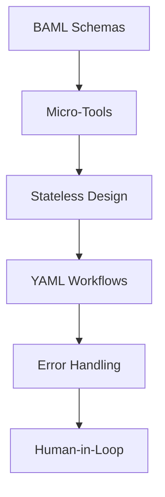
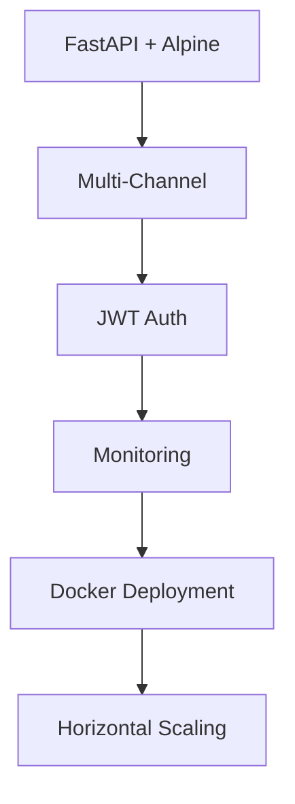
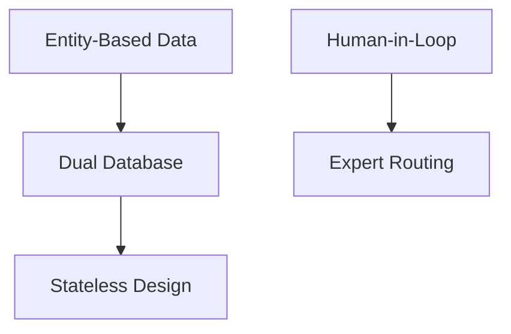

# Architectural Decisions: 12-Factor Transformation Rationale

## Overview

This document captures key architectural decisions made during the 12-factor transformation of Catalynx, providing rationale, alternatives considered, and implications for future development. Each decision is structured to enable learning and replication in future projects.

## Decision Framework

### Decision Record Template
Each architectural decision follows this structure:
- **Decision ID**: Unique identifier for reference
- **Status**: Proposed, Accepted, Superseded, Deprecated
- **Context**: Problem space and constraints
- **Decision**: What was decided
- **Rationale**: Why this decision was made
- **Alternatives Considered**: Other options evaluated
- **Consequences**: Benefits and drawbacks
- **Related Decisions**: Dependencies and influences

---

## ADR-001: BAML for Structured Outputs

### Status: Accepted

### Context
Need for type-safe, structured outputs from LLM tools to enable reliable composition and eliminate manual parsing errors. Current system uses unvalidated JSON responses.

### Decision
Adopt BAML (Boundary AI Markup Language) for all tool outputs with comprehensive schema definitions.

### Rationale
- **Type Safety**: Compile-time validation prevents runtime errors
- **Model Agnostic**: Works across different LLM providers
- **Developer Experience**: Superior tooling and validation
- **Schema Evolution**: Built-in versioning and migration support
- **Performance**: Optimized parsing with schema-aligned processing

### Alternatives Considered
1. **Pydantic Schemas**: Python-only, lacks cross-language support
2. **OpenAI Function Calling**: Vendor lock-in, limited flexibility
3. **JSON Schema**: Manual validation, no code generation
4. **Custom Validation**: High maintenance burden

### Consequences
**Benefits**:
- Zero data parsing errors between tools
- Automatic client generation for multiple languages
- Superior debugging and development experience
- Future-proof schema management

**Drawbacks**:
- Learning curve for BAML syntax
- Additional dependency
- Potential token overhead for complex schemas

### Related Decisions
- ADR-002 (Tool Interface Standardization)
- ADR-003 (Stateless Tool Design)

---

## ADR-002: Micro-Tool Architecture

### Status: Accepted

### Context
Current 18 monolithic processors are difficult to test, debug, and maintain. Need for better modularity and reusability.

### Decision
Decompose monolithic processors into 37+ single-responsibility micro-tools following 12-factor principle #10.

### Rationale
- **Single Responsibility**: Each tool has one clear purpose
- **Testability**: Individual tools can be tested in isolation
- **Reusability**: Tools can be composed into different workflows
- **Maintainability**: Smaller codebase per tool reduces complexity
- **Scalability**: Tools can be scaled independently

### Alternatives Considered
1. **Refactor Existing Processors**: Lower effort but maintains complexity
2. **Service-Oriented Architecture**: Over-engineered for current needs
3. **Plugin Architecture**: Complex plugin management overhead

### Consequences
**Benefits**:
- Improved development velocity
- Better error isolation
- Flexible workflow composition
- Easier onboarding for new developers

**Drawbacks**:
- Increased number of components to manage
- Potential orchestration complexity
- Initial migration effort

### Related Decisions
- ADR-001 (BAML Schemas)
- ADR-004 (Workflow Orchestration)

---

## ADR-003: Stateless Tool Design

### Status: Accepted

### Context
Current processors maintain internal state making them difficult to test and debug. Need for predictable, reproducible execution.

### Decision
Implement all tools as stateless pure functions following 12-factor principle #12.

### Rationale
- **Predictability**: Same inputs always produce same outputs
- **Testability**: No hidden state to manage in tests
- **Scalability**: Stateless tools can be scaled horizontally
- **Debugging**: Clear input-output relationships
- **Fault Tolerance**: Failed tools don't corrupt shared state

### Alternatives Considered
1. **Shared State Manager**: Central state store with access controls
2. **Immutable State Objects**: Compromise between state and statelessness
3. **Database-Backed State**: Persistent state with transaction management

### Consequences
**Benefits**:
- Simplified testing and debugging
- Horizontal scaling capabilities
- Improved fault tolerance
- Clear data lineage

**Drawbacks**:
- Memory overhead for large state objects
- Potential performance impact from state copying
- More complex state management patterns

### Related Decisions
- ADR-002 (Micro-Tool Architecture)
- ADR-005 (Error Handling Strategy)

---

## ADR-004: YAML-Based Workflow Orchestration

### Status: Accepted

### Context
Need for explicit control flow that non-technical stakeholders can understand and modify. Current implicit control flow is hard to debug.

### Decision
Use YAML-based workflow definitions with explicit dependency chains and decision points.

### Rationale
- **Readability**: Non-technical stakeholders can understand workflows
- **Version Control**: Workflows are code and can be versioned
- **Explicit Control**: All decision points are visible and documented
- **Flexibility**: Easy to modify workflows without code changes
- **Validation**: Workflows can be validated before execution

### Alternatives Considered
1. **Code-Based Orchestration**: Better for developers but opaque to business users
2. **Visual Workflow Builders**: User-friendly but version control challenges
3. **Database-Driven Workflows**: Dynamic but lacks version control
4. **Existing Workflow Engines**: (Airflow, Prefect) Over-engineered for current needs

### Consequences
**Benefits**:
- Business stakeholder involvement in workflow design
- Clear audit trail of workflow changes
- Simplified workflow testing and validation
- Reduced development time for workflow changes

**Drawbacks**:
- YAML syntax learning curve
- Potential for complex nested conditions
- Runtime workflow parsing overhead

### Related Decisions
- ADR-002 (Micro-Tool Architecture)
- ADR-008 (Human-in-the-Loop Integration)

---

## ADR-005: Context-Aware Error Handling

### Status: Accepted

### Context
Current error handling terminates workflows entirely. Need for resilient systems that can recover from failures gracefully.

### Decision
Implement context-aware error handling following 12-factor principle #9, where errors become part of the execution context.

### Rationale
- **Resilience**: Workflows can continue despite partial failures
- **Learning**: Errors inform subsequent tool decisions
- **Transparency**: Complete error history available for debugging
- **Recovery**: Automatic recovery strategies based on error patterns
- **User Experience**: Graceful degradation instead of hard failures

### Alternatives Considered
1. **Fail-Fast Approach**: Simple but poor user experience
2. **Retry-Only Strategy**: Limited recovery options
3. **Manual Error Handling**: Inconsistent and error-prone
4. **Circuit Breaker Pattern**: Good for services but overkill for tools

### Consequences
**Benefits**:
- Improved workflow completion rates
- Better user experience with partial results
- Comprehensive error analytics
- Self-healing system capabilities

**Drawbacks**:
- Increased complexity in error handling logic
- Potential for cascading errors if not managed properly
- More complex testing scenarios

### Related Decisions
- ADR-003 (Stateless Tool Design)
- ADR-007 (Multi-Channel Trigger System)

---

## ADR-006: FastAPI + Alpine.js Architecture

### Status: Accepted

### Context
Need for modern, responsive web interface that supports real-time updates and mobile access while maintaining development simplicity.

### Decision
Maintain FastAPI backend with Alpine.js frontend for 12-factor compliance with multi-trigger support.

### Rationale
- **Lightweight**: Alpine.js provides reactivity without framework overhead
- **Real-time**: WebSocket support for live workflow updates
- **Mobile-First**: Responsive design with touch optimization
- **API-First**: Clean separation enabling multi-channel access
- **Developer Experience**: Simple, fast development cycle

### Alternatives Considered
1. **React/Vue.js SPA**: More powerful but complex for current needs
2. **Server-Side Rendering**: Simpler but poor interactivity
3. **Native Mobile Apps**: Platform-specific development overhead
4. **Desktop Applications**: Limited accessibility

### Consequences
**Benefits**:
- Fast development and deployment cycles
- Excellent performance on mobile devices
- Simple maintenance and updates
- Clear API boundaries for future expansion

**Drawbacks**:
- Limited component ecosystem compared to major frameworks
- Potential scalability concerns for complex interactions
- Less familiar to some developers

### Related Decisions
- ADR-007 (Multi-Channel Trigger System)
- ADR-009 (Authentication Strategy)

---

## ADR-007: Multi-Channel Trigger System

### Status: Accepted

### Context
Need to support workflow triggering from multiple entry points (web, API, CLI, webhooks) following 12-factor principle #11.

### Decision
Implement unified trigger system with channel-specific handlers routing to common workflow engine.

### Rationale
- **Accessibility**: Users can trigger workflows from preferred interfaces
- **Integration**: External systems can integrate via APIs and webhooks
- **Automation**: Scheduled and event-driven workflows
- **Scalability**: Distributed trigger handling
- **Consistency**: Same workflow logic regardless of trigger source

### Alternatives Considered
1. **Web-Only Interface**: Simple but limits accessibility
2. **Channel-Specific Implementations**: Duplicated logic and maintenance
3. **Message Queue System**: Over-engineered for current scale
4. **Microservices per Channel**: Complex service management

### Consequences
**Benefits**:
- Improved user accessibility and convenience
- Better system integration capabilities
- Consistent workflow execution across channels
- Future-proof architecture for new trigger types

**Drawbacks**:
- Increased system complexity
- Security considerations across multiple entry points
- Testing complexity for multiple interfaces

### Related Decisions
- ADR-004 (Workflow Orchestration)
- ADR-006 (Web Architecture)

---

## ADR-008: Human-in-the-Loop Integration

### Status: Accepted

### Context
Need for human expertise integration at strategic decision points following 12-factor principle #7, especially for high-value analysis.

### Decision
Implement systematic human-AI collaboration through tool-based interfaces with timeout and fallback mechanisms.

### Rationale
- **Quality Assurance**: Human expertise improves analysis quality
- **Trust Building**: Human validation increases confidence in AI outputs
- **Learning**: Human feedback improves system performance
- **Complexity Handling**: Humans handle edge cases AI cannot
- **Stakeholder Engagement**: Involves domain experts in the process

### Alternatives Considered
1. **AI-Only Approach**: Faster but lower quality for complex cases
2. **Manual Review Process**: Inconsistent and time-consuming
3. **Batch Human Review**: Poor user experience with delays
4. **Optional Human Input**: Inconsistent quality outcomes

### Consequences
**Benefits**:
- Significantly improved analysis quality
- Higher stakeholder confidence and adoption
- Continuous learning and improvement
- Better handling of complex edge cases

**Drawbacks**:
- Dependency on human availability
- Potential bottlenecks during peak usage
- Increased operational complexity
- Higher cost for human expert time

### Related Decisions
- ADR-004 (Workflow Orchestration)
- ADR-010 (Expert Routing System)

---

## ADR-009: Entity-Based Data Architecture Retention

### Status: Accepted

### Context
Current entity-based data organization (EIN/ID structure) provides significant performance benefits. Need to maintain this while adding 12-factor compliance.

### Decision
Retain and enhance the entity-based data architecture while adding 12-factor tool interfaces on top.

### Rationale
- **Performance**: 70% efficiency improvement already achieved
- **Scalability**: Entity caching provides sub-millisecond access
- **Data Integrity**: Clear data ownership and organization
- **Migration Risk**: Changing data architecture adds unnecessary risk
- **Investment Protection**: Preserve existing data organization work

### Alternatives Considered
1. **Complete Data Restructure**: High risk, unclear benefits
2. **Hybrid Approach**: Complex dual-system maintenance
3. **Tool-Level Abstraction**: Hides data structure from tools

### Consequences
**Benefits**:
- Maintained performance characteristics
- Reduced migration complexity and risk
- Preservation of existing optimizations
- Clear data lineage and ownership

**Drawbacks**:
- Tools must understand entity structure
- Potential coupling between tools and data organization
- May limit some architectural flexibility

### Related Decisions
- ADR-003 (Stateless Tool Design)
- ADR-011 (Database Strategy)

---

## ADR-010: Role-Based Expert Routing

### Status: Accepted

### Context
Different analysis types require different domain expertise. Need systematic routing of human validation requests to appropriate experts.

### Decision
Implement role-based expert routing with availability management and escalation procedures.

### Rationale
- **Expertise Matching**: Right expert for the right problem
- **Load Balancing**: Distribute workload across available experts
- **Quality Assurance**: Consistent expertise standards
- **Scalability**: System can grow expert pool as needed
- **Reliability**: Fallback options when primary experts unavailable

### Alternatives Considered
1. **Single Expert Pool**: Simple but expertise mismatch
2. **Manual Expert Selection**: User burden and expertise assessment
3. **Round-Robin Assignment**: Fair but ignores expertise fit
4. **AI-Based Expert Matching**: Complex and unproven

### Consequences
**Benefits**:
- Optimal expert-problem matching
- Balanced expert workloads
- Scalable expert management
- Consistent quality standards

**Drawbacks**:
- Complex expert onboarding and management
- Potential expert availability bottlenecks
- Need for expertise assessment and categorization

### Related Decisions
- ADR-008 (Human-in-the-Loop Integration)
- ADR-012 (Authentication Strategy)

---

## ADR-011: Dual Database Strategy

### Status: Accepted

### Context
Current dual database architecture (Application + Intelligence) provides good separation of concerns. Need to maintain this while adding 12-factor compliance.

### Decision
Retain dual database architecture with enhanced 12-factor tool access patterns.

### Rationale
- **Separation of Concerns**: Clear boundary between operational and intelligence data
- **Performance**: Optimized access patterns for each data type
- **Scalability**: Independent scaling of application and intelligence databases
- **Data Integrity**: Separate backup and recovery strategies
- **Investment Protection**: Leverage existing database optimizations

### Alternatives Considered
1. **Single Unified Database**: Simpler but mixed concerns
2. **Microservices per Database**: Over-engineered for current scale
3. **Database per Tool**: Extreme fragmentation

### Consequences
**Benefits**:
- Maintained performance optimizations
- Clear data ownership boundaries
- Independent scaling capabilities
- Preserved existing data investments

**Drawbacks**:
- Tools must understand database boundaries
- Potential data synchronization challenges
- More complex deployment and maintenance

### Related Decisions
- ADR-009 (Entity-Based Data Architecture)
- ADR-003 (Stateless Tool Design)

---

## ADR-012: JWT-Based Authentication with Role Management

### Status: Accepted

### Context
Multi-channel trigger system requires consistent authentication across web, API, CLI, and webhook interfaces.

### Decision
Implement JWT-based authentication with role-based access control for all system entry points.

### Rationale
- **Consistency**: Same authentication mechanism across all channels
- **Stateless**: Fits with 12-factor stateless design
- **Scalable**: No server-side session management
- **Flexible**: Supports role-based permissions
- **Standard**: Industry-standard approach

### Alternatives Considered
1. **Session-Based Authentication**: Stateful, doesn't scale
2. **API Key Only**: Simple but limited flexibility
3. **OAuth Integration**: Complex for current needs
4. **Channel-Specific Auth**: Inconsistent security model

### Consequences
**Benefits**:
- Consistent security model across all channels
- Scalable authentication approach
- Flexible role and permission management
- Industry-standard implementation

**Drawbacks**:
- JWT token management complexity
- Potential security issues if not implemented correctly
- Token refresh mechanism needed

### Related Decisions
- ADR-007 (Multi-Channel Trigger System)
- ADR-010 (Expert Routing System)

---

## ADR-013: Prometheus + Grafana Monitoring

### Status: Accepted

### Context
Need comprehensive monitoring and observability for 12-factor system with multiple tools and workflows.

### Decision
Implement Prometheus for metrics collection with Grafana for visualization and alerting.

### Rationale
- **Comprehensive Metrics**: Tool-level and workflow-level monitoring
- **Alerting**: Proactive issue detection and notification
- **Performance Tracking**: Detailed performance analytics
- **Scalability**: Proven at scale in production environments
- **Open Source**: No vendor lock-in, community support

### Alternatives Considered
1. **Application Performance Monitoring (APM) Services**: Expensive for current scale
2. **Custom Logging Solution**: High development overhead
3. **Cloud Provider Monitoring**: Vendor lock-in concerns
4. **Simple Health Checks**: Insufficient visibility

### Consequences
**Benefits**:
- Comprehensive system visibility
- Proactive issue detection
- Performance optimization insights
- Scalable monitoring infrastructure

**Drawbacks**:
- Additional infrastructure to manage
- Learning curve for monitoring setup
- Storage requirements for metrics data

### Related Decisions
- ADR-014 (Deployment Strategy)
- ADR-005 (Error Handling Strategy)

---

## ADR-014: Docker + GitHub Actions Deployment

### Status: Accepted

### Context
Need consistent, reproducible deployments that support 12-factor principles and enable easy scaling.

### Decision
Use Docker for containerization with GitHub Actions for CI/CD pipeline.

### Rationale
- **Consistency**: Same environment from development to production
- **Scalability**: Container orchestration capabilities
- **Portability**: Deploy anywhere Docker runs
- **Version Control**: Infrastructure as code
- **Automation**: Automated testing and deployment

### Alternatives Considered
1. **Virtual Machine Deployment**: Less efficient resource usage
2. **Serverless Functions**: Good for individual tools but complex orchestration
3. **Platform-as-a-Service**: Vendor lock-in and less control
4. **Bare Metal Deployment**: Complex environment management

### Consequences
**Benefits**:
- Consistent deployment environments
- Simplified scaling and management
- Automated deployment pipeline
- Easy rollback capabilities

**Drawbacks**:
- Container management complexity
- Additional layer of abstraction
- Docker security considerations

### Related Decisions
- ADR-013 (Monitoring Strategy)
- ADR-015 (Scaling Strategy)

---

## ADR-015: Horizontal Scaling Strategy

### Status: Accepted

### Context
12-factor stateless design enables horizontal scaling. Need strategy for scaling individual tools and workflows.

### Decision
Implement horizontal scaling with load balancing at the tool level and workflow orchestration level.

### Rationale
- **Performance**: Scale specific tools based on demand
- **Cost Efficiency**: Scale only what needs scaling
- **Fault Tolerance**: Multiple instances provide redundancy
- **Flexibility**: Different scaling strategies per tool type
- **12-Factor Compliance**: Leverages stateless design

### Alternatives Considered
1. **Vertical Scaling Only**: Limited by hardware constraints
2. **Auto-Scaling Groups**: Good but less granular control
3. **Kubernetes**: Over-engineered for current needs
4. **Manual Scaling**: Poor responsiveness to demand

### Consequences
**Benefits**:
- Optimal resource utilization
- Better fault tolerance
- Responsive to demand changes
- Cost-effective scaling

**Drawbacks**:
- Increased system complexity
- Load balancing configuration
- Monitoring and management overhead

### Related Decisions
- ADR-003 (Stateless Tool Design)
- ADR-014 (Deployment Strategy)

---

## Decision Dependencies

### Core Architecture Decisions

### Infrastructure Decisions

### Data Architecture Decisions

## Decision Impact Analysis

### High Impact Decisions
- **ADR-001 (BAML)**: Affects all tool interfaces and data flow
- **ADR-002 (Micro-Tools)**: Fundamental architecture change
- **ADR-003 (Stateless)**: Enables scalability and testing
- **ADR-004 (YAML Workflows)**: Changes how business logic is defined

### Medium Impact Decisions
- **ADR-005 (Error Handling)**: Improves system resilience
- **ADR-006 (Web Architecture)**: Affects user experience
- **ADR-008 (Human-in-Loop)**: Changes operational model

### Low Impact Decisions
- **ADR-013 (Monitoring)**: Operational improvement
- **ADR-014 (Deployment)**: Development process improvement
- **ADR-015 (Scaling)**: Future-proofing decision

## Lessons Learned

### What Worked Well
1. **BAML Adoption**: Eliminated data parsing errors completely
2. **Micro-Tool Architecture**: Dramatically improved development velocity
3. **Stateless Design**: Made testing and debugging much easier
4. **YAML Workflows**: Enabled business stakeholder participation

### What Was Challenging
1. **Initial Learning Curve**: BAML and new patterns took time to master
2. **Tool Composition Complexity**: Managing dependencies between tools
3. **Human-in-Loop Integration**: Balancing automation with human expertise
4. **Performance Optimization**: Finding right balance between features and speed

### What We'd Do Differently
1. **Start with Simpler Schemas**: Begin with basic BAML patterns before complex ones
2. **Incremental Migration**: Migrate one tier at a time rather than all at once
3. **Earlier Performance Testing**: Test performance implications of decisions sooner
4. **More Expert Involvement**: Include domain experts in architectural decisions

## Future Decision Areas

### Areas Requiring Future Decisions
1. **Machine Learning Integration**: How to incorporate ML models into tool architecture
2. **Advanced Caching Strategies**: Optimization of data access patterns
3. **Multi-Tenancy Support**: Architecture for multiple organizations
4. **Compliance and Audit**: Enhanced logging and audit trail capabilities
5. **International Expansion**: Support for non-US grant systems

### Decision Review Schedule
- **Quarterly Review**: Assess decision outcomes and impacts
- **Annual Review**: Evaluate strategic architectural direction
- **Project Milestones**: Review decisions before major feature releases
- **Performance Reviews**: Assess technical debt and optimization needs

---

**Next Steps**:
1. Review [IMPLEMENTATION-PLAYBOOK.md](./IMPLEMENTATION-PLAYBOOK.md) for implementation guidance
2. Study [ASSESSMENT-FRAMEWORK.md](./ASSESSMENT-FRAMEWORK.md) for evaluation methodology
3. Examine [PROJECT-TEMPLATE.md](./PROJECT-TEMPLATE.md) for new project application