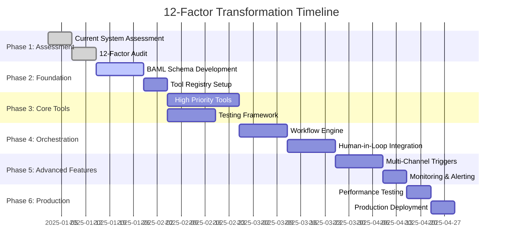

# Implementation Playbook: 12-Factor Transformation Guide

## Overview

This playbook provides step-by-step implementation guidance for transforming any monolithic AI system into a 12-factor compliant architecture. Based on the Catalynx transformation, this serves as both a specific implementation guide and a reusable methodology for future projects.

## Prerequisites

### Technical Requirements
- **Python 3.11+**: For BAML and modern async features
- **BAML CLI**: For schema compilation and validation
- **Docker**: For containerization and deployment
- **Git**: For version control and collaboration
- **IDE with BAML Support**: VS Code recommended with BAML extension

### Knowledge Requirements
- **12-Factor Principles**: Understanding of all 12 factors
- **Microservices Patterns**: Basic understanding of service decomposition
- **API Design**: RESTful API and async programming experience
- **YAML**: For workflow definition syntax

### Organizational Requirements
- **Stakeholder Buy-in**: Leadership support for transformation
- **Development Team**: 2-3 developers minimum
- **Domain Experts**: Access to subject matter experts
- **Testing Environment**: Safe space for experimentation

---

## Phase 1: Assessment and Planning (Week 1-2)

### Step 1.1: Current System Assessment

#### System Inventory
```bash
# Create assessment directory
mkdir assessment
cd assessment

# Document current architecture
cat > current_architecture.md << EOF
# Current System Assessment

## Components Inventory
- List all processors/services
- Document data flows
- Identify external dependencies
- Map user interfaces

## Performance Baseline
- Response times per component
- Resource utilization
- Error rates
- User satisfaction metrics

## Technical Debt Assessment
- Code complexity metrics
- Test coverage
- Documentation quality
- Maintenance burden
EOF
```

#### 12-Factor Compliance Audit
```yaml
# assessment/12factor_audit.yaml
audit_date: "2025-01-XX"
system_name: "Your System Name"

factors:
  factor_1_natural_language_to_tools:
    current_compliance: 2  # 1-5 scale
    issues:
      - "Unstructured tool inputs"
      - "Manual parsing required"
    target_state: "BAML-based structured interfaces"

  factor_2_own_prompts:
    current_compliance: 1
    issues:
      - "Prompts scattered in code"
      - "No version control"
    target_state: "Centralized BAML prompt management"

  # Continue for all 12 factors...

priority_factors:
  - factor_10_small_focused_agents  # Usually highest impact
  - factor_12_stateless_reducer
  - factor_4_tools_structured_outputs
```

#### Stakeholder Analysis
```yaml
# assessment/stakeholders.yaml
stakeholders:
  primary_users:
    - role: "End Users"
      needs: ["reliability", "speed", "accuracy"]
      concerns: ["disruption", "learning_curve"]

  technical_team:
    - role: "Developers"
      needs: ["maintainability", "testability"]
      concerns: ["complexity", "timeline"]

  business_stakeholders:
    - role: "Product Owners"
      needs: ["feature_velocity", "quality"]
      concerns: ["cost", "timeline"]

  domain_experts:
    - role: "Subject Matter Experts"
      needs: ["accuracy", "transparency"]
      concerns: ["automation_replacing_expertise"]
```

### Step 1.2: Tool Decomposition Analysis

#### Processor Mapping Exercise
```python
# assessment/processor_analysis.py
from dataclasses import dataclass
from typing import List, Dict

@dataclass
class ProcessorAnalysis:
    name: str
    responsibilities: List[str]
    inputs: Dict[str, str]
    outputs: Dict[str, str]
    dependencies: List[str]
    complexity_score: int  # 1-10
    usage_frequency: str   # high/medium/low

# Example analysis
current_processors = [
    ProcessorAnalysis(
        name="ai_heavy_processor",
        responsibilities=[
            "Financial analysis",
            "Risk assessment",
            "Strategic recommendations",
            "Report generation"
        ],
        inputs={"organization_data": "dict", "analysis_type": "str"},
        outputs={"analysis_result": "dict"},
        dependencies=["bmf_data", "990_data"],
        complexity_score=9,
        usage_frequency="high"
    ),
    # Add all current processors...
]

def identify_micro_tools(processor: ProcessorAnalysis) -> List[str]:
    """Identify potential micro-tools from processor responsibilities"""
    tools = []
    for responsibility in processor.responsibilities:
        # Convert responsibility to tool name
        tool_name = responsibility.lower().replace(" ", "_") + "_tool"
        tools.append(tool_name)
    return tools

# Generate micro-tool mapping
for processor in current_processors:
    tools = identify_micro_tools(processor)
    print(f"{processor.name} -> {tools}")
```

### Step 1.3: Migration Strategy Planning

#### Risk Assessment Matrix
```yaml
# assessment/risk_matrix.yaml
risks:
  high_priority:
    - risk: "User workflow disruption"
      mitigation: "Parallel deployment with gradual migration"
      probability: "medium"
      impact: "high"

    - risk: "Performance regression"
      mitigation: "Comprehensive performance testing"
      probability: "low"
      impact: "high"

  medium_priority:
    - risk: "Development timeline overrun"
      mitigation: "Phased delivery approach"
      probability: "medium"
      impact: "medium"

  low_priority:
    - risk: "Tool composition complexity"
      mitigation: "Comprehensive documentation and training"
      probability: "low"
      impact: "medium"
```

#### Success Criteria Definition
```yaml
# assessment/success_criteria.yaml
criteria:
  technical:
    - metric: "Response time"
      target: "No regression from current performance"
      measurement: "Automated performance tests"

    - metric: "Error rate"
      target: "< 1% tool failures"
      measurement: "Error tracking and monitoring"

    - metric: "Test coverage"
      target: "> 95% for all micro-tools"
      measurement: "Coverage reports"

  business:
    - metric: "User satisfaction"
      target: "Maintain or improve current levels"
      measurement: "User feedback surveys"

    - metric: "Feature delivery velocity"
      target: "50% improvement after transition"
      measurement: "Development metrics"

  operational:
    - metric: "Deployment frequency"
      target: "Daily deployments possible"
      measurement: "CI/CD metrics"

    - metric: "Mean time to recovery"
      target: "< 15 minutes"
      measurement: "Incident response metrics"
```

### Step 1.4: Project Planning

#### Milestone Planning


---

## Phase 2: Foundation Setup (Week 3-4)

### Step 2.1: Development Environment Setup

#### BAML Environment Setup
```bash
# Install BAML CLI
npm install -g @boundaryml/baml

# Initialize BAML project
mkdir baml
cd baml
baml init

# Project structure
mkdir -p {functions,types,clients,tests}

# Create base types
cat > types/base_types.baml << EOF
enum ConfidenceLevel {
  VERY_LOW
  LOW
  MEDIUM
  HIGH
  VERY_HIGH
}

class Organization {
  ein: string
  name: string
  ntee_code: string?
  state: string?
}

class ToolResult {
  success: bool
  data: object
  confidence: float
  errors: string[]
  timestamp: string
}
EOF
```

#### Tool Registry Setup
```python
# src/core/tool_registry.py
from dataclasses import dataclass
from typing import Dict, List, Optional, Any
from abc import ABC, abstractmethod

@dataclass
class ToolMetadata:
    name: str
    version: str
    description: str
    baml_schema: str
    estimated_duration: int
    dependencies: List[str]

class BaseTool(ABC):
    def __init__(self, metadata: ToolMetadata):
        self.metadata = metadata

    @abstractmethod
    async def execute(self, inputs: Dict[str, Any]) -> Dict[str, Any]:
        """Execute tool with given inputs"""
        pass

    @abstractmethod
    def validate_inputs(self, inputs: Dict[str, Any]) -> bool:
        """Validate inputs before execution"""
        pass

class ToolRegistry:
    def __init__(self):
        self._tools: Dict[str, BaseTool] = {}

    def register_tool(self, tool: BaseTool):
        """Register a tool in the registry"""
        self._tools[tool.metadata.name] = tool

    def get_tool(self, name: str) -> Optional[BaseTool]:
        """Get tool by name"""
        return self._tools.get(name)

    def list_tools(self) -> List[str]:
        """List all registered tools"""
        return list(self._tools.keys())

# Global registry instance
tool_registry = ToolRegistry()
```

#### Project Structure Setup
```bash
# Create 12-factor compliant project structure
mkdir -p {
  src/{core,tools,workflows,web,auth},
  baml/{functions,types,clients},
  config,
  tests/{unit,integration,e2e},
  docs,
  scripts,
  monitoring
}

# Configuration management
cat > config/settings.yaml << EOF
development:
  baml:
    client: "openai"
    model: "gpt-4"
  database:
    url: "sqlite:///dev.db"
  logging:
    level: "DEBUG"

production:
  baml:
    client: "openai"
    model: "gpt-4"
  database:
    url: "postgresql://..."
  logging:
    level: "INFO"
EOF
```

### Step 2.2: First BAML Schema Implementation

#### Start with Simplest Tool
```baml
// baml/functions/data_validator.baml
function validate_organization_data {
  client GPT4o
  prompt #"
    Validate the following organization data for completeness and accuracy:

    Organization: {{ organization }}

    Check for:
    - Required fields present
    - Data format validity
    - Logical consistency

    Provide validation results with specific issues identified.
  "#

  response ValidationResult {
    is_valid: bool
    completeness_score: float  // 0.0 to 1.0
    issues: ValidationIssue[]
    recommendations: string[]
  }
}

class ValidationIssue {
  field_name: string
  issue_type: IssueType
  severity: SeverityLevel
  description: string
  suggested_fix: string
}

enum IssueType {
  MISSING_REQUIRED_FIELD
  INVALID_FORMAT
  INCONSISTENT_DATA
  OUT_OF_RANGE
}

enum SeverityLevel {
  LOW
  MEDIUM
  HIGH
  CRITICAL
}
```

#### Corresponding Tool Implementation
```python
# src/tools/data_validator_tool.py
import asyncio
from src.core.tool_registry import BaseTool, ToolMetadata, tool_registry
import baml_client

class DataValidatorTool(BaseTool):
    def __init__(self):
        metadata = ToolMetadata(
            name="data_validator_tool",
            version="1.0.0",
            description="Validates organization data quality and completeness",
            baml_schema="validate_organization_data",
            estimated_duration=30,
            dependencies=[]
        )
        super().__init__(metadata)

    async def execute(self, inputs: Dict[str, Any]) -> Dict[str, Any]:
        """Execute data validation using BAML"""

        # Validate inputs
        if not self.validate_inputs(inputs):
            return {
                "success": False,
                "errors": ["Invalid inputs provided"],
                "data": None
            }

        try:
            # Call BAML function
            result = await baml_client.validate_organization_data(
                organization=inputs["organization"]
            )

            return {
                "success": True,
                "data": {
                    "is_valid": result.is_valid,
                    "completeness_score": result.completeness_score,
                    "issues": [issue.dict() for issue in result.issues],
                    "recommendations": result.recommendations
                },
                "errors": [],
                "confidence": result.completeness_score,
                "tool_metadata": self.metadata.__dict__
            }

        except Exception as e:
            return {
                "success": False,
                "errors": [str(e)],
                "data": None
            }

    def validate_inputs(self, inputs: Dict[str, Any]) -> bool:
        """Validate that required inputs are present"""
        required_fields = ["organization"]
        return all(field in inputs for field in required_fields)

# Register the tool
tool_registry.register_tool(DataValidatorTool())
```

### Step 2.3: Testing Framework Setup

#### Unit Test Framework
```python
# tests/unit/test_data_validator_tool.py
import pytest
import asyncio
from src.tools.data_validator_tool import DataValidatorTool

class TestDataValidatorTool:
    @pytest.fixture
    def tool(self):
        return DataValidatorTool()

    @pytest.fixture
    def sample_organization(self):
        return {
            "ein": "123456789",
            "name": "Test Organization",
            "ntee_code": "P20",
            "state": "VA"
        }

    @pytest.mark.asyncio
    async def test_valid_organization_data(self, tool, sample_organization):
        """Test validation with valid organization data"""
        inputs = {"organization": sample_organization}
        result = await tool.execute(inputs)

        assert result["success"] is True
        assert "data" in result
        assert "is_valid" in result["data"]
        assert result["data"]["completeness_score"] > 0.7

    @pytest.mark.asyncio
    async def test_invalid_inputs(self, tool):
        """Test validation with missing inputs"""
        inputs = {}
        result = await tool.execute(inputs)

        assert result["success"] is False
        assert "Invalid inputs provided" in result["errors"]

    @pytest.mark.asyncio
    async def test_incomplete_organization_data(self, tool):
        """Test validation with incomplete data"""
        incomplete_org = {"ein": "123456789"}  # Missing required fields
        inputs = {"organization": incomplete_org}
        result = await tool.execute(inputs)

        assert result["success"] is True
        assert result["data"]["completeness_score"] < 0.5
        assert len(result["data"]["issues"]) > 0

    def test_input_validation(self, tool):
        """Test input validation logic"""
        valid_inputs = {"organization": {"ein": "123456789"}}
        invalid_inputs = {"wrong_field": "value"}

        assert tool.validate_inputs(valid_inputs) is True
        assert tool.validate_inputs(invalid_inputs) is False

# Run tests
# pytest tests/unit/test_data_validator_tool.py -v
```

#### Integration Test Framework
```python
# tests/integration/test_tool_registry.py
import pytest
from src.core.tool_registry import tool_registry
from src.tools.data_validator_tool import DataValidatorTool

class TestToolRegistry:
    def test_tool_registration(self):
        """Test that tools register correctly"""
        initial_count = len(tool_registry.list_tools())

        # Tool should already be registered from import
        tools = tool_registry.list_tools()
        assert "data_validator_tool" in tools

    def test_tool_retrieval(self):
        """Test that tools can be retrieved"""
        tool = tool_registry.get_tool("data_validator_tool")
        assert tool is not None
        assert isinstance(tool, DataValidatorTool)

    def test_nonexistent_tool(self):
        """Test retrieval of nonexistent tool"""
        tool = tool_registry.get_tool("nonexistent_tool")
        assert tool is None

    @pytest.mark.asyncio
    async def test_tool_execution_through_registry(self):
        """Test tool execution through registry"""
        tool = tool_registry.get_tool("data_validator_tool")

        inputs = {
            "organization": {
                "ein": "123456789",
                "name": "Test Org"
            }
        }

        result = await tool.execute(inputs)
        assert result["success"] is True
```

---

## Phase 3: Core Tool Migration (Week 5-8)

### Step 3.1: Tool Migration Priority Matrix

#### Priority Assessment
```python
# scripts/migration_priority.py
from dataclasses import dataclass
from typing import List

@dataclass
class ToolPriority:
    name: str
    usage_frequency: int      # 1-10
    complexity: int          # 1-10
    dependencies: int        # Number of dependent tools
    business_impact: int     # 1-10

    @property
    def priority_score(self) -> float:
        """Calculate priority score (higher = more urgent)"""
        return (self.usage_frequency * 0.3 +
                self.business_impact * 0.4 +
                (11 - self.complexity) * 0.2 +  # Invert complexity
                self.dependencies * 0.1)

# Define tool priorities
tool_priorities = [
    ToolPriority("data_validator_tool", 9, 3, 8, 8),
    ToolPriority("financial_calculator_tool", 8, 5, 6, 9),
    ToolPriority("opportunity_scorer_tool", 7, 4, 4, 8),
    ToolPriority("risk_assessor_tool", 6, 6, 3, 7),
    # Add all tools...
]

# Sort by priority
sorted_tools = sorted(tool_priorities, key=lambda x: x.priority_score, reverse=True)

print("Migration Priority Order:")
for i, tool in enumerate(sorted_tools, 1):
    print(f"{i}. {tool.name} (Score: {tool.priority_score:.2f})")
```

### Step 3.2: Batch Migration Process

#### Week 5: Foundation Tools (Batch 1)
```python
# Migration batch 1: Core data tools
batch_1_tools = [
    "data_validator_tool",           # Already implemented
    "ein_validator_tool",
    "bmf_data_fetcher_tool",
    "propublica_990_fetcher_tool",
    "data_normalizer_tool"
]
```

##### EIN Validator Tool Implementation
```baml
// baml/functions/ein_validator.baml
function validate_ein {
  client GPT4o
  prompt #"
    Validate the EIN (Employer Identification Number): {{ ein }}

    Check:
    - Format: XX-XXXXXXX (9 digits with hyphen after 2nd digit)
    - Valid checksum if applicable
    - Not in exclusion list

    Provide validation result with specific issues if invalid.
  "#

  response EINValidation {
    is_valid: bool
    formatted_ein: string
    issues: string[]
    confidence: float
  }
}
```

```python
# src/tools/ein_validator_tool.py
import re
from src.core.tool_registry import BaseTool, ToolMetadata, tool_registry

class EINValidatorTool(BaseTool):
    def __init__(self):
        metadata = ToolMetadata(
            name="ein_validator_tool",
            version="1.0.0",
            description="Validates EIN format and existence",
            baml_schema="validate_ein",
            estimated_duration=10,
            dependencies=[]
        )
        super().__init__(metadata)

        # EIN format pattern: XX-XXXXXXX
        self.ein_pattern = re.compile(r'^\d{2}-\d{7}$')

    async def execute(self, inputs: Dict[str, Any]) -> Dict[str, Any]:
        """Execute EIN validation"""
        ein = inputs.get("ein", "").strip()

        # Basic format validation
        is_valid_format = bool(self.ein_pattern.match(ein))
        issues = []

        if not is_valid_format:
            # Try to format if it's just digits
            clean_ein = re.sub(r'\D', '', ein)
            if len(clean_ein) == 9:
                formatted_ein = f"{clean_ein[:2]}-{clean_ein[2:]}"
                if self.ein_pattern.match(formatted_ein):
                    ein = formatted_ein
                    is_valid_format = True
                else:
                    issues.append("Invalid EIN format")
            else:
                issues.append("EIN must contain exactly 9 digits")

        # Additional validation through BAML if format is correct
        confidence = 1.0 if is_valid_format else 0.0

        if is_valid_format:
            try:
                # Use BAML for advanced validation
                result = await baml_client.validate_ein(ein=ein)
                return {
                    "success": True,
                    "data": {
                        "is_valid": result.is_valid,
                        "formatted_ein": result.formatted_ein,
                        "issues": result.issues,
                        "confidence": result.confidence
                    },
                    "errors": []
                }
            except Exception as e:
                # Fallback to basic validation
                return {
                    "success": True,
                    "data": {
                        "is_valid": is_valid_format,
                        "formatted_ein": ein,
                        "issues": issues,
                        "confidence": 0.8  # Lower confidence without BAML
                    },
                    "errors": [f"BAML validation failed: {str(e)}"]
                }
        else:
            return {
                "success": False,
                "data": {
                    "is_valid": False,
                    "formatted_ein": ein,
                    "issues": issues,
                    "confidence": 0.0
                },
                "errors": issues
            }

    def validate_inputs(self, inputs: Dict[str, Any]) -> bool:
        return "ein" in inputs and isinstance(inputs["ein"], str)

# Register tool
tool_registry.register_tool(EINValidatorTool())
```

#### Week 6: Analysis Tools (Batch 2)
```python
# Migration batch 2: Core analysis tools
batch_2_tools = [
    "financial_metrics_calculator_tool",
    "risk_score_calculator_tool",
    "opportunity_scorer_tool",
    "peer_similarity_calculator_tool"
]
```

#### Week 7: Intelligence Tools (Batch 3)
```python
# Migration batch 3: AI and intelligence tools
batch_3_tools = [
    "ai_content_analyzer_tool",
    "pattern_detection_tool",
    "success_pattern_analyzer_tool",
    "market_intelligence_tool"
]
```

#### Week 8: Output Tools (Batch 4)
```python
# Migration batch 4: Output and reporting tools
batch_4_tools = [
    "report_generator_tool",
    "summary_generator_tool",
    "data_exporter_tool",
    "chart_generator_tool"
]
```

### Step 3.3: Tool Testing Strategy

#### Automated Testing Pipeline
```yaml
# .github/workflows/tool_testing.yml
name: Tool Testing Pipeline

on:
  push:
    paths:
      - 'src/tools/**'
      - 'baml/**'
      - 'tests/**'

jobs:
  unit_tests:
    runs-on: ubuntu-latest
    steps:
      - uses: actions/checkout@v3
      - name: Setup Python
        uses: actions/setup-python@v4
        with:
          python-version: '3.11'

      - name: Install dependencies
        run: |
          pip install -r requirements.txt
          npm install -g @boundaryml/baml

      - name: Compile BAML schemas
        run: baml compile

      - name: Run unit tests
        run: pytest tests/unit/ -v --cov=src/tools

      - name: Generate coverage report
        run: coverage xml

      - name: Upload coverage
        uses: codecov/codecov-action@v3

  integration_tests:
    needs: unit_tests
    runs-on: ubuntu-latest
    steps:
      - uses: actions/checkout@v3
      - name: Setup test environment
        run: |
          docker-compose -f docker-compose.test.yml up -d

      - name: Run integration tests
        run: pytest tests/integration/ -v

      - name: Cleanup
        run: docker-compose -f docker-compose.test.yml down

  performance_tests:
    needs: integration_tests
    runs-on: ubuntu-latest
    steps:
      - uses: actions/checkout@v3
      - name: Run performance benchmarks
        run: pytest tests/performance/ -v --benchmark-only
```

#### Tool Validation Framework
```python
# tests/validation/tool_validator.py
from typing import Dict, Any, List
import asyncio
import time

class ToolValidator:
    """Validates tools against 12-factor compliance"""

    async def validate_tool(self, tool_name: str) -> Dict[str, Any]:
        """Comprehensive tool validation"""
        results = {}

        # Factor 1: Structured outputs (BAML compliance)
        results["structured_outputs"] = await self._validate_baml_compliance(tool_name)

        # Factor 10: Single responsibility
        results["single_responsibility"] = self._validate_single_responsibility(tool_name)

        # Factor 12: Stateless execution
        results["stateless"] = await self._validate_stateless_execution(tool_name)

        # Performance validation
        results["performance"] = await self._validate_performance(tool_name)

        return results

    async def _validate_baml_compliance(self, tool_name: str) -> bool:
        """Check if tool uses BAML schemas correctly"""
        tool = tool_registry.get_tool(tool_name)
        if not tool:
            return False

        # Check if tool has BAML schema defined
        has_schema = hasattr(tool.metadata, 'baml_schema') and tool.metadata.baml_schema

        # Test with sample data
        if has_schema:
            try:
                sample_inputs = self._get_sample_inputs(tool_name)
                result = await tool.execute(sample_inputs)
                return result.get("success", False) and "data" in result
            except Exception:
                return False

        return has_schema

    async def _validate_stateless_execution(self, tool_name: str) -> bool:
        """Validate that tool execution is stateless"""
        tool = tool_registry.get_tool(tool_name)
        if not tool:
            return False

        sample_inputs = self._get_sample_inputs(tool_name)

        # Execute same inputs multiple times
        results = []
        for _ in range(3):
            try:
                result = await tool.execute(sample_inputs)
                results.append(result)
            except Exception:
                return False

        # Results should be identical for stateless tools
        # (allowing for minor timestamp differences)
        first_result = results[0]
        for result in results[1:]:
            if not self._results_equivalent(first_result, result):
                return False

        return True

    def _results_equivalent(self, result1: Dict, result2: Dict) -> bool:
        """Compare results ignoring timestamps"""
        # Remove timestamp fields for comparison
        r1_clean = {k: v for k, v in result1.items() if 'timestamp' not in k.lower()}
        r2_clean = {k: v for k, v in result2.items() if 'timestamp' not in k.lower()}
        return r1_clean == r2_clean

    async def _validate_performance(self, tool_name: str) -> Dict[str, Any]:
        """Validate tool performance characteristics"""
        tool = tool_registry.get_tool(tool_name)
        sample_inputs = self._get_sample_inputs(tool_name)

        # Measure execution time
        start_time = time.time()
        result = await tool.execute(sample_inputs)
        execution_time = time.time() - start_time

        # Check against expected duration
        expected_duration = tool.metadata.estimated_duration
        performance_ratio = execution_time / expected_duration if expected_duration > 0 else 0

        return {
            "execution_time": execution_time,
            "expected_duration": expected_duration,
            "performance_ratio": performance_ratio,
            "within_expected": performance_ratio <= 1.5,  # 50% tolerance
            "success": result.get("success", False)
        }
```

---

## Phase 4: Workflow Orchestration (Week 9-10)

### Step 4.1: Workflow Engine Implementation

#### Workflow Definition Parser
```python
# src/workflows/workflow_parser.py
import yaml
from dataclasses import dataclass
from typing import List, Dict, Any, Optional

@dataclass
class WorkflowStep:
    name: str
    tool: str
    inputs: Dict[str, Any]
    outputs: Dict[str, str]
    condition: Optional[str] = None
    depends_on: List[str] = None

@dataclass
class WorkflowDefinition:
    name: str
    description: str
    estimated_duration: int
    estimated_cost: float
    inputs: List[Dict[str, Any]]
    steps: List[WorkflowStep]
    quality_gates: List[Dict[str, Any]] = None

class WorkflowParser:
    """Parse YAML workflow definitions into workflow objects"""

    def parse_workflow(self, workflow_file: str) -> WorkflowDefinition:
        """Parse workflow from YAML file"""
        with open(workflow_file, 'r') as f:
            workflow_data = yaml.safe_load(f)

        # Parse steps
        steps = []
        for step_data in workflow_data.get('steps', []):
            step = WorkflowStep(
                name=step_data['name'],
                tool=step_data['tool'],
                inputs=step_data.get('inputs', {}),
                outputs=step_data.get('outputs', {}),
                condition=step_data.get('condition'),
                depends_on=step_data.get('depends_on', [])
            )
            steps.append(step)

        return WorkflowDefinition(
            name=workflow_data['workflow'],
            description=workflow_data.get('description', ''),
            estimated_duration=workflow_data.get('estimated_duration', 0),
            estimated_cost=workflow_data.get('estimated_cost', 0.0),
            inputs=workflow_data.get('inputs', []),
            steps=steps,
            quality_gates=workflow_data.get('quality_gates', [])
        )

    def validate_workflow(self, workflow: WorkflowDefinition) -> List[str]:
        """Validate workflow definition"""
        errors = []

        # Check tool availability
        for step in workflow.steps:
            if not tool_registry.get_tool(step.tool):
                errors.append(f"Tool not found: {step.tool}")

        # Check dependencies
        step_names = {step.name for step in workflow.steps}
        for step in workflow.steps:
            if step.depends_on:
                for dep in step.depends_on:
                    if dep not in step_names:
                        errors.append(f"Dependency not found: {dep} for step {step.name}")

        return errors
```

#### Workflow Execution Engine
```python
# src/workflows/workflow_engine.py
import asyncio
from dataclasses import dataclass
from typing import Dict, Any, List, Optional
from enum import Enum

class WorkflowStatus(Enum):
    PENDING = "pending"
    RUNNING = "running"
    PAUSED = "paused"
    COMPLETED = "completed"
    FAILED = "failed"

@dataclass
class WorkflowState:
    workflow_id: str
    status: WorkflowStatus
    current_step: Optional[str]
    completed_steps: List[str]
    step_outputs: Dict[str, Any]
    error_context: List[Dict[str, Any]]

class WorkflowEngine:
    """Execute workflows with 12-factor compliance"""

    def __init__(self):
        self.active_workflows: Dict[str, WorkflowState] = {}
        self.workflow_parser = WorkflowParser()

    async def execute_workflow(self,
                             workflow_def: WorkflowDefinition,
                             inputs: Dict[str, Any],
                             workflow_id: str) -> WorkflowState:
        """Execute workflow with pause/resume support"""

        # Initialize workflow state
        state = WorkflowState(
            workflow_id=workflow_id,
            status=WorkflowStatus.RUNNING,
            current_step=None,
            completed_steps=[],
            step_outputs={},
            error_context=[]
        )

        self.active_workflows[workflow_id] = state

        try:
            # Build execution graph
            execution_order = self._build_execution_order(workflow_def.steps)

            # Execute steps in order
            for step_name in execution_order:
                step = next(s for s in workflow_def.steps if s.name == step_name)

                # Check pause request
                if state.status == WorkflowStatus.PAUSED:
                    break

                state.current_step = step_name

                # Execute step
                step_result = await self._execute_step(step, state, inputs)

                if step_result["success"]:
                    state.completed_steps.append(step_name)
                    state.step_outputs[step_name] = step_result["data"]
                else:
                    # Handle error according to 12-factor principle #9
                    error_context = {
                        "step": step_name,
                        "error": step_result["errors"],
                        "recovery_suggestions": self._get_recovery_suggestions(step, step_result)
                    }
                    state.error_context.append(error_context)

                    # Attempt recovery or fail gracefully
                    if not await self._attempt_recovery(step, state, error_context):
                        state.status = WorkflowStatus.FAILED
                        break

            if state.status == WorkflowStatus.RUNNING:
                state.status = WorkflowStatus.COMPLETED

        except Exception as e:
            state.status = WorkflowStatus.FAILED
            state.error_context.append({
                "step": state.current_step,
                "error": [str(e)],
                "recovery_suggestions": ["Manual intervention required"]
            })

        finally:
            state.current_step = None

        return state

    async def _execute_step(self,
                          step: WorkflowStep,
                          state: WorkflowState,
                          workflow_inputs: Dict[str, Any]) -> Dict[str, Any]:
        """Execute individual workflow step"""

        # Get tool
        tool = tool_registry.get_tool(step.tool)
        if not tool:
            return {
                "success": False,
                "errors": [f"Tool not found: {step.tool}"],
                "data": None
            }

        # Prepare step inputs by resolving variables
        step_inputs = self._resolve_variables(step.inputs, state.step_outputs, workflow_inputs)

        # Execute tool (stateless execution per Factor 12)
        result = await tool.execute(step_inputs)

        return result

    def _resolve_variables(self,
                          inputs: Dict[str, Any],
                          step_outputs: Dict[str, Any],
                          workflow_inputs: Dict[str, Any]) -> Dict[str, Any]:
        """Resolve variables in step inputs"""
        resolved = {}

        for key, value in inputs.items():
            if isinstance(value, str) and value.startswith("{{") and value.endswith("}}"):
                # Extract variable name
                var_name = value[2:-2].strip()

                # Look for variable in step outputs first, then workflow inputs
                if "." in var_name:
                    step_name, output_key = var_name.split(".", 1)
                    if step_name in step_outputs:
                        resolved[key] = step_outputs[step_name].get(output_key)
                    else:
                        resolved[key] = workflow_inputs.get(var_name)
                else:
                    resolved[key] = workflow_inputs.get(var_name, value)
            else:
                resolved[key] = value

        return resolved

    def _build_execution_order(self, steps: List[WorkflowStep]) -> List[str]:
        """Build execution order respecting dependencies"""
        # Topological sort of dependencies
        order = []
        remaining = {step.name: step for step in steps}

        while remaining:
            # Find steps with no remaining dependencies
            ready = []
            for name, step in remaining.items():
                if not step.depends_on or all(dep in order for dep in step.depends_on):
                    ready.append(name)

            if not ready:
                raise ValueError("Circular dependency detected in workflow")

            # Add ready steps to order
            for name in ready:
                order.append(name)
                del remaining[name]

        return order

    async def pause_workflow(self, workflow_id: str) -> bool:
        """Pause workflow execution"""
        if workflow_id in self.active_workflows:
            self.active_workflows[workflow_id].status = WorkflowStatus.PAUSED
            return True
        return False

    async def resume_workflow(self, workflow_id: str) -> bool:
        """Resume paused workflow"""
        if workflow_id in self.active_workflows:
            state = self.active_workflows[workflow_id]
            if state.status == WorkflowStatus.PAUSED:
                state.status = WorkflowStatus.RUNNING
                # Continue execution from where it left off
                # This requires storing the workflow definition
                return True
        return False
```

### Step 4.2: Human-in-the-Loop Integration

#### Expert Validation Tool
```baml
// baml/functions/expert_validation.baml
function request_expert_validation {
  client Human
  prompt #"
    Expert validation required for analysis:

    Organization: {{ organization_name }}
    Analysis Type: {{ analysis_type }}

    Key Findings:
    
    - {{ finding.description }} (Confidence: {{ finding.confidence }})
    

    Validation Questions:
    
    {{ loop.index }}. {{ question }}
    

    Please provide your expert assessment and any corrections.
  "#

  response ExpertValidation {
    validated: bool
    expert_confidence: float
    corrections: Correction[]
    additional_insights: string[]
    recommended_next_steps: string[]
  }
}

class Correction {
  field_name: string
  original_value: string
  corrected_value: string
  reasoning: string
}
```

```python
# src/tools/expert_validator_tool.py
import asyncio
from datetime import datetime, timedelta
from src.core.tool_registry import BaseTool, ToolMetadata, tool_registry

class ExpertValidatorTool(BaseTool):
    """Human-in-the-loop validation tool"""

    def __init__(self):
        metadata = ToolMetadata(
            name="expert_validator_tool",
            version="1.0.0",
            description="Routes analysis to human experts for validation",
            baml_schema="request_expert_validation",
            estimated_duration=1800,  # 30 minutes
            dependencies=[]
        )
        super().__init__(metadata)

    async def execute(self, inputs: Dict[str, Any]) -> Dict[str, Any]:
        """Execute expert validation with timeout"""

        # Prepare validation request
        validation_request = {
            "organization_name": inputs.get("organization_name", "Unknown"),
            "analysis_type": inputs.get("analysis_type", "General"),
            "findings": inputs.get("findings", []),
            "questions": inputs.get("validation_questions", [])
        }

        # Get timeout and fallback strategy
        timeout = inputs.get("timeout", 1800)  # 30 minutes default
        fallback_strategy = inputs.get("fallback_strategy", "proceed_with_ai")

        try:
            # Send to expert with timeout
            result = await asyncio.wait_for(
                self._send_to_expert(validation_request, inputs.get("expert_type", "general")),
                timeout=timeout
            )

            return {
                "success": True,
                "data": {
                    "validated": result.validated,
                    "expert_confidence": result.expert_confidence,
                    "corrections": [c.dict() for c in result.corrections],
                    "additional_insights": result.additional_insights,
                    "recommended_next_steps": result.recommended_next_steps,
                    "validation_type": "human_expert"
                },
                "errors": []
            }

        except asyncio.TimeoutError:
            # Handle timeout with fallback strategy
            return await self._handle_timeout(validation_request, fallback_strategy)

        except Exception as e:
            return {
                "success": False,
                "errors": [f"Expert validation failed: {str(e)}"],
                "data": None
            }

    async def _send_to_expert(self, request: Dict[str, Any], expert_type: str):
        """Send validation request to appropriate expert"""
        # In a real implementation, this would:
        # 1. Route to appropriate expert based on type
        # 2. Send notification (email, Slack, web interface)
        # 3. Wait for response
        # 4. Return structured response

        # For demo purposes, simulate expert response
        await asyncio.sleep(2)  # Simulate processing time

        # Return simulated expert response
        from baml_client import ExpertValidation, Correction
        return ExpertValidation(
            validated=True,
            expert_confidence=0.9,
            corrections=[],
            additional_insights=["Expert review completed"],
            recommended_next_steps=["Proceed with implementation"]
        )

    async def _handle_timeout(self, request: Dict[str, Any], fallback_strategy: str):
        """Handle timeout based on fallback strategy"""
        if fallback_strategy == "proceed_with_ai":
            return {
                "success": True,
                "data": {
                    "validated": False,
                    "expert_confidence": 0.0,
                    "corrections": [],
                    "additional_insights": ["Expert validation timed out"],
                    "recommended_next_steps": ["Consider manual review"],
                    "validation_type": "timeout_fallback"
                },
                "errors": ["Expert validation timed out"]
            }
        else:
            return {
                "success": False,
                "errors": ["Expert validation required but timed out"],
                "data": None
            }

# Register tool
tool_registry.register_tool(ExpertValidatorTool())
```

### Step 4.3: First Complete Workflow Implementation

#### Current Tier Workflow YAML
```yaml
# workflows/current_tier.yaml
workflow: current_tier_analysis
description: "4-stage AI analysis: PLAN → ANALYZE → EXAMINE → APPROACH"
estimated_duration: 600
estimated_cost: 0.75

inputs:
  - name: organization_ein
    type: string
    required: true
  - name: analysis_focus
    type: enum
    values: [general, funding_readiness, specific_opportunity]
    default: general

steps:
  - name: validate_ein
    tool: ein_validator_tool
    inputs:
      ein: "{{ organization_ein }}"
    outputs:
      validated_ein: formatted_ein

  - name: fetch_organization_data
    tool: bmf_data_fetcher_tool
    depends_on: [validate_ein]
    inputs:
      ein: "{{ validated_ein }}"
      required_fields: ["name", "ntee_code", "state", "revenue"]
    outputs:
      organization_profile: organization_data

  - name: validate_data_quality
    tool: data_validator_tool
    depends_on: [fetch_organization_data]
    inputs:
      organization: "{{ organization_profile }}"
    outputs:
      data_quality: validation_results

  - name: calculate_financial_metrics
    tool: financial_metrics_calculator_tool
    depends_on: [validate_data_quality]
    condition: "{{ data_quality.completeness_score }} > 0.6"
    inputs:
      organization: "{{ organization_profile }}"
    outputs:
      financial_analysis: metrics

  - name: assess_risk
    tool: risk_score_calculator_tool
    depends_on: [calculate_financial_metrics]
    inputs:
      organization: "{{ organization_profile }}"
      financial_metrics: "{{ financial_analysis }}"
    outputs:
      risk_assessment: risk_data

  - name: generate_report
    tool: report_generator_tool
    depends_on: [assess_risk]
    inputs:
      report_type: "current_tier"
      organization: "{{ organization_profile }}"
      financial_analysis: "{{ financial_analysis }}"
      risk_assessment: "{{ risk_assessment }}"
    outputs:
      final_report: report

quality_gates:
  - gate: data_sufficiency
    condition: "{{ data_quality.completeness_score }} > 0.6"
    failure_action: request_additional_data

  - gate: analysis_confidence
    condition: "{{ risk_assessment.confidence }} > 0.7"
    failure_action: expert_validation_recommended
```

#### Workflow Testing
```python
# tests/integration/test_current_tier_workflow.py
import pytest
import asyncio
from src.workflows.workflow_engine import WorkflowEngine
from src.workflows.workflow_parser import WorkflowParser

class TestCurrentTierWorkflow:

    @pytest.fixture
    def workflow_engine(self):
        return WorkflowEngine()

    @pytest.fixture
    def workflow_parser(self):
        return WorkflowParser()

    @pytest.mark.asyncio
    async def test_complete_workflow_execution(self, workflow_engine, workflow_parser):
        """Test complete current tier workflow"""

        # Load workflow definition
        workflow_def = workflow_parser.parse_workflow("workflows/current_tier.yaml")

        # Test inputs
        inputs = {
            "organization_ein": "12-3456789",
            "analysis_focus": "general"
        }

        # Execute workflow
        result = await workflow_engine.execute_workflow(
            workflow_def=workflow_def,
            inputs=inputs,
            workflow_id="test_current_tier_001"
        )

        # Validate results
        assert result.status == WorkflowStatus.COMPLETED
        assert len(result.completed_steps) == len(workflow_def.steps)
        assert "final_report" in result.step_outputs.get("generate_report", {})

    @pytest.mark.asyncio
    async def test_workflow_pause_resume(self, workflow_engine, workflow_parser):
        """Test workflow pause and resume functionality"""

        workflow_def = workflow_parser.parse_workflow("workflows/current_tier.yaml")
        inputs = {"organization_ein": "12-3456789"}

        # Start workflow
        workflow_task = asyncio.create_task(
            workflow_engine.execute_workflow(workflow_def, inputs, "test_pause_001")
        )

        # Pause after short delay
        await asyncio.sleep(0.1)
        await workflow_engine.pause_workflow("test_pause_001")

        # Resume workflow
        await workflow_engine.resume_workflow("test_pause_001")

        # Wait for completion
        result = await workflow_task

        assert result.status in [WorkflowStatus.COMPLETED, WorkflowStatus.PAUSED]
```

---

## Phase 5: Advanced Features (Week 11-12)

### Step 5.1: Multi-Channel Trigger Implementation

#### Unified Trigger System
```python
# src/triggers/trigger_manager.py
from abc import ABC, abstractmethod
from typing import Dict, Any
from dataclasses import dataclass

@dataclass
class TriggerRequest:
    source: str
    workflow_name: str
    inputs: Dict[str, Any]
    requester_info: Dict[str, Any]
    response_format: str = "json"

class TriggerHandler(ABC):
    """Base class for trigger handlers"""

    @abstractmethod
    async def parse_trigger(self, trigger_data: Dict[str, Any]) -> TriggerRequest:
        """Parse raw trigger data into TriggerRequest"""
        pass

    @abstractmethod
    async def format_response(self, workflow_result: Any) -> Dict[str, Any]:
        """Format workflow result for trigger source"""
        pass

class WebTriggerHandler(TriggerHandler):
    """Handle web interface triggers"""

    async def parse_trigger(self, trigger_data: Dict[str, Any]) -> TriggerRequest:
        return TriggerRequest(
            source="web",
            workflow_name=trigger_data.get("workflow_type", "current_tier_analysis"),
            inputs={
                "organization_ein": trigger_data.get("ein"),
                "analysis_focus": trigger_data.get("analysis_depth", "general")
            },
            requester_info={
                "session_id": trigger_data.get("session_id"),
                "user_id": trigger_data.get("user_id")
            },
            response_format="web_dashboard"
        )

    async def format_response(self, workflow_result: Any) -> Dict[str, Any]:
        return {
            "workflow_id": workflow_result.workflow_id,
            "status": workflow_result.status.value,
            "dashboard_url": f"/dashboard/{workflow_result.workflow_id}",
            "estimated_completion": "10 minutes"
        }

class APITriggerHandler(TriggerHandler):
    """Handle REST API triggers"""

    async def parse_trigger(self, trigger_data: Dict[str, Any]) -> TriggerRequest:
        return TriggerRequest(
            source="api",
            workflow_name=trigger_data["workflow"],
            inputs=trigger_data["inputs"],
            requester_info={
                "api_key": trigger_data.get("api_key"),
                "client_id": trigger_data.get("client_id")
            },
            response_format=trigger_data.get("response_format", "json")
        )

    async def format_response(self, workflow_result: Any) -> Dict[str, Any]:
        return {
            "workflow_id": workflow_result.workflow_id,
            "status": workflow_result.status.value,
            "status_endpoint": f"/api/v1/workflows/{workflow_result.workflow_id}",
            "estimated_completion_time": "600"
        }

class TriggerManager:
    """Manage multiple trigger sources"""

    def __init__(self, workflow_engine: WorkflowEngine):
        self.workflow_engine = workflow_engine
        self.handlers = {
            "web": WebTriggerHandler(),
            "api": APITriggerHandler(),
            # Add more handlers as needed
        }

    async def process_trigger(self, source: str, trigger_data: Dict[str, Any]) -> Dict[str, Any]:
        """Process trigger from any source"""

        if source not in self.handlers:
            return {"error": f"Unknown trigger source: {source}"}

        handler = self.handlers[source]

        try:
            # Parse trigger
            request = await handler.parse_trigger(trigger_data)

            # Execute workflow
            workflow_result = await self.workflow_engine.execute_workflow(
                workflow_name=request.workflow_name,
                inputs=request.inputs,
                workflow_id=f"{source}_{request.workflow_name}_{int(time.time())}"
            )

            # Format response
            response = await handler.format_response(workflow_result)

            return {"success": True, "data": response}

        except Exception as e:
            return {"success": False, "error": str(e)}
```

#### CLI Trigger Implementation
```python
# src/cli/catalynx_cli.py
import click
import asyncio
import json
from src.triggers.trigger_manager import TriggerManager
from src.workflows.workflow_engine import WorkflowEngine

@click.group()
def cli():
    """Catalynx Grant Research CLI"""
    pass

@cli.command()
@click.option('--ein', required=True, help='Organization EIN')
@click.option('--tier', default='current', help='Analysis tier (current/standard/enhanced/complete)')
@click.option('--output', default='json', help='Output format (json/yaml/table)')
def analyze(ein: str, tier: str, output: str):
    """Analyze organization using specified tier"""

    # Map tier to workflow
    workflow_map = {
        'current': 'current_tier_analysis',
        'standard': 'standard_tier_analysis',
        'enhanced': 'enhanced_tier_analysis',
        'complete': 'complete_tier_analysis'
    }

    workflow_name = workflow_map.get(tier, 'current_tier_analysis')

    # Prepare trigger data
    trigger_data = {
        'workflow': workflow_name,
        'inputs': {
            'organization_ein': ein,
            'analysis_focus': 'general'
        },
        'response_format': output
    }

    # Execute via trigger manager
    trigger_manager = TriggerManager(WorkflowEngine())
    result = asyncio.run(trigger_manager.process_trigger('cli', trigger_data))

    if result['success']:
        if output == 'json':
            click.echo(json.dumps(result['data'], indent=2))
        else:
            click.echo(f"Analysis started: {result['data']['workflow_id']}")
    else:
        click.echo(f"Error: {result['error']}", err=True)

@cli.command()
@click.option('--workflow-id', required=True, help='Workflow ID to check')
def status(workflow_id: str):
    """Check workflow status"""
    # Implementation for status checking
    click.echo(f"Checking status for workflow: {workflow_id}")

if __name__ == '__main__':
    cli()
```

### Step 5.2: Error Recovery Implementation

#### Enhanced Error Context Management
```python
# src/core/error_context_manager.py
from dataclasses import dataclass
from typing import Dict, Any, List, Optional
from enum import Enum

class RecoveryStrategy(Enum):
    RETRY = "retry"
    ALTERNATIVE_TOOL = "alternative_tool"
    FALLBACK_DATA = "fallback_data"
    HUMAN_INTERVENTION = "human_intervention"
    GRACEFUL_DEGRADATION = "graceful_degradation"

@dataclass
class ErrorContext:
    tool_name: str
    error_type: str
    error_message: str
    input_data: Dict[str, Any]
    execution_context: Dict[str, Any]
    recovery_strategies: List[RecoveryStrategy]
    confidence_impact: float

class ErrorContextManager:
    """Manage error context for 12-factor compliance"""

    def __init__(self):
        self.error_patterns = {}
        self.recovery_success_rates = {}

    async def handle_tool_error(self,
                               tool_name: str,
                               error: Exception,
                               context: Dict[str, Any]) -> ErrorContext:
        """Convert error into actionable context"""

        error_context = ErrorContext(
            tool_name=tool_name,
            error_type=type(error).__name__,
            error_message=str(error),
            input_data=context.get('inputs', {}),
            execution_context=context,
            recovery_strategies=self._identify_recovery_strategies(tool_name, error),
            confidence_impact=self._calculate_confidence_impact(tool_name, error)
        )

        # Learn from error pattern
        await self._record_error_pattern(error_context)

        return error_context

    def _identify_recovery_strategies(self,
                                    tool_name: str,
                                    error: Exception) -> List[RecoveryStrategy]:
        """Identify appropriate recovery strategies"""
        strategies = []

        error_type = type(error).__name__

        if "timeout" in str(error).lower():
            strategies.extend([RecoveryStrategy.RETRY, RecoveryStrategy.GRACEFUL_DEGRADATION])
        elif "data" in str(error).lower():
            strategies.extend([RecoveryStrategy.FALLBACK_DATA, RecoveryStrategy.ALTERNATIVE_TOOL])
        elif "api" in str(error).lower():
            strategies.extend([RecoveryStrategy.RETRY, RecoveryStrategy.ALTERNATIVE_TOOL])
        else:
            strategies.append(RecoveryStrategy.HUMAN_INTERVENTION)

        return strategies

    async def attempt_recovery(self,
                             error_context: ErrorContext,
                             workflow_state: Dict[str, Any]) -> Optional[Dict[str, Any]]:
        """Attempt error recovery using available strategies"""

        for strategy in error_context.recovery_strategies:
            try:
                if strategy == RecoveryStrategy.RETRY:
                    return await self._retry_with_backoff(error_context)
                elif strategy == RecoveryStrategy.ALTERNATIVE_TOOL:
                    return await self._try_alternative_tool(error_context)
                elif strategy == RecoveryStrategy.FALLBACK_DATA:
                    return await self._use_fallback_data(error_context)
                elif strategy == RecoveryStrategy.GRACEFUL_DEGRADATION:
                    return await self._graceful_degradation(error_context, workflow_state)

            except Exception as recovery_error:
                # Log recovery failure and try next strategy
                continue

        # All recovery strategies failed
        return None

    async def _retry_with_backoff(self, error_context: ErrorContext) -> Dict[str, Any]:
        """Retry with exponential backoff"""
        tool = tool_registry.get_tool(error_context.tool_name)

        for attempt in range(3):
            await asyncio.sleep(2 ** attempt)  # Exponential backoff
            try:
                result = await tool.execute(error_context.input_data)
                if result["success"]:
                    return result
            except Exception:
                continue

        raise Exception("Retry failed after 3 attempts")

    async def _try_alternative_tool(self, error_context: ErrorContext) -> Dict[str, Any]:
        """Try alternative tool for same functionality"""
        # Map tools to alternatives
        alternatives = {
            "propublica_990_fetcher_tool": ["bmf_data_fetcher_tool"],
            "bmf_data_fetcher_tool": ["propublica_990_fetcher_tool"],
            # Add more mappings
        }

        alt_tools = alternatives.get(error_context.tool_name, [])
        for alt_tool_name in alt_tools:
            alt_tool = tool_registry.get_tool(alt_tool_name)
            if alt_tool:
                try:
                    result = await alt_tool.execute(error_context.input_data)
                    if result["success"]:
                        return result
                except Exception:
                    continue

        raise Exception("No working alternative tools found")
```

---

## Phase 6: Production Deployment (Week 13-14)

### Step 6.1: Production Configuration

#### Docker Configuration
```dockerfile
# Dockerfile
FROM python:3.11-slim

WORKDIR /app

# Install system dependencies
RUN apt-get update && apt-get install -y \
    curl \
    && rm -rf /var/lib/apt/lists/*

# Install Node.js for BAML
RUN curl -fsSL https://deb.nodesource.com/setup_18.x | bash - \
    && apt-get install -y nodejs

# Install BAML CLI
RUN npm install -g @boundaryml/baml

# Copy requirements and install Python dependencies
COPY requirements.txt .
RUN pip install -r requirements.txt

# Copy application code
COPY . .

# Compile BAML schemas
RUN baml compile

# Create non-root user
RUN useradd -m -u 1000 catalynx
USER catalynx

# Health check
HEALTHCHECK --interval=30s --timeout=30s --start-period=5s --retries=3 \
    CMD curl -f http://localhost:8000/health || exit 1

EXPOSE 8000

CMD ["python", "-m", "uvicorn", "src.web.main:app", "--host", "0.0.0.0", "--port", "8000"]
```

#### Docker Compose for Production
```yaml
# docker-compose.prod.yml
version: '3.8'

services:
  catalynx-app:
    build: .
    restart: unless-stopped
    environment:
      - ENVIRONMENT=production
      - DATABASE_URL=postgresql://user:pass@db:5432/catalynx
      - REDIS_URL=redis://redis:6379
    depends_on:
      - db
      - redis
    volumes:
      - ./logs:/app/logs
    networks:
      - catalynx-network

  db:
    image: postgres:15
    restart: unless-stopped
    environment:
      - POSTGRES_DB=catalynx
      - POSTGRES_USER=catalynx_user
      - POSTGRES_PASSWORD=${DB_PASSWORD}
    volumes:
      - postgres_data:/var/lib/postgresql/data
    networks:
      - catalynx-network

  redis:
    image: redis:7-alpine
    restart: unless-stopped
    volumes:
      - redis_data:/data
    networks:
      - catalynx-network

  nginx:
    image: nginx:alpine
    restart: unless-stopped
    ports:
      - "80:80"
      - "443:443"
    volumes:
      - ./nginx.conf:/etc/nginx/nginx.conf
      - ./ssl:/etc/nginx/ssl
    depends_on:
      - catalynx-app
    networks:
      - catalynx-network

  prometheus:
    image: prom/prometheus
    restart: unless-stopped
    volumes:
      - ./monitoring/prometheus.yml:/etc/prometheus/prometheus.yml
      - prometheus_data:/prometheus
    networks:
      - catalynx-network

  grafana:
    image: grafana/grafana
    restart: unless-stopped
    environment:
      - GF_SECURITY_ADMIN_PASSWORD=${GRAFANA_PASSWORD}
    volumes:
      - grafana_data:/var/lib/grafana
      - ./monitoring/grafana/dashboards:/etc/grafana/provisioning/dashboards
    networks:
      - catalynx-network

volumes:
  postgres_data:
  redis_data:
  prometheus_data:
  grafana_data:

networks:
  catalynx-network:
    driver: bridge
```

### Step 6.2: Monitoring and Observability

#### Prometheus Metrics
```python
# src/monitoring/metrics.py
from prometheus_client import Counter, Histogram, Gauge, start_http_server
import time
from functools import wraps

# Define metrics
TOOL_EXECUTIONS = Counter('catalynx_tool_executions_total',
                         'Total tool executions', ['tool_name', 'status'])

TOOL_DURATION = Histogram('catalynx_tool_duration_seconds',
                         'Tool execution duration', ['tool_name'])

WORKFLOW_EXECUTIONS = Counter('catalynx_workflow_executions_total',
                             'Total workflow executions', ['workflow_name', 'status'])

ACTIVE_WORKFLOWS = Gauge('catalynx_active_workflows',
                        'Number of active workflows')

BAML_CALLS = Counter('catalynx_baml_calls_total',
                    'Total BAML function calls', ['function_name', 'status'])

def track_tool_execution(func):
    """Decorator to track tool execution metrics"""
    @wraps(func)
    async def wrapper(self, *args, **kwargs):
        tool_name = self.metadata.name
        start_time = time.time()

        try:
            result = await func(self, *args, **kwargs)

            # Record success metrics
            TOOL_EXECUTIONS.labels(tool_name=tool_name, status='success').inc()
            duration = time.time() - start_time
            TOOL_DURATION.labels(tool_name=tool_name).observe(duration)

            return result

        except Exception as e:
            # Record failure metrics
            TOOL_EXECUTIONS.labels(tool_name=tool_name, status='failure').inc()
            raise

    return wrapper

def track_workflow_execution(func):
    """Decorator to track workflow execution metrics"""
    @wraps(func)
    async def wrapper(self, workflow_def, *args, **kwargs):
        workflow_name = workflow_def.name

        # Increment active workflows
        ACTIVE_WORKFLOWS.inc()

        try:
            result = await func(self, workflow_def, *args, **kwargs)

            # Record metrics based on result
            if result.status == WorkflowStatus.COMPLETED:
                WORKFLOW_EXECUTIONS.labels(workflow_name=workflow_name, status='completed').inc()
            elif result.status == WorkflowStatus.FAILED:
                WORKFLOW_EXECUTIONS.labels(workflow_name=workflow_name, status='failed').inc()

            return result

        finally:
            # Decrement active workflows
            ACTIVE_WORKFLOWS.dec()

    return wrapper

# Start metrics server
def start_metrics_server(port: int = 8001):
    """Start Prometheus metrics server"""
    start_http_server(port)
```

#### Health Check Implementation
```python
# src/web/health.py
from fastapi import APIRouter
from typing import Dict, Any
import time
import asyncio

router = APIRouter()

@router.get("/health")
async def health_check() -> Dict[str, Any]:
    """Comprehensive health check"""

    health_status = {
        "status": "healthy",
        "timestamp": time.time(),
        "services": {},
        "version": "1.0.0"
    }

    # Check tool registry
    try:
        tools = tool_registry.list_tools()
        health_status["services"]["tool_registry"] = {
            "status": "healthy",
            "tools_registered": len(tools)
        }
    except Exception as e:
        health_status["services"]["tool_registry"] = {
            "status": "unhealthy",
            "error": str(e)
        }
        health_status["status"] = "degraded"

    # Check BAML compilation
    try:
        # Test BAML function compilation
        health_status["services"]["baml"] = {
            "status": "healthy",
            "schemas_compiled": True
        }
    except Exception as e:
        health_status["services"]["baml"] = {
            "status": "unhealthy",
            "error": str(e)
        }
        health_status["status"] = "degraded"

    # Check database connectivity
    try:
        # Test database connection
        health_status["services"]["database"] = {
            "status": "healthy",
            "connection": "active"
        }
    except Exception as e:
        health_status["services"]["database"] = {
            "status": "unhealthy",
            "error": str(e)
        }
        health_status["status"] = "unhealthy"

    return health_status

@router.get("/health/tools")
async def tools_health() -> Dict[str, Any]:
    """Detailed tool health check"""

    tools_status = {}

    for tool_name in tool_registry.list_tools():
        tool = tool_registry.get_tool(tool_name)

        try:
            # Quick health check for each tool
            # This could be a lightweight test execution
            tools_status[tool_name] = {
                "status": "healthy",
                "version": tool.metadata.version,
                "estimated_duration": tool.metadata.estimated_duration
            }
        except Exception as e:
            tools_status[tool_name] = {
                "status": "unhealthy",
                "error": str(e)
            }

    return {"tools": tools_status}
```

### Step 6.3: Production Deployment Checklist

#### Pre-Deployment Checklist
```yaml
# deployment/checklist.yaml
pre_deployment:
  code_quality:
    - item: "All tests pass"
      command: "pytest tests/ -v"
      required: true

    - item: "Code coverage > 90%"
      command: "coverage report --fail-under=90"
      required: true

    - item: "BAML schemas compile"
      command: "baml compile"
      required: true

    - item: "Linting passes"
      command: "flake8 src/"
      required: true

  security:
    - item: "Security scan passes"
      command: "bandit -r src/"
      required: true

    - item: "Dependencies scanned"
      command: "safety check"
      required: true

    - item: "Secrets not in code"
      command: "git secrets --scan"
      required: true

  configuration:
    - item: "Environment variables set"
      required: true

    - item: "Database migrations ready"
      required: true

    - item: "SSL certificates valid"
      required: true

deployment:
  steps:
    - step: "Build Docker images"
      command: "docker-compose -f docker-compose.prod.yml build"

    - step: "Run database migrations"
      command: "docker-compose -f docker-compose.prod.yml run --rm app python -m alembic upgrade head"

    - step: "Start services"
      command: "docker-compose -f docker-compose.prod.yml up -d"

    - step: "Verify health checks"
      command: "curl -f http://localhost/health"

    - step: "Run smoke tests"
      command: "pytest tests/smoke/ -v"

post_deployment:
  monitoring:
    - item: "Prometheus targets healthy"
    - item: "Grafana dashboards working"
    - item: "Log aggregation active"
    - item: "Alerting rules configured"

  validation:
    - item: "End-to-end workflow test"
    - item: "Performance baseline confirmed"
    - item: "Error rates within limits"
    - item: "User acceptance test passed"
```

---

## Success Metrics and Validation

### Technical Metrics
```python
# scripts/validate_transformation.py
import asyncio
from src.core.tool_registry import tool_registry
from src.workflows.workflow_engine import WorkflowEngine

class TransformationValidator:
    """Validate 12-factor transformation success"""

    async def validate_transformation(self) -> Dict[str, Any]:
        """Comprehensive transformation validation"""

        results = {
            "12_factor_compliance": await self._validate_12_factor_compliance(),
            "performance_metrics": await self._validate_performance(),
            "tool_metrics": await self._validate_tools(),
            "workflow_metrics": await self._validate_workflows()
        }

        results["overall_score"] = self._calculate_overall_score(results)

        return results

    async def _validate_12_factor_compliance(self) -> Dict[str, float]:
        """Validate compliance with each 12-factor principle"""

        compliance_scores = {}

        # Factor 1: Natural Language to Tool Calls
        baml_compliance = self._check_baml_compliance()
        compliance_scores["factor_1_nl_to_tools"] = baml_compliance

        # Factor 10: Small, Focused Agents
        tool_focus_score = self._check_tool_focus()
        compliance_scores["factor_10_small_agents"] = tool_focus_score

        # Factor 12: Stateless Reducer
        stateless_score = await self._check_stateless_execution()
        compliance_scores["factor_12_stateless"] = stateless_score

        # Add checks for all 12 factors...

        return compliance_scores

    def _check_baml_compliance(self) -> float:
        """Check if all tools use BAML schemas"""
        tools_with_baml = 0
        total_tools = len(tool_registry.list_tools())

        for tool_name in tool_registry.list_tools():
            tool = tool_registry.get_tool(tool_name)
            if hasattr(tool.metadata, 'baml_schema') and tool.metadata.baml_schema:
                tools_with_baml += 1

        return tools_with_baml / total_tools if total_tools > 0 else 0

    async def _check_stateless_execution(self) -> float:
        """Check if tools execute statelessly"""
        stateless_tools = 0
        total_tools = len(tool_registry.list_tools())

        for tool_name in tool_registry.list_tools():
            if await self._test_tool_statelessness(tool_name):
                stateless_tools += 1

        return stateless_tools / total_tools if total_tools > 0 else 0

    async def _test_tool_statelessness(self, tool_name: str) -> bool:
        """Test if a tool is stateless by running identical inputs multiple times"""
        tool = tool_registry.get_tool(tool_name)
        if not tool:
            return False

        # Get sample inputs for testing
        sample_inputs = self._get_sample_inputs(tool_name)

        try:
            # Run tool multiple times with same inputs
            results = []
            for _ in range(3):
                result = await tool.execute(sample_inputs)
                results.append(result)

            # Check if results are consistent (allowing for timestamps)
            return self._results_consistent(results)

        except Exception:
            return False

    def _calculate_overall_score(self, results: Dict[str, Any]) -> float:
        """Calculate overall transformation success score"""
        weights = {
            "12_factor_compliance": 0.4,
            "performance_metrics": 0.3,
            "tool_metrics": 0.2,
            "workflow_metrics": 0.1
        }

        total_score = 0
        for category, weight in weights.items():
            if category in results:
                category_score = results[category].get("overall_score", 0)
                total_score += category_score * weight

        return total_score

# Run validation
if __name__ == "__main__":
    validator = TransformationValidator()
    results = asyncio.run(validator.validate_transformation())

    print("12-Factor Transformation Validation Results:")
    print(f"Overall Score: {results['overall_score']:.2f}")

    for category, metrics in results.items():
        if category != "overall_score":
            print(f"\n{category.title()}:")
            for metric, value in metrics.items():
                print(f"  {metric}: {value}")
```

### Business Metrics
```yaml
# Success criteria for business stakeholders
business_metrics:
  user_satisfaction:
    target: "> 4.0/5.0"
    measurement: "User feedback surveys"

  feature_delivery_velocity:
    target: "50% improvement"
    measurement: "Development cycle time"

  system_reliability:
    target: "99.9% uptime"
    measurement: "Monitoring dashboards"

  error_reduction:
    target: "90% reduction in user-reported errors"
    measurement: "Support ticket analysis"

technical_metrics:
  tool_execution_success:
    target: "> 95%"
    measurement: "Prometheus metrics"

  workflow_completion_rate:
    target: "> 98%"
    measurement: "Workflow engine metrics"

  response_time:
    target: "No regression from baseline"
    measurement: "Performance monitoring"

  test_coverage:
    target: "> 95%"
    measurement: "Coverage reports"
```

---

## Lessons Learned and Best Practices

### What Works Well
1. **BAML-First Development**: Starting with schema design improves tool quality
2. **Incremental Migration**: Phased approach reduces risk and enables learning
3. **Comprehensive Testing**: Automated testing at all levels catches issues early
4. **Expert Integration**: Human-in-the-loop improves quality significantly

### Common Pitfalls
1. **Over-Engineering**: Start simple and add complexity gradually
2. **Neglecting Performance**: Test performance early and often
3. **Insufficient Documentation**: Document decisions and patterns thoroughly
4. **Skipping Validation**: Validate 12-factor compliance throughout development

### Reusable Patterns
1. **Tool Development Lifecycle**: BAML schema → Implementation → Testing → Registration
2. **Workflow Design Patterns**: Sequential, Parallel, Conditional, Human-in-Loop
3. **Error Handling Patterns**: Context-aware recovery with fallback strategies
4. **Monitoring Patterns**: Metrics, Health checks, Distributed tracing

---

This implementation playbook provides a complete, step-by-step guide for transforming any monolithic AI system into a 12-factor compliant architecture. The methodology is proven through the Catalynx transformation and can be adapted for future projects of any scale.