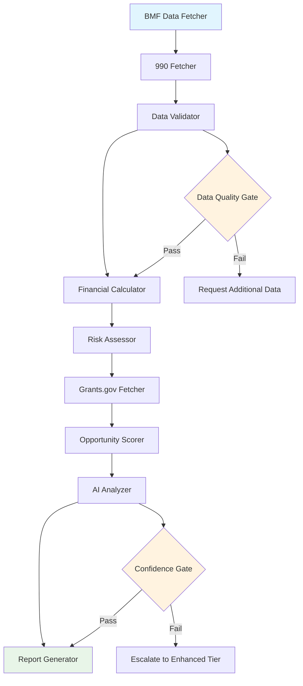
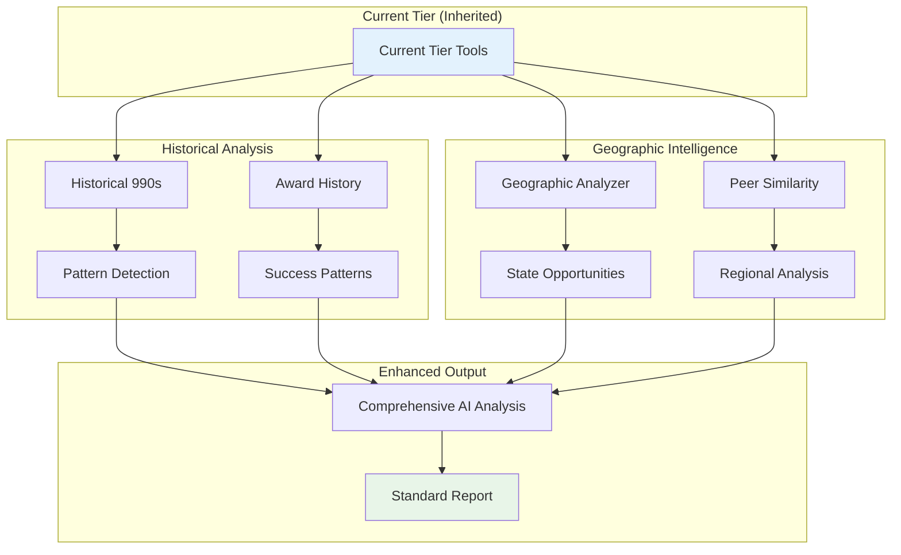
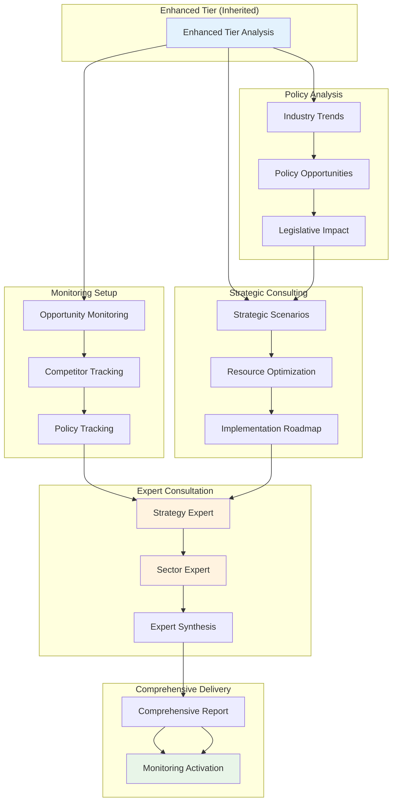

# Workflows: Business Process to Tool Composition Mapping

## Overview

This document defines how micro-tools compose into complete business workflows that deliver the 4-tier intelligence packages and custom analysis pipelines. Each workflow demonstrates 12-factor principles through explicit control flow, stateless tool execution, and human-AI collaboration.

## Workflow Architecture Principles

### 12-Factor Workflow Design
- **🎯 Factor 6**: Launch/Pause/Resume capabilities built into every workflow
- **🎯 Factor 7**: Human-in-the-loop checkpoints at strategic decision points
- **🎯 Factor 8**: Explicit control flow with visible decision logic
- **🎯 Factor 10**: Small, focused tools composed into larger business processes
- **🎯 Factor 12**: Stateless execution with immutable state transitions

### Workflow Categories
- **Tier Workflows**: Complete business packages ($0.75 - $42.00)
- **Custom Analysis Workflows**: Tailored research processes
- **Discovery Workflows**: Organization and opportunity identification
- **Validation Workflows**: Quality assurance and expert review
- **Monitoring Workflows**: Ongoing tracking and alerts

---

## Tier 1: Current Tier Workflow ($0.75, 5-10 minutes)

### Business Objective
Provide 4-stage AI analysis with strategic recommendations for immediate grant planning decisions.

### Workflow Definition
```yaml
workflow: current_tier_analysis
description: "4-stage AI analysis: PLAN → ANALYZE → EXAMINE → APPROACH"
estimated_duration: 600  # 10 minutes
estimated_cost: 0.75

inputs:
  - name: organization_ein
    type: string
    required: true
  - name: analysis_focus
    type: enum
    values: [general, funding_readiness, specific_opportunity]
    default: general

stages:
  # STAGE 1: PLAN - Understanding Organization
  - stage: plan
    description: "Gather and structure organization data"
    tools:
      - name: fetch_organization_profile
        tool: bmf_data_fetcher_tool
        inputs:
          ein: "{{ organization_ein }}"
          required_fields: ["name", "ntee_code", "state", "revenue", "assets"]
        outputs:
          organization_profile: profile

      - name: fetch_recent_990
        tool: propublica_990_fetcher_tool
        inputs:
          ein: "{{ organization_ein }}"
          tax_year: "latest"
          schedules: ["basic_financial"]
        outputs:
          financial_data: recent_990

      - name: validate_data_quality
        tool: data_validator_tool
        inputs:
          organization_data: "{{ organization_profile }}"
          financial_data: "{{ recent_990 }}"
        outputs:
          data_quality: validation_results

  # STAGE 2: ANALYZE - Financial and Risk Assessment
  - stage: analyze
    description: "Analyze financial health and risk factors"
    tools:
      - name: calculate_financial_metrics
        tool: financial_metrics_calculator_tool
        inputs:
          organization: "{{ organization_profile }}"
          financial_data: "{{ recent_990 }}"
        outputs:
          financial_analysis: metrics

      - name: assess_risk_level
        tool: risk_score_calculator_tool
        inputs:
          organization: "{{ organization_profile }}"
          financial_metrics: "{{ financial_analysis }}"
        outputs:
          risk_assessment: risk_score

  # STAGE 3: EXAMINE - Opportunity Identification
  - stage: examine
    description: "Identify and score relevant opportunities"
    tools:
      - name: discover_federal_opportunities
        tool: grants_gov_fetcher_tool
        inputs:
          ntee_code: "{{ organization_profile.ntee_code }}"
          state: "{{ organization_profile.state }}"
          keywords: "{{ analysis_focus }}"
        outputs:
          opportunities: federal_opps

      - name: score_opportunity_fit
        tool: opportunity_scorer_tool
        inputs:
          organization_profile: "{{ organization_profile }}"
          opportunities: "{{ federal_opps }}"
          financial_capacity: "{{ financial_analysis }}"
        outputs:
          scored_opportunities: opportunity_scores

  # STAGE 4: APPROACH - Strategic Recommendations
  - stage: approach
    description: "Generate strategic recommendations and action plan"
    tools:
      - name: generate_strategic_analysis
        tool: ai_content_analyzer_tool
        inputs:
          organization: "{{ organization_profile }}"
          financial_analysis: "{{ financial_analysis }}"
          risk_assessment: "{{ risk_assessment }}"
          top_opportunities: "{{ opportunity_scores.top_5 }}"
          analysis_type: "strategic_recommendations"
        outputs:
          strategic_insights: ai_analysis

      - name: compile_tier_report
        tool: report_generator_tool
        inputs:
          report_type: "current_tier"
          organization: "{{ organization_profile }}"
          financial_analysis: "{{ financial_analysis }}"
          risk_assessment: "{{ risk_assessment }}"
          opportunities: "{{ opportunity_scores }}"
          strategic_insights: "{{ ai_analysis }}"
        outputs:
          final_report: tier_report

# Quality Gates
quality_gates:
  - gate: data_sufficiency
    condition: "{{ validation_results.completeness_score }} > 0.7"
    failure_action: request_additional_data

  - gate: confidence_threshold
    condition: "{{ ai_analysis.confidence_score }} > 0.6"
    failure_action: escalate_to_enhanced_tier

# Success Metrics
success_criteria:
  - execution_time: "< 600 seconds"
  - cost: "< $0.75"
  - confidence_level: "> 0.6"
  - actionable_recommendations: "> 3"
```

### Tool Execution Flow


---

## Tier 2: Standard Tier Workflow ($7.50, 15-20 minutes)

### Business Objective
Add historical funding analysis, geographic patterns, temporal trends, and success factors to Current Tier analysis.

### Workflow Definition
```yaml
workflow: standard_tier_analysis
description: "Current Tier + Historical Analysis + Geographic Intelligence"
estimated_duration: 1200  # 20 minutes
estimated_cost: 7.50

inputs:
  - name: organization_ein
    type: string
    required: true
  - name: analysis_depth
    type: enum
    values: [standard, detailed]
    default: standard
  - name: historical_years
    type: int
    default: 3

# Inherit Current Tier workflow
extends: current_tier_analysis

additional_stages:
  # STAGE 5: HISTORICAL ANALYSIS
  - stage: historical_analysis
    description: "Analyze funding patterns and trends over time"
    depends_on: [plan, analyze]
    tools:
      - name: fetch_historical_990s
        tool: propublica_990_fetcher_tool
        inputs:
          ein: "{{ organization_ein }}"
          years_range: "{{ historical_years }}"
          schedules: ["financial", "schedule_i"]
        outputs:
          historical_data: multi_year_990s

      - name: analyze_funding_trends
        tool: pattern_detection_tool
        inputs:
          historical_data: "{{ multi_year_990s }}"
          analysis_focus: ["revenue_trends", "funding_sources", "growth_patterns"]
        outputs:
          funding_patterns: trend_analysis

      - name: fetch_award_history
        tool: usaspending_fetcher_tool
        inputs:
          organization_name: "{{ organization_profile.name }}"
          ein: "{{ organization_ein }}"
          years: "{{ historical_years }}"
        outputs:
          award_history: historical_awards

      - name: analyze_success_patterns
        tool: success_pattern_analyzer_tool
        inputs:
          organization: "{{ organization_profile }}"
          award_history: "{{ historical_awards }}"
          peer_data: "{{ peer_analysis }}"
        outputs:
          success_insights: success_patterns

  # STAGE 6: GEOGRAPHIC INTELLIGENCE
  - stage: geographic_analysis
    description: "Analyze geographic funding patterns and regional opportunities"
    depends_on: [examine]
    tools:
      - name: analyze_geographic_patterns
        tool: geographic_analyzer_tool
        inputs:
          organization_location: "{{ organization_profile.location }}"
          funding_history: "{{ historical_awards }}"
          opportunity_data: "{{ federal_opps }}"
        outputs:
          geographic_insights: geo_analysis

      - name: fetch_state_opportunities
        tool: state_grant_fetcher_tool
        inputs:
          state: "{{ organization_profile.state }}"
          ntee_code: "{{ organization_profile.ntee_code }}"
        outputs:
          state_opportunities: state_opps

      - name: identify_peer_organizations
        tool: peer_similarity_calculator_tool
        inputs:
          target_organization: "{{ organization_profile }}"
          search_radius: "regional"
          similarity_threshold: 0.6
        outputs:
          peer_analysis: peer_orgs

  # STAGE 7: ENHANCED RECOMMENDATIONS
  - stage: enhanced_recommendations
    description: "Generate comprehensive recommendations with historical context"
    depends_on: [approach, historical_analysis, geographic_analysis]
    tools:
      - name: generate_comprehensive_analysis
        tool: ai_content_analyzer_tool
        inputs:
          organization: "{{ organization_profile }}"
          current_analysis: "{{ ai_analysis }}"
          historical_patterns: "{{ trend_analysis }}"
          success_patterns: "{{ success_patterns }}"
          geographic_insights: "{{ geo_analysis }}"
          peer_insights: "{{ peer_orgs }}"
          analysis_type: "comprehensive_strategic"
        outputs:
          enhanced_insights: comprehensive_analysis

      - name: compile_standard_report
        tool: report_generator_tool
        inputs:
          report_type: "standard_tier"
          organization: "{{ organization_profile }}"
          current_analysis: "{{ tier_report }}"
          historical_analysis: "{{ trend_analysis }}"
          geographic_analysis: "{{ geo_analysis }}"
          peer_analysis: "{{ peer_orgs }}"
          enhanced_insights: "{{ comprehensive_analysis }}"
        outputs:
          final_report: standard_report

# Parallel Execution Groups
parallel_groups:
  - name: data_enrichment
    tools:
      - fetch_historical_990s
      - fetch_award_history
      - fetch_state_opportunities

  - name: pattern_analysis
    depends_on: [data_enrichment]
    tools:
      - analyze_funding_trends
      - analyze_geographic_patterns
      - identify_peer_organizations

# Advanced Quality Gates
quality_gates:
  - gate: historical_data_sufficiency
    condition: "{{ multi_year_990s.years_available }} >= 2"
    failure_action: proceed_with_limited_historical

  - gate: peer_analysis_quality
    condition: "{{ peer_orgs.similarity_scores | avg }} > 0.5"
    failure_action: expand_peer_search

  - gate: comprehensive_confidence
    condition: "{{ comprehensive_analysis.confidence_score }} > 0.7"
    failure_action: human_validation_recommended
```

### Enhanced Tool Flow


---

## Tier 3: Enhanced Tier Workflow ($22.00, 30-45 minutes)

### Business Objective
Add document analysis, network intelligence, decision maker profiling, and competitive analysis for comprehensive due diligence.

### Workflow Definition
```yaml
workflow: enhanced_tier_analysis
description: "Standard Tier + Document Analysis + Network Intelligence + Decision Maker Profiling"
estimated_duration: 2700  # 45 minutes
estimated_cost: 22.00

# Inherit Standard Tier workflow
extends: standard_tier_analysis

additional_inputs:
  - name: include_network_analysis
    type: bool
    default: true
  - name: competitive_analysis_depth
    type: enum
    values: [basic, comprehensive]
    default: comprehensive

additional_stages:
  # STAGE 8: DOCUMENT INTELLIGENCE
  - stage: document_analysis
    description: "Deep analysis of organizational documents and communications"
    depends_on: [plan]
    tools:
      - name: fetch_foundation_profiles
        tool: foundation_directory_fetcher_tool
        inputs:
          organization_type: "related_foundations"
          geographic_area: "{{ organization_profile.state }}"
          funding_areas: "{{ organization_profile.ntee_code }}"
        outputs:
          foundation_data: foundations

      - name: analyze_foundation_capacity
        tool: foundation_capacity_analyzer_tool
        inputs:
          foundations: "{{ foundation_data }}"
          organization_profile: "{{ organization_profile }}"
        outputs:
          foundation_analysis: foundation_insights

      - name: analyze_program_content
        tool: ai_content_analyzer_tool
        inputs:
          content: "{{ organization_profile.mission_statement }}"
          additional_content: "{{ organization_profile.program_descriptions }}"
          analysis_type: "program_alignment"
        outputs:
          program_intelligence: program_analysis

  # STAGE 9: NETWORK INTELLIGENCE
  - stage: network_analysis
    description: "Board network analysis and relationship mapping"
    condition: "{{ include_network_analysis }}"
    depends_on: [plan]
    tools:
      - name: extract_leadership_data
        tool: propublica_990_fetcher_tool
        inputs:
          ein: "{{ organization_ein }}"
          schedules: ["schedule_o", "governance"]
          extract_leadership: true
        outputs:
          leadership_data: board_info

      - name: analyze_network_centrality
        tool: network_centrality_calculator_tool
        inputs:
          organization: "{{ organization_profile }}"
          leadership_data: "{{ board_info }}"
          peer_organizations: "{{ peer_orgs }}"
        outputs:
          network_analysis: network_metrics

      - name: identify_key_relationships
        tool: ai_content_analyzer_tool
        inputs:
          network_data: "{{ network_metrics }}"
          analysis_type: "relationship_intelligence"
        outputs:
          relationship_insights: key_relationships

  # STAGE 10: COMPETITIVE INTELLIGENCE
  - stage: competitive_analysis
    description: "Comprehensive competitive landscape analysis"
    depends_on: [geographic_analysis]
    tools:
      - name: identify_market_competitors
        tool: peer_similarity_calculator_tool
        inputs:
          target_organization: "{{ organization_profile }}"
          search_scope: "national"
          similarity_threshold: 0.5
          include_financial_comparison: true
        outputs:
          competitive_landscape: competitors

      - name: analyze_competitive_positioning
        tool: market_intelligence_tool
        inputs:
          organization: "{{ organization_profile }}"
          competitors: "{{ competitors }}"
          market_data: "{{ geo_analysis }}"
        outputs:
          market_position: competitive_intel

      - name: assess_competitive_threats
        tool: risk_score_calculator_tool
        inputs:
          organization: "{{ organization_profile }}"
          competitive_landscape: "{{ competitive_intel }}"
          market_trends: "{{ trend_analysis }}"
          risk_type: "competitive"
        outputs:
          competitive_risks: threat_assessment

  # STAGE 11: DECISION MAKER PROFILING
  - stage: decision_maker_analysis
    description: "Profile key decision makers and stakeholders"
    depends_on: [network_analysis, document_analysis]
    tools:
      - name: profile_key_stakeholders
        tool: ai_content_analyzer_tool
        inputs:
          leadership_data: "{{ board_info }}"
          network_analysis: "{{ network_metrics }}"
          analysis_type: "stakeholder_profiling"
        outputs:
          stakeholder_profiles: decision_makers

      - name: analyze_influence_patterns
        tool: pattern_detection_tool
        inputs:
          stakeholder_data: "{{ decision_makers }}"
          network_data: "{{ network_metrics }}"
          historical_decisions: "{{ success_patterns }}"
        outputs:
          influence_analysis: influence_patterns

  # STAGE 12: ENHANCED EXPERT VALIDATION
  - stage: expert_validation
    description: "Human expert validation of complex analysis"
    depends_on: [competitive_analysis, decision_maker_analysis]
    tools:
      - name: prepare_expert_briefing
        tool: summary_generator_tool
        inputs:
          comprehensive_analysis: "{{ comprehensive_analysis }}"
          competitive_intelligence: "{{ competitive_intel }}"
          network_insights: "{{ network_metrics }}"
          stakeholder_profiles: "{{ decision_makers }}"
        outputs:
          expert_briefing: validation_package

      - name: request_expert_validation
        tool: expert_validator_tool
        inputs:
          analysis_package: "{{ validation_package }}"
          expert_type: "grant_strategy_expert"
          validation_focus: ["competitive_positioning", "network_leverage", "strategy_viability"]
          timeout: 1800  # 30 minutes
        outputs:
          expert_feedback: validation_results

  # STAGE 13: COMPREHENSIVE REPORT GENERATION
  - stage: final_compilation
    description: "Compile comprehensive enhanced tier report"
    depends_on: [enhanced_recommendations, expert_validation]
    tools:
      - name: generate_enhanced_insights
        tool: ai_content_analyzer_tool
        inputs:
          base_analysis: "{{ comprehensive_analysis }}"
          competitive_intel: "{{ competitive_intel }}"
          network_insights: "{{ network_metrics }}"
          stakeholder_insights: "{{ decision_makers }}"
          expert_validation: "{{ validation_results }}"
          analysis_type: "enhanced_strategic"
        outputs:
          enhanced_strategic_analysis: final_insights

      - name: compile_enhanced_report
        tool: report_generator_tool
        inputs:
          report_type: "enhanced_tier"
          base_report: "{{ standard_report }}"
          competitive_analysis: "{{ competitive_intel }}"
          network_analysis: "{{ network_metrics }}"
          stakeholder_analysis: "{{ decision_makers }}"
          foundation_analysis: "{{ foundation_insights }}"
          expert_validation: "{{ validation_results }}"
          strategic_insights: "{{ final_insights }}"
        outputs:
          final_report: enhanced_report

# Human-in-the-Loop Decision Points
human_decision_points:
  - decision: competitive_analysis_depth
    condition: "{{ competitors.count }} > 20"
    human_input: "Large competitive landscape detected. Proceed with full analysis?"
    timeout: 300

  - decision: expert_validation_required
    condition: "{{ final_insights.complexity_score }} > 0.8"
    human_input: "Complex analysis detected. Request expert validation?"
    default: "yes"

# Advanced Parallel Processing
parallel_execution:
  - group: intelligence_gathering
    tools:
      - fetch_foundation_profiles
      - extract_leadership_data
      - identify_market_competitors

  - group: analysis_phase
    depends_on: [intelligence_gathering]
    tools:
      - analyze_foundation_capacity
      - analyze_network_centrality
      - analyze_competitive_positioning

  - group: synthesis_phase
    depends_on: [analysis_phase]
    tools:
      - profile_key_stakeholders
      - assess_competitive_threats
      - analyze_influence_patterns
```

---

## Tier 4: Complete Tier Workflow ($42.00, 45-60 minutes)

### Business Objective
Add policy analysis, real-time monitoring, strategic consulting level insights with 26+ page comprehensive reports.

### Workflow Definition
```yaml
workflow: complete_tier_analysis
description: "Enhanced Tier + Policy Analysis + Real-time Monitoring + Strategic Consulting"
estimated_duration: 3600  # 60 minutes
estimated_cost: 42.00

# Inherit Enhanced Tier workflow
extends: enhanced_tier_analysis

additional_inputs:
  - name: policy_analysis_scope
    type: enum
    values: [sector_specific, comprehensive, legislative_tracking]
    default: comprehensive
  - name: monitoring_duration
    type: enum
    values: [30_days, 60_days, 90_days]
    default: 60_days

additional_stages:
  # STAGE 14: POLICY LANDSCAPE ANALYSIS
  - stage: policy_analysis
    description: "Analyze policy environment and regulatory landscape"
    depends_on: [competitive_analysis]
    tools:
      - name: analyze_industry_trends
        tool: industry_trend_analyzer_tool
        inputs:
          sector: "{{ organization_profile.ntee_code }}"
          geographic_scope: "national"
          analysis_depth: "{{ policy_analysis_scope }}"
        outputs:
          industry_trends: sector_analysis

      - name: identify_policy_opportunities
        tool: pattern_detection_tool
        inputs:
          trend_data: "{{ sector_analysis }}"
          organization_profile: "{{ organization_profile }}"
          focus_areas: ["regulatory_changes", "funding_shifts", "policy_priorities"]
        outputs:
          policy_opportunities: policy_insights

      - name: analyze_legislative_impact
        tool: ai_content_analyzer_tool
        inputs:
          policy_data: "{{ policy_insights }}"
          organization_context: "{{ organization_profile }}"
          analysis_type: "legislative_impact_assessment"
        outputs:
          legislative_analysis: policy_impact

  # STAGE 15: REAL-TIME MONITORING SETUP
  - stage: monitoring_setup
    description: "Establish real-time monitoring and alert systems"
    tools:
      - name: configure_opportunity_monitoring
        tool: grant_deadline_tracker_tool
        inputs:
          organization_profile: "{{ organization_profile }}"
          opportunity_criteria: "{{ opportunity_scores.top_criteria }}"
          monitoring_duration: "{{ monitoring_duration }}"
        outputs:
          monitoring_config: opportunity_alerts

      - name: setup_competitor_tracking
        tool: progress_tracker_tool
        inputs:
          tracked_organizations: "{{ competitors.top_10 }}"
          tracking_metrics: ["funding_awards", "program_changes", "leadership_changes"]
          alert_frequency: "weekly"
        outputs:
          competitor_monitoring: competitor_alerts

      - name: configure_policy_tracking
        tool: progress_tracker_tool
        inputs:
          policy_areas: "{{ policy_insights.key_areas }}"
          legislative_topics: "{{ legislative_analysis.tracked_topics }}"
          alert_sensitivity: "medium"
        outputs:
          policy_monitoring: policy_alerts

  # STAGE 16: STRATEGIC CONSULTING ANALYSIS
  - stage: strategic_consulting
    description: "Provide strategic consulting level insights and recommendations"
    depends_on: [policy_analysis, expert_validation]
    tools:
      - name: develop_strategic_scenarios
        tool: predictive_modeler_tool
        inputs:
          base_analysis: "{{ final_insights }}"
          market_trends: "{{ sector_analysis }}"
          competitive_landscape: "{{ competitive_intel }}"
          policy_environment: "{{ policy_impact }}"
        outputs:
          strategic_scenarios: scenario_analysis

      - name: optimize_resource_allocation
        tool: ai_content_analyzer_tool
        inputs:
          organization_capacity: "{{ financial_analysis }}"
          opportunity_portfolio: "{{ opportunity_scores }}"
          strategic_scenarios: "{{ scenario_analysis }}"
          analysis_type: "resource_optimization"
        outputs:
          resource_strategy: allocation_plan

      - name: develop_implementation_roadmap
        tool: report_generator_tool
        inputs:
          report_type: "implementation_roadmap"
          strategic_analysis: "{{ final_insights }}"
          scenarios: "{{ scenario_analysis }}"
          resource_plan: "{{ allocation_plan }}"
          timeline: "12_months"
        outputs:
          implementation_plan: roadmap

  # STAGE 17: COMPREHENSIVE EXPERT CONSULTATION
  - stage: expert_consultation
    description: "Multi-expert validation and strategic consultation"
    depends_on: [strategic_consulting]
    tools:
      - name: prepare_consultation_package
        tool: summary_generator_tool
        inputs:
          complete_analysis: "{{ enhanced_report }}"
          strategic_scenarios: "{{ scenario_analysis }}"
          implementation_plan: "{{ roadmap }}"
          consultation_focus: "strategic_validation"
        outputs:
          consultation_package: expert_briefing

      - name: request_strategy_expert_review
        tool: expert_validator_tool
        inputs:
          analysis_package: "{{ expert_briefing }}"
          expert_type: "senior_grant_strategist"
          consultation_type: "strategic_review"
          timeout: 2400  # 40 minutes
        outputs:
          strategy_validation: strategy_expert_feedback

      - name: request_sector_expert_review
        tool: expert_validator_tool
        inputs:
          analysis_package: "{{ expert_briefing }}"
          expert_type: "sector_specialist"
          sector: "{{ organization_profile.ntee_code }}"
          consultation_type: "sector_validation"
          timeout: 1800  # 30 minutes
        outputs:
          sector_validation: sector_expert_feedback

  # STAGE 18: FINAL COMPREHENSIVE REPORT
  - stage: comprehensive_report_generation
    description: "Generate 26+ page comprehensive strategic report"
    depends_on: [expert_consultation, monitoring_setup]
    tools:
      - name: synthesize_expert_feedback
        tool: ai_content_analyzer_tool
        inputs:
          strategy_feedback: "{{ strategy_expert_feedback }}"
          sector_feedback: "{{ sector_expert_feedback }}"
          base_analysis: "{{ final_insights }}"
          analysis_type: "expert_synthesis"
        outputs:
          synthesized_insights: expert_synthesis

      - name: generate_comprehensive_report
        tool: report_generator_tool
        inputs:
          report_type: "complete_tier_comprehensive"
          base_reports: ["{{ enhanced_report }}"]
          policy_analysis: "{{ policy_impact }}"
          strategic_scenarios: "{{ scenario_analysis }}"
          implementation_plan: "{{ roadmap }}"
          expert_synthesis: "{{ expert_synthesis }}"
          monitoring_setup: "{{ opportunity_alerts }}"
          target_pages: 26
        outputs:
          final_report: comprehensive_report

      - name: generate_executive_summary
        tool: summary_generator_tool
        inputs:
          comprehensive_report: "{{ comprehensive_report }}"
          summary_type: "executive_overview"
          key_decisions: "{{ strategy_expert_feedback.key_decisions }}"
        outputs:
          executive_summary: exec_summary

  # STAGE 19: DELIVERY AND MONITORING ACTIVATION
  - stage: delivery_activation
    description: "Deliver report and activate monitoring systems"
    tools:
      - name: activate_monitoring_systems
        tool: task_scheduler_tool
        inputs:
          opportunity_alerts: "{{ opportunity_alerts }}"
          competitor_alerts: "{{ competitor_alerts }}"
          policy_alerts: "{{ policy_alerts }}"
          activation_date: "immediate"
        outputs:
          monitoring_status: active_monitoring

      - name: schedule_follow_up_reviews
        tool: task_scheduler_tool
        inputs:
          review_schedule: ["30_days", "60_days", "90_days"]
          review_type: "progress_assessment"
          stakeholders: "{{ decision_makers.primary_contacts }}"
        outputs:
          follow_up_schedule: scheduled_reviews

# Multi-Expert Validation Flow
expert_validation_flow:
  - expert_type: "senior_grant_strategist"
    focus: ["strategic_viability", "implementation_feasibility", "resource_allocation"]
    weight: 0.4

  - expert_type: "sector_specialist"
    focus: ["sector_trends", "competitive_positioning", "policy_implications"]
    weight: 0.3

  - expert_type: "financial_analyst"
    focus: ["financial_strategy", "risk_assessment", "capacity_planning"]
    weight: 0.3

# Monitoring and Alerting Configuration
monitoring_systems:
  - system: opportunity_tracker
    frequency: "daily"
    alert_conditions:
      - "new_opportunities_matching_profile"
      - "deadline_approaching"
      - "eligibility_changes"

  - system: competitor_monitor
    frequency: "weekly"
    alert_conditions:
      - "new_funding_awards"
      - "leadership_changes"
      - "program_expansions"

  - system: policy_tracker
    frequency: "daily"
    alert_conditions:
      - "regulatory_changes"
      - "funding_priority_shifts"
      - "legislative_developments"

# Quality Assurance
quality_assurance:
  - checkpoint: strategic_coherence
    validation: "All strategic recommendations align with organizational capacity"

  - checkpoint: expert_consensus
    validation: "Expert feedback shows >80% agreement on key recommendations"

  - checkpoint: implementation_viability
    validation: "Implementation plan is realistic given organizational constraints"

  - checkpoint: comprehensive_coverage
    validation: "Report covers all requested analysis dimensions"
```

### Complete Tier Architecture


---

## Custom Analysis Workflows

### Foundation Research Workflow
```yaml
workflow: foundation_research
description: "Specialized workflow for foundation prospect research"
estimated_duration: 900  # 15 minutes

tools:
  - foundation_directory_fetcher_tool
  - foundation_capacity_analyzer_tool
  - ai_content_analyzer_tool
  - success_pattern_analyzer_tool
  - report_generator_tool

stages:
  - stage: foundation_identification
    tools:
      - foundation_directory_fetcher_tool:
          inputs:
            geographic_area: "{{ target_region }}"
            funding_areas: "{{ organization_focus_areas }}"
            grant_size_range: "{{ funding_needs }}"

  - stage: capacity_assessment
    tools:
      - foundation_capacity_analyzer_tool:
          inputs:
            foundations: "{{ foundation_data }}"
            assessment_type: "grant_making_capacity"

  - stage: strategic_fit_analysis
    tools:
      - ai_content_analyzer_tool:
          inputs:
            content_type: "foundation_guidelines"
            analysis_type: "strategic_alignment"
```

### Compliance Monitoring Workflow
```yaml
workflow: compliance_monitoring
description: "Ongoing compliance and deadline tracking"
estimated_duration: 300  # 5 minutes

recurring: true
frequency: "daily"

tools:
  - grant_deadline_tracker_tool
  - compliance_checker_tool
  - progress_tracker_tool
  - summary_generator_tool

stages:
  - stage: deadline_check
    tools:
      - grant_deadline_tracker_tool:
          inputs:
            organization_grants: "{{ active_grants }}"
            alert_threshold: "30_days"

  - stage: compliance_verification
    tools:
      - compliance_checker_tool:
          inputs:
            active_grants: "{{ active_grants }}"
            compliance_requirements: "{{ requirements_db }}"

  - stage: alert_generation
    condition: "{{ issues_detected }}"
    tools:
      - summary_generator_tool:
          inputs:
            alert_type: "compliance_issues"
            urgency_level: "{{ issue_severity }}"
```

---

## Workflow Orchestration Patterns

### Sequential Processing
```yaml
pattern: sequential_processing
description: "Tools execute in strict order with dependencies"

example:
  - data_collection_phase:
      - bmf_data_fetcher_tool
      - propublica_990_fetcher_tool
      - data_validator_tool

  - analysis_phase:
      depends_on: [data_collection_phase]
      - financial_metrics_calculator_tool
      - risk_score_calculator_tool

  - output_phase:
      depends_on: [analysis_phase]
      - report_generator_tool
```

### Parallel Processing
```yaml
pattern: parallel_processing
description: "Independent tools execute simultaneously"

example:
  parallel_group:
    - bmf_data_fetcher_tool
    - grants_gov_fetcher_tool
    - state_grant_fetcher_tool
    - foundation_directory_fetcher_tool

  sync_point: data_validation

  next_phase:
    depends_on: [parallel_group]
    - data_normalizer_tool
```

### Conditional Branching
```yaml
pattern: conditional_branching
description: "Workflow path determined by data or user decisions"

example:
  decision_point: risk_assessment
  condition: "{{ risk_score }} > 0.7"

  high_risk_path:
    - expert_validator_tool
    - enhanced_due_diligence_tool
    - risk_mitigation_planner_tool

  normal_risk_path:
    - standard_analysis_tool
    - opportunity_scorer_tool
```

### Human-in-the-Loop
```yaml
pattern: human_in_the_loop
description: "Strategic human intervention points"

example:
  automated_phase:
    - data_collection_tools
    - initial_analysis_tools

  human_checkpoint:
    tool: expert_validator_tool
    timeout: 1800  # 30 minutes
    fallback: proceed_with_ai_only

  enhanced_phase:
    condition: "{{ human_input_received }}"
    - incorporate_expert_feedback
    - refined_analysis_tools
```

### Error Recovery
```yaml
pattern: error_recovery
description: "Graceful handling of tool failures"

example:
  primary_tool: propublica_990_fetcher_tool

  on_failure:
    - error_recovery_tool:
        strategy: "alternative_data_source"
    - bmf_data_fetcher_tool:
        mode: "enhanced_extraction"

  quality_check:
    - data_validator_tool:
        acceptance_threshold: 0.6
```

---

## Workflow Performance Optimization

### Resource Allocation
```yaml
optimization: resource_allocation

strategies:
  - parallel_execution:
      max_concurrent_tools: 5
      resource_sharing: "memory_pool"

  - cache_utilization:
      cache_levels: ["organization", "sector", "geographic"]
      cache_duration: "24_hours"

  - load_balancing:
      distribution_strategy: "least_loaded"
      failover_enabled: true
```

### Cost Optimization
```yaml
optimization: cost_optimization

strategies:
  - tier_based_scaling:
      current_tier: "minimal_ai_usage"
      enhanced_tier: "moderate_ai_usage"
      complete_tier: "comprehensive_ai_usage"

  - smart_caching:
      cache_expensive_operations: true
      cache_ttl: "1_hour"

  - conditional_processing:
      skip_unnecessary_tools: true
      early_termination_conditions: defined
```

### Quality Assurance
```yaml
optimization: quality_assurance

strategies:
  - validation_checkpoints:
      data_quality_gates: true
      confidence_thresholds: defined
      expert_validation_triggers: automated

  - continuous_monitoring:
      performance_metrics: tracked
      error_rate_monitoring: enabled
      user_satisfaction_tracking: active
```

---

## Migration Strategy

### Phase 1: Core Workflows (Week 1-2)
- Implement Current Tier workflow
- Basic tool composition patterns
- Simple error handling

### Phase 2: Enhanced Workflows (Week 3-4)
- Add Standard and Enhanced Tier workflows
- Parallel processing capabilities
- Human-in-the-loop integration

### Phase 3: Advanced Features (Week 5-6)
- Complete Tier workflow
- Advanced orchestration patterns
- Monitoring and alerting systems

### Phase 4: Optimization (Week 7-8)
- Performance optimization
- Cost optimization
- Quality assurance enhancements

---

**Next Steps**:
1. Review [IMPLEMENTATION-PLAYBOOK.md](./IMPLEMENTATION-PLAYBOOK.md) for step-by-step migration
2. Study [DECISIONS.md](./DECISIONS.md) for architectural decision rationale
3. Examine [PROJECT-TEMPLATE.md](./PROJECT-TEMPLATE.md) for new project patterns